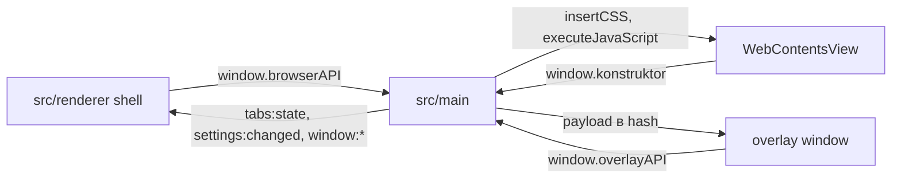

# 🏗️ Архитектура приложения

Документ объясняет общую архитектуру браузера: процессы Electron, пул `WebContentsView`, мосты `browserAPI` и `konstruktor`, overlay-окна.

## 🧩 Состав процессов

Main владеет окнами, вкладками, overlay и хранилищами. Renderer рисует shell вокруг свободной области, где живет `WebContentsView`. View показывает сайты и внутренние страницы. Overlay показывает меню, тосты, диалоги и поиск поверх всего.



## 🏗️ Архитектура

```
src/
  main/                 ядро: окна, вкладки, overlay, поиск, темы, stores
    docs/               документация систем main
    index.ts            IPC-роутер, связка deps без циклов
    browserState.ts     типы WindowState/TabData, пул окон
    windowsManager.ts   окна, layout, fullscreen, bounds, сессии
    tabsManager.ts      вкладки, detach/attach, pushTabsState
    stripOrder.ts       единый ряд t:/g:, инвариант
    groupsManager.ts    роутер groups:*
    groupsInstances.ts  экземпляры групп, collapse/pin
    groupsMenu.ts       контекстное меню группы
    iconVerify.ts       верификация иконок URL/file/emoji
    browserTheme.ts     color-scheme сайтов, dataset.theme страниц
    findManager.ts      состояние поиска, findInPage и custom-поиск
    findScripts.ts      builder-функции JS-инъекций
    windowMenu.ts       меню окна
    overlay/            overlay-окна menu/toast/dialog/find
      index.ts          точка входа для потребителей
      service.ts        логика показа и разбора запросов
      pool.ts           окна оверлея и прогрев
      ipc.ts            каналы overlay:* и их разбор
      session.ts        сессии, токены, стек вложенности
      geometry.ts       позиция и размер поверхностей
      logger.ts         логирование по OVERLAY_DEBUG
    settingsStore.ts    settings.json
    historyStore.ts     history.json
    downloadsStore.ts   downloads.json
    shortcutsStore.ts   shortcuts.json
    dnsConfig.ts        Secure DNS switches
    internalPages.ts    konstruktor://history, settings, downloads
    startPage.ts        konstruktor://start
    internalBridge.ts   registerPreloadScript на сессии
  preload/
    index.ts            window.browserAPI для shell
    overlay.ts          window.overlayAPI для overlay-окна
    SHELL_BRIDGE.md     документация моста shell и overlay
  view-preload/
    internal.ts         window.konstruktor для view
    VIEW_BRIDGE.md      документация моста view
  shared/
    overlay-types.ts    контракт сообщений и типов overlay
  renderer/
    docs/               документация shell и UI
    App.vue             корневой layout, panel-top и panel-bottom
    main.ts             точка входа renderer
    overlay.ts          точка входа overlay-окна
    index.html          документ shell
    menu.html           документ overlay-окна
    styles.css          базовые стили shell
    core/               useTabs, useTheme, layoutEngine, registry
    components/stdlib/  TabStrip, TabGroupNode, tabShared, useStripDrag и другие
    overlay/            BrowserMenu, ToastStack, PromptDialog, FindBar, IconDialog
      components/       MenuList, DialogForm
      registry.ts       выбор компонента по model.view
    layouts/            пресеты ClassicTop, Minimal
docs/
  ARCHITECTURE.md       этот файл
  DOCS.md               правила документирования
  GIT.md                правила работы с git
  TROUBLESHOOTING.md    разбор проблем
  UPDATE_PLAN.md        план автообновления
```

## 📦 Карта модулей

| Область | Ответственность | Документы |
|---|---|---|
| Окна и вкладки | `BrowserWindow`, `WebContentsView`, layout, сессии | `src/main/docs/WINDOWS_TABS.md` |
| Оверлей main | Позиционирование, фокус, жизненный цикл | `src/main/docs/OVERLAY.md` |
| Поиск | `findInPage`, custom DOM-поиск, подсветка | `src/main/docs/FIND.md` |
| Темы | `dark`, `light`, `system`, `slate` | `src/main/docs/THEMES.md` |
| Хранилища | JSON в userData, DNS | `src/main/docs/STORES.md` |
| Внутренние страницы | `konstruktor://`, preload на сессиях | `src/main/docs/INTERNAL_PAGES.md` |
| Shell и layout | `App.vue`, инсеты, пресеты | `src/renderer/docs/SHELL_LAYOUT.md` |
| Состояние shell | Подписки IPC, тема, `theme-lock` | `src/renderer/docs/CORE_STATE.md` |
| Stdlib | Готовые Vue-компоненты | `src/renderer/docs/STDLIB.md` |
| Overlay UI | Vue-панели поверх страницы | `src/renderer/docs/OVERLAY_UI.md` |
| Мост shell | `browserAPI`, `overlayAPI` | `src/preload/SHELL_BRIDGE.md` |
| Мост view | `window.konstruktor` | `src/view-preload/VIEW_BRIDGE.md` |
