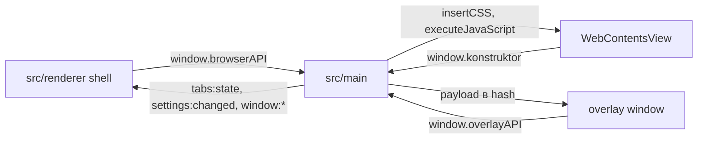

# 🏗️ Архитектура приложения

Документ объясняет общую архитектуру браузера: процессы Electron, пул `WebContentsView`, мосты `browserAPI` и `konstruktor`, overlay-окна.

## 🧩 Состав процессов

Main владеет окнами, вкладками, overlay и хранилищами. Renderer рисует shell вокруг свободной области, где живет `WebContentsView`. View показывает сайты и внутренние страницы. Overlay показывает меню, тосты, диалоги и поиск поверх всего.



## 🏗️ Архитектура

```
src/
  main/                 ядро: окна, вкладки, overlay, поиск, темы, stores
    docs/               документация систем main
    index.ts            wiring: схема, DNS, register*Ipc, жизненный цикл app
    diagnostics.ts      dev-диагностика по флагам окружения
    browserTheme.ts     color-scheme сайтов, dataset.theme страниц
    zoomManager.ts      масштаб страницы, единый зум
    i18n.ts             t(), init языка, смена через settings:save
    windows/            кластер окон
      deps.ts           wiring createTab/createWindow, wsOf и действий меню страницы
      browserState.ts   типы WindowState/TabData, пул окон
      windowsManager.ts окна, layout view, bounds, сессии, drag
      windowMenu.ts     меню окна (ПКМ по навигации)
      fullscreen.ts     F11-сценарий, сброс контентного режима
      windowIpc.ts      каналы window:*/zoom:*
      browserMenu.ts    меню браузера (menu:popup) и его гашение
    tabs/               кластер вкладок и панели
      tabsManager.ts    вкладки, detach/attach, pushTabsState
      tabsIpc.ts        каналы tabs:*/devtools:*/layout:update
      tabsMenu.ts       контекстные меню вкладки и панели
      pageMenu.ts       контекстное меню веб-страницы (ПКМ, Shift+F10)
      stripOrder.ts     единый ряд t:/g:, инвариант
      devtools.ts       DevTools страницы: док в view, toggleDevTools, инспектор
    groups/             кластер групп вкладок
      groupsManager.ts  роутер groups:*
      groupsInstances.ts экземпляры групп, collapse/pin
      groupsMenu.ts     контекстное меню группы
      groupsStore.ts    groups.json
    overlay/            overlay-окна menu/toast/dialog/find
      index.ts          точка входа для потребителей
      service.ts        показ: сессия, токены, present(), painted
      close.ts          закрытие сессий, стек, возврат фокуса
      resolve.ts        команды renderer: select/dismiss/submit
      push.ts           сборка push и геометрия уровней
      pool.ts           окна оверлея и прогрев
      ipc.ts            каналы overlay:* и их разбор
      session.ts        сессии, токены, стек вложенности
      geometry.ts       позиция и размер поверхностей
      logger.ts         логирование по OVERLAY_DEBUG
      iconVerify.ts     верификация иконок URL/file/emoji
    find/               кластер поиска по странице
      findManager.ts    состояние поиска, findInPage и custom-поиск
      findScripts.ts    builder-функции JS-инъекций
    store/              JSON-хранилища в userData
      settingsStore.ts  settings.json
      historyStore.ts   history.json
      downloadsStore.ts downloads.json
      shortcutsStore.ts shortcuts.json
      dnsConfig.ts      Secure DNS switches
      ipc.ts            каналы history:*/downloads:*/settings:*/shortcuts:*
    pages/              внутренние страницы konstruktor://
      internalPages.ts  URL-константы и реэкспорт builder'ов
      shell.ts          общий HTML-каркас и базовый CSS
      historyPage.ts    история: хронология и поиск
      settingsPage.ts   настройки и выбор темы
      downloadsPage.ts  загрузки с прогрессом
      startPage.ts      konstruktor://start
      protocol.ts       роутинг konstruktor:// по host на всех партициях
      internalBridge.ts registerPreloadScript на сессии
  preload/              три прелоада в одной папке
    docs/               SHELL_BRIDGE.md, VIEW_BRIDGE.md
    shell/index.ts      window.browserAPI для shell
    overlay-window/overlay.ts  window.overlayAPI для overlay-окна
    view/internal.ts    window.konstruktor для view
    view/pip.ts         кнопка PiP над HTML5-плеером в каждом фрейме
  shared/
    overlay-types.ts    контракт сообщений и типов overlay
    i18n/               локализация: каталоги, реестр языков, runtime страниц
      locales/          en.json — язык-источник
      languages.ts      реестр LANGUAGES
      index.ts          resolveLocale, ресурсы, опции i18next
      pageRuntime.ts    window.tr для внутренних страниц
      I18N.md           документация системы перевода
  renderer/
    docs/               документация shell и UI
    App.vue             корневой layout, panel-top и panel-bottom
    main.ts             точка входа renderer
    overlay.ts          точка входа overlay-окна
    i18n.ts             фабрика i18next для shell и overlay
    index.html          документ shell
    menu.html           документ overlay-окна
    styles.css          базовые стили shell
    core/               useTabs, useTheme, layoutEngine, registry
    components/stdlib/  TabStrip, TabGroupNode, tabShared, useStripDrag, useTabStripDrag и другие
    overlay/            BrowserMenu, ToastStack, PromptDialog, FindBar, IconDialog
      payload.ts        типы push, пропсы уровней, мерж патчей, сверка stale
      components/       MenuList, DialogForm
      registry.ts       выбор компонента по model.view
    layouts/            пресеты ClassicTop, Minimal
docs/
  ARCHITECTURE.md       этот файл
  DOCS.md               правила документирования
  GIT.md                правила работы с git
  TROUBLESHOOTING.md    разбор проблем
  UPDATE_PLAN.md        план автообновления
```

## 📦 Карта модулей

| Область | Ответственность | Документы |
|---|---|---|
| Окна и вкладки | Окна — `windows/`, вкладки и панель — `tabs/`, layout, сессии | `src/main/docs/WINDOWS_TABS.md` |
| Оверлей main | Позиционирование, фокус, жизненный цикл | `src/main/docs/OVERLAY.md` |
| Поиск | `findInPage`, custom DOM-поиск, подсветка | `src/main/docs/FIND.md` |
| Темы | `dark`, `light`, `system`, `slate` | `src/main/docs/THEMES.md` |
| Хранилища | JSON в userData, DNS | `src/main/docs/STORES.md` |
| Локализация | Каталоги, ключи, детект и смена языка | `src/shared/i18n/I18N.md` |
| Внутренние страницы | `konstruktor://`, preload на сессиях | `src/main/docs/INTERNAL_PAGES.md` |
| Shell и layout | `App.vue`, инсеты, пресеты | `src/renderer/docs/SHELL_LAYOUT.md` |
| Состояние shell | Подписки IPC, тема, `theme-lock` | `src/renderer/docs/CORE_STATE.md` |
| Stdlib | Готовые Vue-компоненты | `src/renderer/docs/STDLIB.md` |
| Overlay UI | Vue-панели поверх страницы | `src/renderer/docs/OVERLAY_UI.md` |
| Мост shell | `browserAPI`, `overlayAPI` | `src/preload/docs/SHELL_BRIDGE.md` |
| Мост view | `window.konstruktor` | `src/preload/docs/VIEW_BRIDGE.md` |
