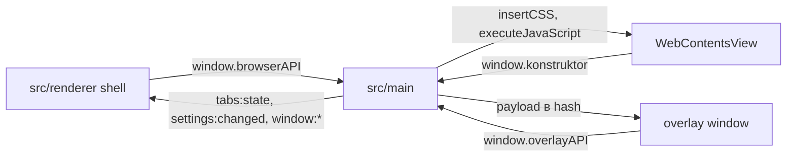

# 🏗️ Архитектура приложения

Документ объясняет, как устроен браузер в целом: из каких процессов он состоит, какие в нём есть поверхности и как они общаются друг с другом. Карта папок `src` и их назначение — ниже; список документов по отдельным системам — в `README.md`.

## 🌐 Работа браузера

Пользователь работает с браузером как с обычным окном: перед ним рамка с панелями и областью страницы. Клики и клавиатура попадают либо в интерфейс, либо в саму страницу — туда, куда указывает курсор и где сейчас фокус. То, что видит пользователь, собирается из нескольких независимых слоёв, наложенных друг на друга.

Главное окно задаёт рамку приложения. Внутри него живёт область страницы, которую рисует отдельный нативный слой, и интерфейсная обвязка вокруг неё. Поверх этого слоя из интерфейса ничего нарисовать нельзя: страница непрозрачна для остальной отрисовки. Поэтому меню, диалоги, тосты и панель поиска показываются в отдельном прозрачном окне поверх всего — окне оверлея.

Роли процессов разделены. Main владеет состоянием — окнами, вкладками, настройками и хранилищами — и только он умеет обращаться к системе. Renderer отвечает за три поверхности: интерфейс (shell), страницу (view) и оверлей. Ни одна поверхность не работает с системой напрямую: каждая общается с main через свой узкий мост, а вне этих мостов у renderer доступа к системе нет.

Общение идёт в обе стороны. Поверхность сообщает main о действии пользователя — открыть вкладку, выбрать пункт меню, отправить поисковый запрос; это команда. Main, в свою очередь, рассылает поверхностям обновления состояния и данные для отрисовки: тему, список вкладок, содержимое меню. Общего состояния поверхности не держат — они показывают то, что прислал main, и сообщают ему о действиях.

Роли поверхностей:

- **Shell** рисует интерфейс вокруг страницы и сообщает main, сколько места занимают панели, чтобы main расставил область страницы.
- **View** показывает сайт или внутреннюю страницу; остальным слоям его содержимое недоступно.
- **Оверлей** показывает меню, диалоги, тосты и поиск поверх страницы; данные для них приходят от main.

Каждая поверхность общается с main через свой мост: shell — через `window.browserAPI`, страница — через `window.konstruktor`, окно оверлея — через `window.overlayAPI`. Main отвечает обновлениями: shell присылает состояние интерфейса (`tabs:state`, `settings:changed`, `window:*`), странице — приёмы оформления (`insertCSS`, `executeJavaScript`), оверлею — данные для отрисовки (`payload` в hash).

Схема ниже показывает направления общения: стрелки от поверхностей к main — команды и действия пользователя, стрелки от main к поверхностям — обновления состояния и данные для отрисовки.



## 🏗️ Архитектура

```
src/
  main/               ядро main-процесса: окна, вкладки, оверлей, поиск, темы, хранилища, диагностика
    windows/          окна: пул, layout, сессии, fullscreen, инкогнито
    tabs/             вкладки и панель: единый ряд, detach/attach, контекстные меню, DevTools
    groups/           группы вкладок: шаблоны и экземпляры, вложенность, закрепление
    overlay/          overlay-окна: позиционирование, фокус, жизненный цикл, сессии
    find/             поиск по странице: findInPage и собственный DOM-поиск
    store/            JSON-хранилища в userData и Secure DNS
    pages/            внутренние страницы konstruktor://: роутинг, HTML, preload на сессиях
    docs/             документация систем main, у которых нет своей папки
  preload/            прелоады: мосты между main и тремя поверхностями renderer
    shell/            мост интерфейса: window.browserAPI
    overlay-window/   мост окна оверлея: window.overlayAPI
    view/             мост страницы: window.konstruktor
    docs/             документация мостов
  renderer/           shell: layout, состояние, stdlib, overlay-панели, пресеты
    core/             состояние shell: вкладки, тема, layout-инсеты, реестр компонентов
    components/stdlib/ готовые Vue-компоненты панелей
    overlay/          Vue-панели окна оверлея
    layouts/          пресеты расположения панелей
    docs/             документация shell
  shared/             общий код процессов: контракт оверлея и локализация
    i18n/             локализация: каталоги переводов, реестр языков, runtime страниц
```
