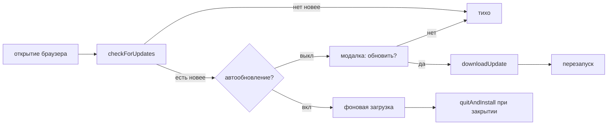

# 🔄 План автообновления

План описывает будущий механизм обновления собранной версии браузера: проверка релизов, модалка, фоновая загрузка, смена источника.

## 🧩 Выбор решения

Используется связка `electron-updater` и `electron-builder` с провайдером `github`. Встроенный `autoUpdater` Electron не используется: на Windows он требует ручной работы с Squirrel-файлами, а `electron-updater` уже умеет `latest.yml`, дифференциальные апдейты и `Generic`-источники.

## 📦 Публикация релизов

Сборка через `electron-builder` публикует в GitHub Release инсталлятор, `blockmap` и `latest.yml` с версией и хэшами. CI собирает по тегу `vX.Y.Z` и публикует через `GH_TOKEN`. Версия берется только из `package.json`, формат строго семвер. В dev-режиме апдейтер отключается, иначе он ругается на отсутствие `app-update.yml`.

## 🖥️ Сценарии обновления

Проверка запускается после `createWindow` и далее по интервалу раз в 4-6 часов. При выключенном автообновлении и событии `update-available` показывается overlay-диалог: обновить сейчас или позже. При включенном автообновлении загрузка идет в фоне с `autoDownload` и `autoInstallOnAppQuit`, установка происходит через `quitAndInstall` при закрытии. Прогресс показывается тостом `download-progress`.

## 🔀 Смена источника

Источник хранится в `settings.json` как `updateSource`: форк на GitHub задается через `owner` и `repo`, свой сервер через `url` провайдера `generic`. Смена источника пересоздает конфиг апдейтера и запускает тестовый `checkForUpdates`. Приватные репозитории требуют токен, поэтому в первой версии поддерживаются только публичные.

## 🛠️ Состав работ

Новый модуль main `src/main/updater.ts` владеет конфигом апдейтера, проверками и пробросом событий `update:available`, `update:progress`, `update:downloaded` в renderer. Настройки расширяются полями `autoUpdate` и `updateSource`. UI добавляет чекбокс автообновления, поля источника с кнопкой проверки и overlay-диалог обновления.

## ⚠️ Нюансы

Подпись кодовым сертификатом убирает SmartScreen, на механику обновления не влияет. Дифференциальные апдейты через `blockmap` качают только дельту и включены по умолчанию для NSIS. Невалидный источник показывает ошибку проверки, а не молчит. Каналы `latest` и `beta` с флагом `allowPrerelease` откладываются за пределы первой версии.
