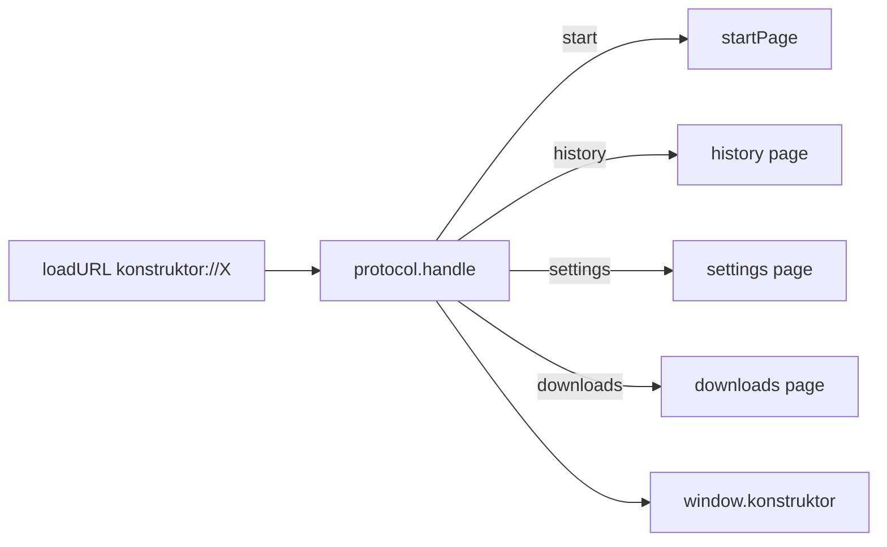

# 🌐 Внутренние страницы

Документ описывает страницы `konstruktor://`: роутинг, preload-мост, темы, поведение.

## 🧩 Адреса

Поддерживаются `konstruktor://start`, `history`, `settings`, `downloads`. HTML собирается в `startPage.ts` и `internalPages.ts` без внешних ресурсов и работает офлайн.

| Адрес | Назначение | Хранилище |
|---|---|---|
| `konstruktor://start` | Стартовая страница-табло с плитками | `shortcuts.json` |
| `konstruktor://history` | История визитов с хронологией по дням, месяцам и годам | `history.json`, инкогнито не пишет и не читает |
| `konstruktor://downloads` | Хранилище загрузок с системными иконками | `downloads.json` |
| `konstruktor://settings` | Поиск, домашняя страница, DNS, тема, режимы зума | `settings.json` |

## 🔀 Роутинг

`index.ts` регистрирует `protocol.handle` на трех сессиях: default, обычной и инкогнито. Роутинг идет по host URL. Схема объявлена privileged до ready, иначе view ее не рендерит.

## 🔌 Мост

`internalBridge.ts` ставит `registerPreloadScript` на каждую партицию. Скрипт выполняется в каждом фрейме до загрузки документа и отдает `window.konstruktor`: история, настройки, шорткаты, загрузки.

## 🎨 Темы и поведение

Страницы читают тему из настроек до отрисовки и ставят `dataset.theme`. История группирует визиты по дням, месяцам и годам. Настройки сохраняются через `saveSettings` и пушат `settings:changed` в shell.
