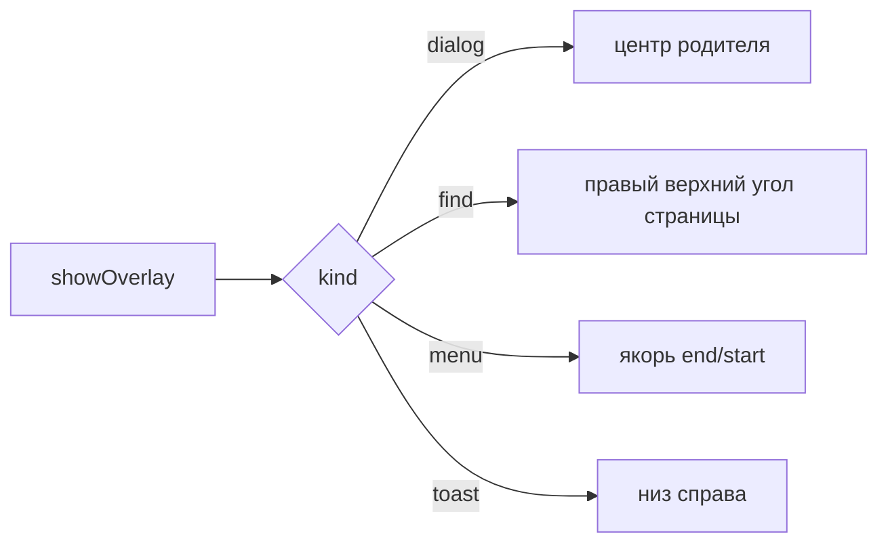

# 💬 Оверлей-окна

Документ описывает overlay-окна main: виды панелей, позиционирование, фокус, жизненный цикл.

## 🧩 Виды панелей

`overlayManager.ts` поддерживает kinds `menu`, `toast`, `dialog`, `find`, `icon`. Меню показывает пункты и инкогнито-бейдж, тост показывает завершение загрузки, диалог запрашивает ввод, диалог иконки принимает URL, путь к файлу или emoji с верификацией типа (`iconVerify.ts` — `verifyIconSource`/`verifyEmojiButton`), поиск висит над страницей.

## 📐 Позиционирование

Диалог центрируется по родителю. Поиск встает в правый верхний угол области страницы ниже верхней панели. Меню встает от якоря с выравниванием `end` или `start`. Координаты клампятся в границы родителя.

## ⌨️ Фокус

Окно создается с `focusable: true`, иначе панель поиска не держит ввод. Меню и диалог открываются через `showInactive`, поиск через `show` с фокусом.

## 🔄 Жизненный цикл

Одновременно живет один оверлей на родителя, новый вытесняет старый. Выбор уходит через `resolveOverlaySelect`, ввод через `resolveOverlaySubmit`, отмена через `resolveOverlayDismiss`. Родительские `move`, `resize`, `minimize` и `blur` закрывают оверлей.
