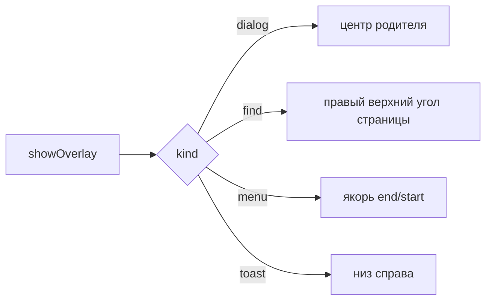

# 💬 Оверлей-окна

Документ описывает overlay-окна main: виды панелей, позиционирование, фокус, жизненный цикл, отладку.

Логика показа живёт в `overlay/service.ts`, окна и прогрев — в `overlay/pool.ts`, каналы и их разбор — в `overlay/ipc.ts`, сессии и токены — в `overlay/session.ts`, расчёт позиции и размера — в `overlay/geometry.ts`. Точка входа для потребителей — `overlay/index.ts`. Накопленные грабли — в [TROUBLESHOOTING.md](../../../docs/TROUBLESHOOTING.md).

## 🧩 Виды панелей

Сервис поддерживает kinds `menu`, `toast`, `dialog`, `find`, `icon`, `window-menu`, `zoom`. Меню показывает пункты и инкогнито-бейдж, тост показывает завершение загрузки, диалог запрашивает ввод, диалог иконки принимает URL, путь к файлу или emoji с верификацией типа (`iconVerify.ts` — `verifyIconSource`/`verifyEmojiButton`), поиск висит над страницей, попап зума управляет масштабом страницы у бейджа в адресной строке.

Компонент для каждого вида выбирается из реестра `renderer/overlay/registry.ts` по `model.view`, поэтому новая поверхность добавляется регистрацией компонента, а не правкой корня.

Виды с общим контрактом гашения собирает `isDismissableMenuLike` (menu, window-menu, zoom): повторный клик-тогл по триггеру, клик мимо по shell/странице и запоминание `lastClosed` проходят через неё. Зум-попап в списке обязателен: без него он не закрывался бы кликом по странице либо закрывался при каждом `+`. Команды `select` попапа дополнительно держат сессию открытой через `holdOnSelect` — `+`/`−`/`Reset` обновляют процент патчем `overlay:update` вместо закрытия.

## 📐 Позиционирование и размер

Позиция и размер поверхности описываются декларативно в `geometry.ts` (`SurfaceSpec` на вид: ширина, высота, выравнивание, отступ) и считаются функцией `resolveBounds()` с разворотом меню у края экрана.

Диалог центрируется по родителю. Поиск встает в правый верхний угль области страницы ниже верхней панели. Меню встает от якоря с выравниванием `end` или `start`. Тост — в правый нижний. Координаты клампятся в `workArea` дисплея **родителя**, а не в объединённую область: на Linux `workArea.x` отрицателен для левого монитора, и арифметика в положительных координатах уводила окно на соседний дисплей.



**Размер приходит из renderer, а не из формулы.** Компонент меряет свой элемент поверхности через `ResizeObserver` и шлёт `overlay:measured`; main клампит и применяет через `applyMeasured`. Пункт занимает 46 px (padding 9+9, строка 14, border 1), и измерение снимается вместо расчёта, поэтому смена темы или системного шрифта размер не ломает.

Меряется `firstElementChild` поверхности, а не `.overlay-root`: корень растянут на всё окно и мерял бы размер окна, то есть сам бы себе противоречил.

Пока размер не пришёл, окно получает запасной размер (потолок `spec.width`) — он заметно шире настоящего, поэтому при `align: 'end'` левая сторона прыгает после замера.

## ⌨️ Фокус

Окно создается с `focusable: true`, иначе панель поиска не держит ввод. Меню и панель поиска забирают фокус явно (`focus()`), остальные виды открываются через `showInactive()`. Диалоги фокус берут автофокусом поля ввода, тост фокуса не берёт вовсе.

Явный `focus()` обязателен для клавиатурной навигации: оверлей открывается без фокуса, и без вызова стрелки не доходят до renderer. Клик по меню тоже сработал бы, но активирует окно — то есть фокус даёт первый клик, а не открытие.

Из-за `focusable: true` оверлей остаётся в цепочке Alt+Tab, и Windows при возврате в приложение отдаёт фокус **ему**, а не родителю. Окно при этом прозрачное и пустое, но живое: клавиши уходят в его `webContents`, где `before-input-event` не слушается. Поэтому при возврате фокус переадресуется родителю.

Фокус возвращается и при закрытии оверлея — иначе повторный Ctrl+F не сработал бы, пока пользователь не кликнет по странице. Возврат выполняется не всегда, а только если фокус сейчас наш: иначе мы бы выкинули пользователя из чужого приложения.

## 🎚️ Видимость вместо show/hide

Окно живёт постоянно, а видимость меняется прозрачностью:

| Действие | Реализация |
|----------|-----------|
| Показать | `setOpacity(1)` |
| Скрыть | `setOpacity(0)` + `setIgnoreMouseEvents(true)` + размонтирование содержимого |

Окно показывается один раз за жизнь — на прогреве при старте, сразу с `setOpacity(0)`.

**Скрытие обеспечивают три независимых слоя.** Размонтирование содержимого через `v-if` в renderer, прозрачность окна и `setIgnoreMouseEvents(true)`. Каждый закрывает свою часть: окно может оказаться в любой точке экрана, и прозрачный кадр виден там, где пустой DOM не виден вовсе.

Окно остаётся на своих координатах и не перемещается при скрытии.

**На Linux `setOpacity` не действует**, поэтому содержимое снимается размонтированием, а размонтирование асинхронно. Перед перемещением окна main дожидается подтверждения, что содержимое убрано из DOM (`awaitUnmounted`, канал `overlay:unmounted`).

## 🔄 Показ по подтверждению

Показ выполняется только после подтверждения отрисовки от renderer: до сигнала `overlay:painted` окно прозрачно, иначе видны пункты предыдущего меню.

```ts
win.setOpacity(0)                    // погасить
win.setBounds({ x, y, w, h })        // потом переставить
pushPayload(win, message)            // данные через overlay:push
setContentUnmounted(win, false)      // renderer снимает v-if
const painted = await overlayPainted(win, token)
if (!painted) { abortPresent(win, parent, token); return }
win.setOpacity(1)                    // и только теперь видно
```

Если подтверждения не пришло, показ отменяется и оверлей возвращается в пул: показ вслепую дал бы пустое окно без ошибок в логах.

Таймаут ожидания разделён надвое: `PAINT_BUDGET_MS` (60 мс) — только лог, показ не трогаем; `PAINT_TIMEOUT_MS` (1000 мс) — настоящая страховка для случая «renderer не ответит никогда». Разделение принципиально: пока ждём, окно прозрачно и пусто, поэтому ожидание не ощущается — оно целиком уходит на паузу **до** появления меню. Короткий таймаут ловит не поломку, а медленный кадр, и отменяет показ, который вот-вот был бы показан.

## 🔄 Жизненный цикл

На родителя жив один оверлей: новый вытесняет старый. Выбор уходит через `resolveOverlaySelect`, ввод через `resolveOverlaySubmit`, отмена через `resolveOverlayDismiss`, отмена диалога иконки — `resolveOverlaySubmitIcon`.

Оверлей закрывается при потере родителя: движение, ресайз, сворачивание и переключение на чужое окно. Пока содержимое размонтировано, эти слушатели игнорируются — иначе собственные `setBounds` при показе закрывают только что открытое меню.

Переключение на другое приложение ловится на том окне, которое **фактически держало фокус**: и на родителе, и на самом оверлее. Слушать только родителя мало — при открытой панели поиска фокус держит оверлей, родитель потерял его ещё при открытии, и его `blur` при Alt+Tab не приходит вовсе. Признак один: фокус ушло в чужое приложение, а не в наше второе окно.

Повторный клик по той же кнопке-триггеру закрывает её меню: сравнивается `toggleKey` активного запроса. Контекстные меню (правый клик) ключа не имеют и всегда просто показываются.

Клик в любом другом месте гасит меню: по вкладке, адресной строке, панели закладок и по самой странице. Меню живёт в отдельном окне, поэтому shell и view-preload ловят `mousedown` и отправляют `menu:dismiss-on-shell-click`. Закрывается только `kind: 'menu'` — диалоги и панель поиска живут своей логикой. Клик по самому триггеру `☰` не гасит меню, иначе `toggle` сломался бы.

Оверлей принадлежит прежней вкладке, поэтому при переключении вкладки он закрывается — и закрывается **до** переключения. Иначе возврат фокуса отдал бы его родителю, а переключение тут же забрало бы фокус у вкладки, и наоборот.

## 🔐 Сессии и защита от гонок

Каждое открытие увеличивает `sessionId`. Токен едет в каждой команде и проверяется на трёх сторонах: renderer отбрасывает запоздалые `push` и `update`, `ipc.ts` отсекает команду до вызова обработчика и отвечает `false`, а `session.ts` сверяет токен в `resolveOverlay*`.

Окно из пула одно на все сессии, поэтому без сверки счётчик от прошлого поиска появился бы в текущем, а команда для закрытой сессии применилась бы к новой.

## 🗄️ Стек вложенности

Сессии хранятся стеком на родителя (`session.ts`), геометрия считает объединение уровней, контракт несёт `stack: StackEntry[]` со сдвигом каждого уровня, renderer рисует уровни друг над другом.

При `NESTED_DIALOGS = false` в `showOverlay` стек всегда глубиной 1: диалог иконки вытесняет меню вкладки. Флаг включает второй уровень — диалог поверх меню; условие под ним написано, и все проверки по токену, геометрии уровней и фокусу уже работают на любой глубине.

## 🧪 Отладка

Логи включаются переменной окружения, читается один раз при старте:

```bash
# Подробно: каждое событие
OVERLAY_DEBUG=1 npm run dev

# Максимально подробно
OVERLAY_DEBUG=2 npm run dev

# Без переменной — terse: только открытия, закрытия и ошибки
```

Категории: `pool`, `session`, `command`, `geometry`, `perf`, `lifecycle`, `error`.

Пример вывода:
```
[overlay:pool     ] prewarming window { parentId: 1 }
[overlay:perf     ] prewarm: 358.0ms { parentId: 1 }
[overlay:pool     ] reusing pooled window { parentId: 1, kind: 'menu' }
[overlay:geometry ] resolved { x: 351, y: 279, width: 260, height: 340 }
[overlay:lifecycle] [trace] push sessionId=1 no-anim=true anims=[] count=0 { windowId: 2 }
[overlay:perf     ] open(menu, reused): 30.3ms
[overlay:session  ] closing { parentId: 1, kind: 'menu' }
```

Страница оверлея грузится **один раз за жизнь окна**, данные приходят через `overlay:push`. Значение `loadCount: 1` в логах — признак того, что навигация не вернулась; рост означает, что оверлей снова перезагружает страницу вместо обновления по IPC.

Диагностический приём: `waited for unmount confirm` и `unmount confirm timeout` показывают, отработала ли синхронизация размонтирования перед перемещением окна. Второе — повод разбираться, а не норма.
