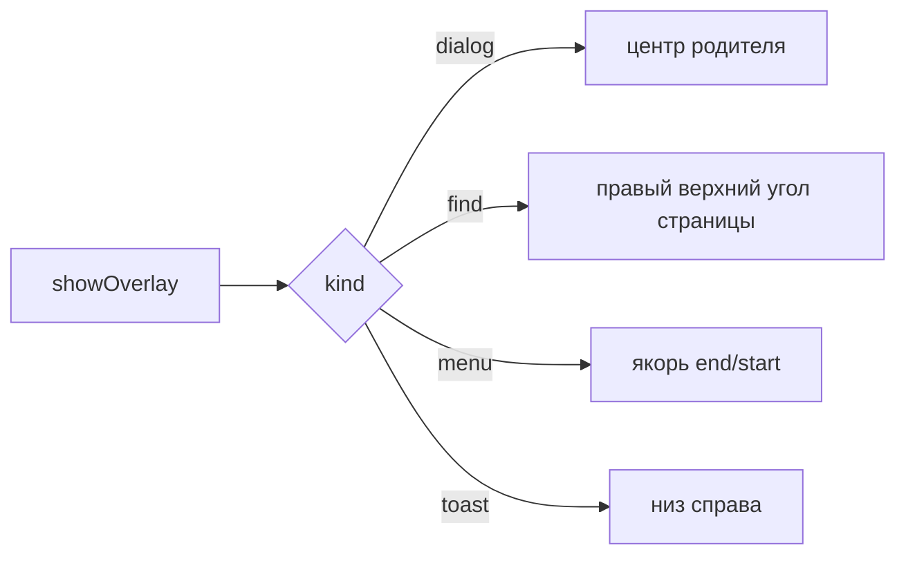

# 💬 Оверлей-окна

Документ описывает overlay-окна main: виды панелей, позиционирование, фокус, жизненный цикл.

Логика живёт в `overlay/service.ts`, окна и прогрев — в `overlay/pool.ts`, регистрация каналов — в `overlay/ipc.ts`. `overlayManager.ts` остался фасадом для старых вызовов и удаляется на шаге 10.

## 🧩 Виды панелей

`overlayManager.ts` поддерживает kinds `menu`, `toast`, `dialog`, `find`, `icon`. Меню показывает пункты и инкогнито-бейдж, тост показывает завершение загрузки, диалог запрашивает ввод, диалог иконки принимает URL, путь к файлу или emoji с верификацией типа (`iconVerify.ts` — `verifyIconSource`/`verifyEmojiButton`), поиск висит над страницей.

## 📐 Позиционирование

Диалог центрируется по родителю. Поиск встает в правый верхний угол области страницы ниже верхней панели. Меню встает от якоря с выравниванием `end` или `start`. Координаты клампятся в границы родителя.

## ⌨️ Фокус

Окно создается с `focusable: true`, иначе панель поиска не держит ввод. Поиск забирает фокус (`focus()`), остальные виды открываются без фокуса (`showInactive`).

Из-за `focusable: true` оверлей остаётся в цепочке Alt+Tab, и Windows при возврате в приложение отдаёт фокус **ему**, а не родителю. Окно при этом прозрачное и пустое, но живое: клавиши уходят в его `webContents`, где `before-input-event` не слушается. Поэтому при возврате фокус переадресуется родителю.

Фокус возвращается и при закрытии оверлея — иначе повторный Ctrl+F не сработал бы, пока пользователь не кликнет по странице. Возврат выполняется не всегда, а только если фокус сейчас наш: иначе мы бы выкинули пользователя из чужого приложения.

## 🎚️ Видимость вместо show/hide

Окно не вызывается `show()`/`hide()` — Windows анимирует оба вызова, и меню «прыгало» бы при каждом открытии. Вместо этого окно живёт постоянно, а видимость меняется прозрачностью:

| Действие | Реализация |
|----------|-----------|
| Показать | `setOpacity(1)` |
| Скрыть | `setOpacity(0)` + `setIgnoreMouseEvents(true)` + размонтирование содержимого |

Единственный `showInactive()` — на прогреве окна при старте, сразу с `setOpacity(0)`.

Показ выполняется только после подтверждения отрисовки от renderer: до сигнала `overlay:painted` окно прозрачно, иначе видны пункты предыдущего меню. Подтверждения не будет — прозрачность **не возвращается**: оверлей отменяется и возвращается в пул, потому что показ вслепую даёт пустое окно без ошибок в логах. Причины и нюансы — в [TROUBLESHOOTING.md](../../../docs/TROUBLESHOOTING.md).

## 🔄 Жизненный цикл

Одновременно жив один оверлей на родителя. Выбор уходит через `resolveOverlaySelect`, ввод через `resolveOverlaySubmit`, отмена через `resolveOverlayDismiss`, отмена диалога иконки — `resolveOverlaySubmitIcon`.

Оверлей закрывается при потере родителя: движение, ресайз, сворачивание и переключение на чужое окно. Переключение ловится на том окне, которое **фактически держало фокус**: и на родителе, и на самом оверлее. Слушать только родителя мало — при открытой панели поиска фокус держит оверлей, родитель потерял его ещё при открытии, и его `blur` при Alt+Tab не приходит вовсе. Признак один: фокус ушёл в чужое приложение, а не в наше второе окно. Нюансы — в [TROUBLESHOOTING.md](../../../docs/TROUBLESHOOTING.md).

Повторный клик по той же кнопке-триггеру закрывает её меню: сравнивается `toggleKey` активного запроса. Контекстные меню (правый клик) ключа не имеют и всегда просто показываются.

Клик в любом другом месте гасит меню: по вкладке, адресной строке, панели закладок и по самой странице. Меню живёт в отдельном окне и таких кликов не видит, поэтому shell и view-preload ловят `mousedown` и отправляют `menu:dismiss-on-shell-click`. Закрывается только `kind: 'menu'` — диалоги и панель поиска живут своей логикой. Клик по самому триггеру `☰` не гасит меню, иначе `toggle` сломался бы.

**Координатная парковка отключена** (`PARK_MOVES_WINDOW = false`). Переезд между дисплеями заставлял композитор пересоздавать поверхность, и первый кадр приходил с задержкой ровно в один кадр (16.6 мс при 60 Гц). Замеры на трёх конфигурациях: за объединённой рабочей областью → в пределах дисплея родителя (16.6 → 3.8 мс) → перемещение выключено (3.9 мс). Скрытие обеспечивают три независимых слоя: размонтирование содержимого, прозрачность и `setIgnoreMouseEvents(true)`. Парковочные функции остались в пуле как `@deprecated`.

Отладочные логи включаются через `OVERLAY_DEBUG=1`, категории и примеры — в [OVERLAY_PLAN.md](./OVERLAY_PLAN.md).
