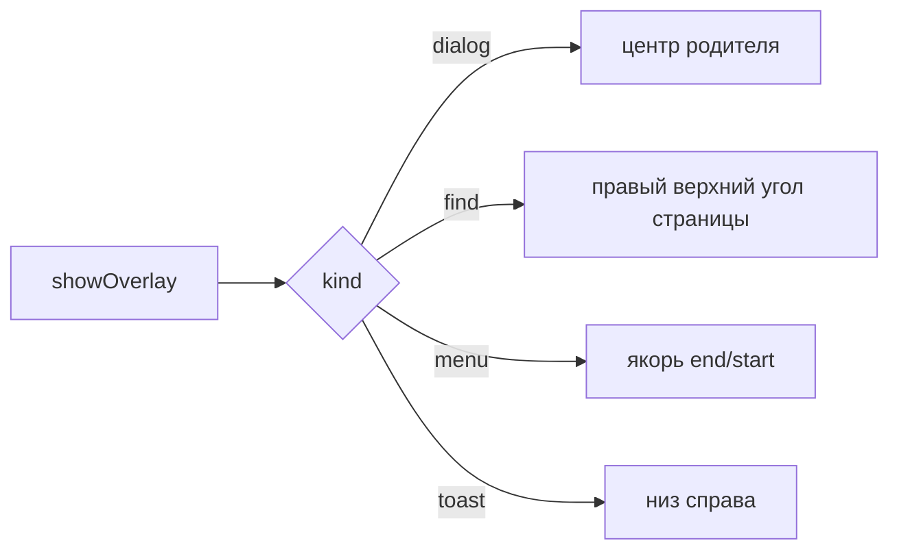

# 💬 Оверлей-окна

Документ описывает overlay-окна main: виды панелей, позиционирование, фокус, жизненный цикл.

## 🧩 Виды панелей

`overlayManager.ts` поддерживает kinds `menu`, `toast`, `dialog`, `find`, `icon`. Меню показывает пункты и инкогнито-бейдж, тост показывает завершение загрузки, диалог запрашивает ввод, диалог иконки принимает URL, путь к файлу или emoji с верификацией типа (`iconVerify.ts` — `verifyIconSource`/`verifyEmojiButton`), поиск висит над страницей.

## 📐 Позиционирование

Диалог центрируется по родителю. Поиск встает в правый верхний угол области страницы ниже верхней панели. Меню встает от якоря с выравниванием `end` или `start`. Координаты клампятся в границы родителя.

## ⌨️ Фокус

Окно создается с `focusable: true`, иначе панель поиска не держит ввод. Поиск забирает фокус (`focus()`), остальные виды открываются без фокуса (`showInactive`).

## 🎚️ Видимость вместо show/hide

Окно не вызывается `show()`/`hide()` — Windows анимирует оба вызова, и меню «прыгало» бы при каждом открытии. Вместо этого окно живёт постоянно, а видимость меняется прозрачностью:

| Действие | Реализация |
|----------|-----------|
| Показать | `setOpacity(1)` |
| Скрыть | `setOpacity(0)` + `setBounds(PARK)`, где `PARK = {x: -32000, y: -32000}` |

Единственный `showInactive()` — на прогреве окна при старте, сразу с `setOpacity(0)`.

Показ выполняется только после подтверждения отрисовки от renderer: до сигнала `overlay:ready` окно прозрачно, иначе видны пункты предыдущего меню. Причины и нюансы — в [TROUBLESHOOTING.md](../../../docs/TROUBLESHOOTING.md).

## 🔄 Жизненный цикл

Одновременно жив один оверлей на родителя. Выбор уходит через `resolveOverlaySelect`, ввод через `resolveOverlaySubmit`, отмена через `resolveOverlayDismiss`, отмена диалога иконки — `resolveOverlaySubmitIcon`. Родительские `move`, `resize`, `minimize` и `blur` закрывают оверлей.

Повторный клик по той же кнопке-триггеру закрывает её меню: сравнивается `toggleKey` активного запроса. Контекстные меню (правый клик) ключа не имеют и всегда просто показываются.

Отладочные логи включаются через `OVERLAY_DEBUG=1`, категории и примеры — в [OVERLAY_PLAN.md](./OVERLAY_PLAN.md).
