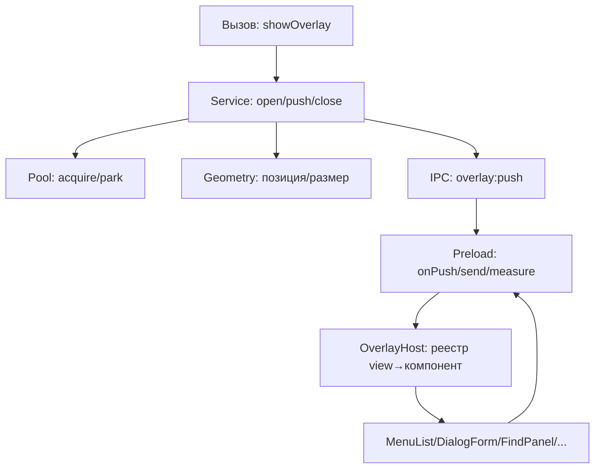
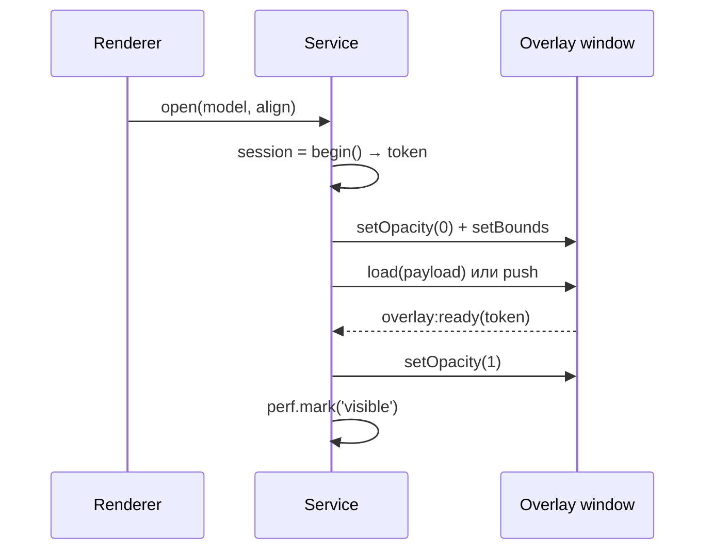
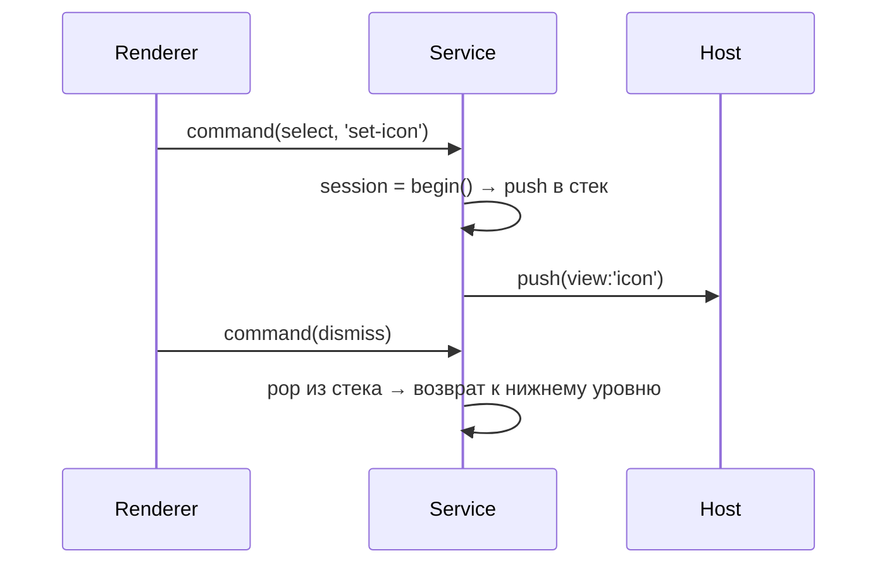

# 🛠️ План рефакторинга оверлеев

Документ описывает план полной переработки системы оверлеев: контекстные меню, модальные диалоги, панель поиска, тосты. Работа идёт шагами, каждый даёт визуальный результат для ручной проверки. Текущее состояние системы описано в [OVERLAY.md](./OVERLAY.md).

## 🎯 Цели

| # | Требование |
|---|-----------|
| 0 | Работать на отдельных окнах |
| 1 | Открываться мгновенно: окно прогревается при старте, после закрытия уходит в пул |
| 2 | Отображаться поверх `WebContentsView` (сайта) |
| 3 | Быть универсальным: один компонент покрывает все меню, наполнение приходит данными |
| 4 | Выходить за границы окна (оконная природа) |

## 🔍 Что переделываем

| Проблема | Следствие |
|----------|-----------|
| Данные передаются через URL hash → в prod это полный reload | Мигание, задержка 15–30 мс |
| Роутер `v-else-if` по `payload.kind` | Новая поверхность требует правки корня |
| Обратный вызов через `__iconApply` на объекте окна | Ломается при любом рефакторинге |
| `resolveOverlay*` перебирают `Map` перебором | Дублирование кода, O(n) |
| Вложенность через ручную проверку `active.get(id)?.overlay !== overlay` | Хрупко |
| Обновление данных через `executeJavaScript(buildScript(...))` | Генерация JS-строк, небезопасно |
| Размеры захардкожены в main, разметка — в renderer | Меню режется при смене темы/шрифта |
| Нет измерения задержки | Оптимизация вслепую |

## 🏗️ Архитектура



| Слой | Модуль | Роль |
|------|--------|------|
| Контракт | `src/shared/overlay-types.ts` | Типы сообщений для всех трёх контекстов |
| Main | `main/overlay/pool.ts` | Окна, прогрев, парковка |
| Main | `main/overlay/session.ts` | Сессии, токены, стек вложенности |
| Main | `main/overlay/geometry.ts` | Позиция/размер с клампом по экрану |
| Main | `main/overlay/service.ts` | Единственная точка входа |
| Main | `main/overlay/logger.ts` | Логи и perf-метки |
| Preload | `preload/overlay.ts` | Типизированный мост |
| Renderer | `renderer/overlay/OverlayHost.vue` | Рендерит компонент по реестру |
| Renderer | `renderer/overlay/registry.ts` | `view → компонент` |
| Renderer | `renderer/overlay/hooks/useOverlaySession.ts` | Хук сессии и измерений |

## 💡 Ключевые решения

**Данные через IPC-push, не URL.** Страница оверлея грузится один раз без payload, дальше main шлёт `overlay:push` — renderer обновляет реактивно, без перезагрузок.

| Канал | Направление | Содержимое |
|-------|-----------|------------|
| `overlay:push` | main → renderer | Новая сессия: `sessionId`, `model`, `theme`, `animations` |
| `overlay:update` | main → renderer | Точечный патч живой сессии (счётчик поиска, ошибка) |
| `overlay:command` | renderer → main | Действие: `select`, `submit`, `dismiss`, `find-*` |
| `overlay:measured` | renderer → main | Реальные размеры после монтирования |

**Сессии и токены.** Каждый `open()` увеличивает `sessionId`. Renderer отбрасывает команды со старым `sessionId` — защита от гонок.

**Стек вложенности.** Вложенные диалоги (меню → выбор иконки) идут вторым уровнем, а не заменяют первый. Закрытие верхнего возвращает нижний.

**Runtime-геометрия.** Компонент шлёт `overlay:measured` через `ResizeObserver`, main клампит по экрану. Хардкод `MENU_ITEM_H` уходит.

**Показ по подтверждению.** Окно остаётся прозрачным, пока renderer не подтвердит отрисовку — иначе видны пункты предыдущего меню. Подробности в [TROUBLESHOOTING.md](../../../docs/TROUBLESHOOTING.md).

**Никаких `show()`/`hide()`.** Окно живёт постоянно, скрытие — прозрачность и парковка за экраном. Иначе DWM анимирует каждое переключение.

## 🔀 Flow

### 🪟 Открытие



### 🧱 Вложенность



## 🪜 Шаги

| # | Шаг | Проверка | Статус |
|---|-----|----------|--------|
| 0 | Структура и контракт | `npm run build` чисто, ничего не сломано | ✅ |
| 1 | Логгер и perf-метки | логи в терминале при открытии меню | ✅ |
| 2 | Типизированный preload | `npm run typecheck` чисто | ⬜ |
| 3 | Пул и прогрев | окно оверлея в DevTools при старте | ⬜ |
| 4 | IPC-push вместо URL | смена меню без перезагрузки страницы | ⬜ |
| 5 | Сессии и защита от гонок | пропадает баг с «залипающими» пунктами | ⬜ |
| 6 | Runtime-геометрия | меню точно по размеру, не режется у края | ⬜ |
| 7 | Универсальные компоненты | все меню через один `MenuList` | ⬜ |
| 8 | Стек вложенности | меню → диалог двумя уровнями | ⬜ |
| 9 | Прогрев dev и prod | первый клик мгновенный в preview | ⬜ |
| 10 | Миграция вызовов | старый `overlayManager.ts` удалён | ⬜ |
| 11 | Метрики | сводка p50/p95 в логах | ⬜ |

Шаги 0–3 аддитивны и безопасны. Шаг 4 переломный: меняет способ доставки данных. Шаги 5–11 последовательное улучшение поверх работающего ядра. До шага 10 старый код продолжает работать.

## 📈 Метрики успеха

| Метрика | Сейчас | Цель |
|---------|--------|------|
| Открытие меню (prod, тёплое) | 15–30 мс | < 8 мс |
| Первый клик (холодное) | 50–100 мс | < 10 мс |
| Смена контекста меню | reload | push, 0 reload |
| Мигание при переключении | есть | 0 |
| Залипание пунктов меню | бывает | 0 |
| Обрезание меню у края экрана | бывает | 0 |

## 🧪 Отладка

Логи включаются переменной окружения, читаются один раз при старте:

```powershell
# Подробно: каждое событие
$env:OVERLAY_DEBUG = '1'; npm run dev

# Максимально подробно
$env:OVERLAY_DEBUG = '2'; npm run dev
```

Категории: `pool`, `session`, `command`, `geometry`, `perf`, `lifecycle`, `error`.
Частые сбои и их причины собраны в [TROUBLESHOOTING.md](../../../docs/TROUBLESHOOTING.md).
