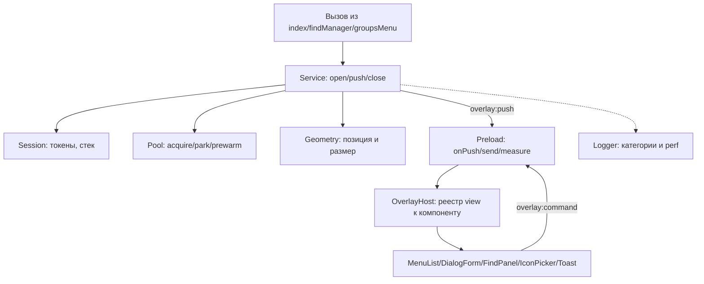
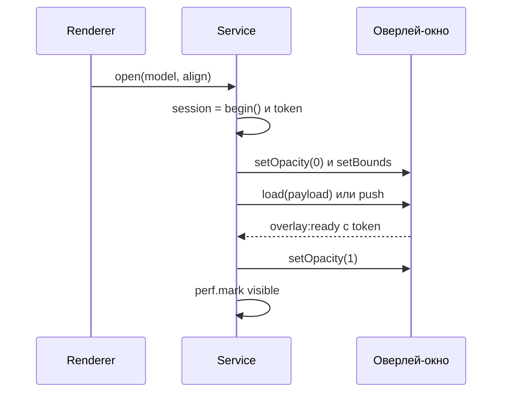
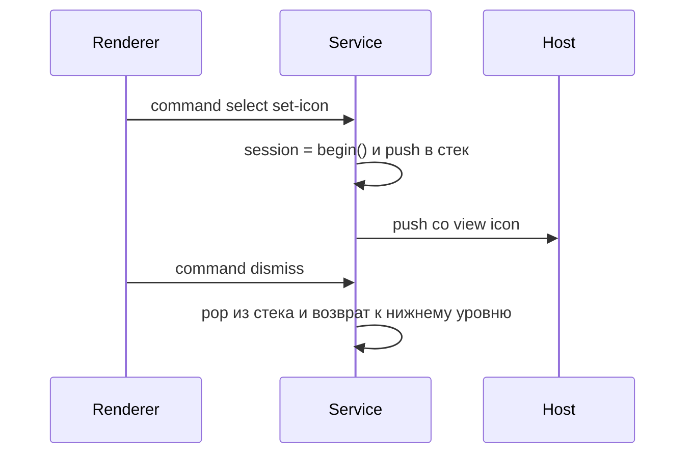

# 🛠️ План рефакторинга оверлеев

Документ описывает план полной переработки системы оверлеев: контекстные меню, модальные диалоги, панель поиска, тосты. Работа идёт шагами, каждый даёт визуальный результат для ручной проверки. Текущее состояние системы описано в [OVERLAY.md](./OVERLAY.md), накопленные нюансы — в [TROUBLESHOOTING.md](../../../docs/TROUBLESHOOTING.md).

**Для нового агента или разработчика:** этот файл самодостаточен. Он содержит всю архитектуру, все найденные грабли, точный статус по шагам и критерии приёмки. Начинать чтение с раздела «Обязательные к соблюдению правила».

## 📌 Статус: шаги 0–3 завершены

| # | Шаг | Статус | Коммит |
|---|-----|--------|--------|
| 0 | Структура и контракт | ✅ | `19c27be` |
| 1 | Логгер и perf-метки | ✅ | `19c27be` |
| 2 | Типизированный preload | ✅ | `297a318` |
| 3 | Пул и прогрев | ✅ | — |
| 4 | IPC-push вместо URL | ⬜ следующий | — |
| 4 | IPC-push вместо URL | ⬜ | — |
| 5 | Сессии и защита от гонок | ⬜ | — |
| 6 | Runtime-геометрия | ⬜ | — |
| 7 | Универсальные компоненты | ⬜ | — |
| 8 | Стек вложенности | ⬜ | — |
| 9 | Прогрев dev и prod | ⬜ | — |
| 10 | Миграция вызовов | ⬜ | — |
| 11 | Метрики | ⬜ | — |

Ветка `rf/overlay-menu-system`, шаги 0–2 закоммичены (`297a318`). Шаг 3 не закоммичен: вынос пула в `pool.ts`, исправление инверсии в переименовании, актуализация документации.

### 🧨 Ошибка шага 2, исправленная на шаге 3

Переименование `sendParked` → `setContentMounted` **инвертировало смысл булева значения**. Канал `overlay:park` несёт флаг `contentUnmounted`, то есть `true` означает размонтировано, но имя `setContentMounted` читалось как «показать». Правильно — `setContentUnmounted`.

Класс ошибки опасный: ни типы, ни логи, ни рантайм её не показывают. Механически правильная замена меняет читаемость кода, не меняя поведения. Та же ошибка была воспроизведена при первом написании `pool.ts` — `hideContent` слал `false`. Предупреждения оставлены в трёх местах кода.

## 🎯 Цели

| # | Требование |
|---|-----------|
| 0 | Работать на отдельных окнах |
| 1 | Открываться мгновенно: окно прогревается при старте, после закрытия уходит в пул |
| 2 | Отображаться поверх `WebContentsView` (сайта) |
| 3 | Быть универсальным: один компонент покрывает все меню, наполнение приходит данными |
| 4 | Выходить за границы окна (оконная природа) |

## 🔍 Что переделываем

| Проблема | Следствие |
|----------|-----------|
| Данные передаются через URL hash → в prod это полный reload | Мигание, задержка 15–30 мс |
| Роутер `v-else-if` по `payload.kind` в `OverlayRoot.vue` | Новая поверхность требует правки корня |
| Обратный вызов через `__iconApply` на объекте окна | Ломается при любом рефакторинге |
| `resolveOverlay*` перебирают `Map` перебором | Дублирование кода, O(n) |
| Вложенность через ручную проверку `active.get(id)?.overlay !== overlay` | Хрупко |
| Обновление данных через `executeJavaScript(buildScript(...))` | Генерация JS-строк, небезопасно |
| Размеры захардкожены в main (`MENU_ITEM_H = 40`), разметка — в renderer | Меню режется при смене темы/шрифта |
| Нет измерения задержки | Оптимизация вслепую |

## 🏗️ Целевая архитектура



| Слой | Модуль | Роль | Статус |
|------|--------|------|--------|
| Контракт | `src/shared/overlay-types.ts` | Типы сообщений для main, preload, renderer | ✅ создан |
| Main | `src/main/overlay/logger.ts` | Логи и perf-метки | ✅ создан |
| Main | `src/main/overlay/index.ts` | Barrel-модуль | ✅ создан |
| Main | `src/main/overlay/pool.ts` | Окна, прогрев, скрытие содержимого | ✅ шаг 3 |
| Main | `src/main/overlay/session.ts` | Сессии, токены, стек вложенности | ⬜ шаг 5 |
| Main | `src/main/overlay/geometry.ts` | Позиция и размер с клампом по экрану | ⬜ шаг 6 |
| Main | `src/main/overlay/service.ts` | Единственная точка входа | ⬜ шаг 4 |
| Main | `src/main/overlay/ipc.ts` | Регистрация каналов | ⬜ шаг 4 |
| Preload | `src/preload/overlay.ts` | Типизированный мост | ✅ шаг 2 |
| Renderer | `src/renderer/overlay/OverlayRoot.vue` | Сейчас `v-else-if` роутер, станет `OverlayHost` | ⬜ шаг 4 |
| Renderer | `src/renderer/overlay/registry.ts` | Соответствие view и компонента | ⬜ шаг 7 |
| Renderer | `src/renderer/overlay/hooks/useOverlaySession.ts` | Хук сессии и измерений | ⬜ шаг 4 |
| Renderer | `src/renderer/overlay/components/*` | Универсальные компоненты | ⬜ шаг 7 |

## 💡 Ключевые решения

**Данные через IPC-push, не URL.** Страница оверлея грузится один раз без payload, дальше main шлёт `overlay:push` — renderer обновляет реактивно, без перезагрузок. Это убирает главный источник мигания.

| Канал | Направление | Содержимое |
|-------|-----------|------------|
| `overlay:push` | main → renderer | Новая сессия: `sessionId`, `model`, `theme`, `animations` |
| `overlay:update` | main → renderer | Точечный патч живой сессии: счётчик поиска, ошибка |
| `overlay:command` | renderer → main | Действие: `select`, `submit`, `dismiss`, `find-*` |
| `overlay:measured` | renderer → main | Реальные размеры после монтирования |

**Сессии и токены.** Каждый `open()` увеличивает `sessionId`. Renderer отбрасывает команды со старым `sessionId` — защита от гонок при быстром переключении меню.

**Стек вложенности.** Вложенные диалоги (меню к выбору иконки) идут вторым уровнем, а не заменяют первый. Закрытие верхнего возвращает нижний. Одно окно, стек внутри — без второго `BrowserWindow`.

**Runtime-геометрия.** Компонент шлёт `overlay:measured` через `ResizeObserver`, main клампит по экрану. Хардкод `MENU_ITEM_H` уходит.

**Показ по подтверждению.** Окно остаётся прозрачным, пока renderer не подтвердит отрисовку — иначе видны пункты предыдущего меню.

**Никаких `show()` и `hide()`.** Окно живёт постоянно, скрытие — прозрачность и парковка за экраном. Иначе DWM анимирует каждое переключение.

## ⚠️ Обязательные к соблюдению правила

Эти находки получены экспериментально. Нарушение любого из них возвращает уже исправленные баги.

### 🚫 Правило 1: никогда не вызывать `show()` и `hide()`

Windows анимирует появление и скрытие frameless-окна; длительность берётся из настройки «Анимированные элементы управления и элементы внутри окна» (около 200 мс).

- `setOpacity`, `prefers-reduced-motion` и настройка приложения на анимацию не влияют
- **Прогрев не помогает**: DWM анимирует каждый цикл `show` и `hide`, а не только первый
- **Работает только отказ от вызовов.** `showInactive()` вызывается ровно один раз за жизнь окна, на прогреве, сразу с `setOpacity(0)`

```ts
// показать: setContentMounted(true), setBounds с реальными координатами, setOpacity(1)
// скрыть:   setContentMounted(false), setOpacity(0)
```

**Координатная парковка отключена** (`PARK_MOVES_WINDOW = false`). Скрытие обеспечивают три независимых слоя: размонтирование содержимого через `v-if`, прозрачность окна и `setIgnoreMouseEvents(true)`. Позиция среди них лишняя — см. раздел «Парковка позицией — устарела».

### 👻 Правило 2: `setOpacity(0)` до любых `setBounds` с реальными координатами

Иначе окно со старым содержимым переедет на новую позицию, и пользователь увидит вспышку предыдущего меню.

```ts
win.setOpacity(0)          // сначала погасить
contentUnmounted.add(parent.id)
win.setBounds({ x, y, width, height })   // потом переставить
// ... загрузить payload ...
await overlayReady(token)  // дождаться подтверждения от renderer
win.setOpacity(1)          // только теперь видно
```

Подтверждение от renderer: `hashchange` → `nextTick` → `ipcRenderer.send('overlay:ready', token)`. **`rAF` в этой фазе не нужен**: требуется только факт применения payload в JS, а за отрисовку отвечает отдельная фаза `painted`, где `rAF` остаётся обязательным.

Подтверждение отрисовки: main шлёт `setContentMounted(false)` → renderer применяет `v-if` → `nextTick` → один `rAF` → `ipcRenderer.send('overlay:painted', token)`. Без кадра сигнал уходит до фактической отрисовки.

### 🔔 Правило 3: событие готовности окна различается для dev и prod

| Сценарий | Тип навигации | Событие |
|---|---|---|
| dev: `loadURL` на Vite со сменой hash | same-document | `did-navigate-in-page` |
| prod: `loadFile` с hash | полный reload | `did-finish-load` |
| новое окно | первая загрузка | `ready-to-show` |

Слушатели вешать **до** `load` — иначе на быстром кэше событие приходит раньше подписки. **Оба слушателя обязательно снимать в обработчике**: не сработавший `once` висит до следующей навигации, и Electron выдаёт `MaxListenersExceededWarning` при лимите 10 на `WebContents`.

### 📏 Правило 4: флаг `no-anim` ставить на `<html>`, а не на `.overlay-root`

CSS-анимация `overlay-fade` стартует в том же кадре, когда Vue монтирует компонент. Класс на `.overlay-root` успевает примениться **после** старта анимации, и fade проигрывается даже при `animations: false`. На `<html>` класс стоит до первой отрисовки.

### 🔄 Правило 5: размонтированное окно игнорирует события родителя

На оверлее висят слушатели `parent.move`, `parent.resize`, `parent.minimize` и `parent.blur`. Пока окно размонтировано (`contentUnmounted.has(parent.id)`), они не должны срабатывать: иначе собственные действия вызывают закрытие активного меню и засоряют лог.

**Парковка позицией отключена, но правило остаётся** — оно защищает не от парковки, а от собственных `setBounds` при показе.

### 🎚️ Правило 6: toggle по ключу, а не по факту наличия меню

Повторный клик по кнопке-триггеру закрывает только её собственное меню. Сравнивается `toggleKey` активного запроса. Без ключа кнопка `☰` закрывала бы меню вкладки. Контекстные меню (правый клик) ключа не имеют и всегда просто показываются.

### 👆 Правило 7: различать blur своего оверлея и blur пользователя

Оверлей открыт через `showInactive()` и сам по себе фокуса не берёт. Но без координатной парковки окно лежит точно под курсором с выключенным вводом, и Windows **активирует** его: родитель теряет фокус, `closeOnBlur` закрывает меню, и `onSelect` не вызывается — клик проходит сквозь меню.

Различать надо по источнику:

```ts
if (process.platform === 'win32' && overlay.isFocused()) return   // фокус забрали мы
const until = focusHandoff.get(parent.id) ?? 0                     // Linux: focus() асинхронный
if (Date.now() < until) return
closeOverlay(parent)
```

На Windows `isFocused()` синхронный, на Linux `focus()` асинхронный — нужны **обе** проверки. Убрать одну — вернуть баг на соответствующей платформе.

### ⌨️ Правило 8: Esc ловить на родителе, а не в renderer оверлея

Оверлей не имеет фокуса, поэтому `keydown` в его renderer не срабатывает, а Esc уходит в страницу. Ловить на `parent.webContents.on('before-input-event', ...)`.

Тосты исключаются: они пассивны и живут по своему таймеру. Обработчик Esc в renderer оверлея убран — двух путей закрытия быть не должно.

## 🧪 Отладка

Логи включаются переменной окружения, читаются один раз при старте:

```powershell
# Подробно: каждое событие
$env:OVERLAY_DEBUG = '1'; npm run dev

# Максимально подробно
$env:OVERLAY_DEBUG = '2'; npm run dev
```

Категории: `pool`, `session`, `command`, `geometry`, `perf`, `lifecycle`, `error`.

Пример вывода:
```
[overlay:pool     ] prewarming window { parentId: 1 }
[overlay:perf     ] prewarm: 358.0ms { parentId: 1 }
[overlay:lifecycle] overlay parked { parentId: 1 }
[overlay:pool     ] reusing pooled window { parentId: 1, kind: 'menu' }
[overlay:geometry ] resolved { x: 351, y: 279, width: 260, height: 340 }
[overlay:lifecycle] [trace] ready(hashchange) token=1 { windowId: 2 }
[overlay:perf     ] open(menu, reused): 30.3ms
[overlay:session  ] closing { parentId: 1, kind: 'menu' }
```

**Осторожно с самодиагностикой.** `document.getAnimations()`, измеренный через `rAF` после `hashchange`, показывает `count=0` — анимация к этому моменту уже завершилась. Это даёт ложный вывод «анимаций нет». Проверять нужно на первом кадре либо сравнением с отключённой системной анимацией Windows.

**Временный канал `overlay:trace`** (строка от renderer) предназначен для отладки и удаляется после неё. Канал `overlay:ready` нужен постоянно.

## 🔀 Flow

### 🪟 Открытие



### 🧱 Вложенность



## 📐 Что уже реализовано в шагах 0–3

**`src/shared/overlay-types.ts`** (141 строка) — контракт без импортов electron и vue, собирается во всех трёх контекстах. Содержит `ViewKind`, `SurfaceAlign`, `Surface`, `MenuItem`, `OverlayModel`, `PushMessage`, `UpdateMessage`, `OverlayCommand`, `MeasureMessage` и константы каналов.

**`src/main/overlay/logger.ts`** — категории, уровни через `OVERLAY_DEBUG`, `mark` и `perf`, `recordOpen` и `dumpStats`, `logError`. Подключён к старому `overlayManager.ts` в точках: создание и переиспользование окна, геометрия, показ, команды, закрытие, жизненный цикл.

**`src/main/overlayManager.ts`** (939 строк) — работает, но содержит накопленные хаки, которые шаги 4–10 заменят:

| Что | Где | Замена на шаге |
|-----|-----|----------------|
| ~~`overlayPool: Map<parentId, BrowserWindow>`~~ | `overlay/pool.ts` | ✅ 3 |
| ~~`PARK_MOVES_WINDOW`, `parkOverlay()`, парковочные функции~~ | `overlay/pool.ts` | ✅ 3 |
| `sessionCounter` и `pendingReady` | модуль | 5 |
| `showOverlay(..., request)` и `OverlayRequest` | `service.ts` | 4 |
| `loadURL` и `loadFile` с hash | `service.ts` | 4 |
| `active: Map` и перебор в `resolveOverlay*` | `session.ts` | 4 |
| `__iconApply` на объекте окна | `service.ts` | 4 |
| `MENU_W`, `MENU_ITEM_H`, `MENU_PAD` и прочие константы | `geometry.ts` | 6 |
| Расчёт `x` и `y` | `geometry.ts` | 6 |
| `executeJavaScript(buildIconErrorScript(...))` | уходит с `executeJavaScript` | 4 |

**14 вызовов `showOverlay`** в 4 файлах — их предстоит мигрировать на шаге 10:

| Файл | Строки |
|------|--------|
| `src/main/index.ts` | 183, 327, 400, 454, 485, 808, 869 |
| `src/main/groupsMenu.ts` | 70, 94, 120, 183, 224 |
| `src/main/findManager.ts` | 33 |
| `src/main/overlayManager.ts` | 286 (определение) |

**`src/preload/overlay.ts`** — мост по контракту из `overlay-types.ts`. Новые методы `onPush`, `onUpdate`, `send`, `measure`; старые `select`, `dismiss`, `submit`, `submitIcon`, `find*` помечены `@deprecated` и работают как раньше — вызовы мигрируются на шаге 10. `trace`, `ready`, `painted` без изменений. `setContentMounted` и `onContentMounted` — переименованы на шаге 2 (были `setParked` / `onParked`).

**`src/renderer/overlay/OverlayRoot.vue`** — парсит payload из hash, слушает `hashchange`, шлёт `ready`. Роутер `v-else-if` заменяется на `OverlayHost` с реестром.

## 🪜 Шаги

### ✅ Шаг 0 — структура и контракт

Созданы `src/shared/overlay-types.ts`, `src/main/overlay/index.ts` и этот документ. Поведение не менялось.

**Приёмка:** `npm run build` чисто, приложение работает как раньше.

### ✅ Шаг 1 — логгер и perf-метки

Создан `src/main/overlay/logger.ts`, подключён к `overlayManager.ts`.

Найдено и исправлено семь багов: `ready-to-show` не срабатывает повторно; утечка слушателей и `MaxListenersExceededWarning`; незакрываемый `Empty overlay payload`; toggle закрывал чужое меню; системная анимация DWM; вспышка старого содержимого; спам `parent move` и `close`.

**Приёмка:** меню открывается за 1.5–30 мс, логи читаемы, системная анимация не мешает.

Фактически после шага: 5–13 мс на тёплом открытии, первое открытие 11–12 мс. Ускорение достигнуто устранением переезда между дисплеями, а не отказом от парковки вообще — см. «Парковка позицией — устарела».

### ✅ Шаг 2 — типизированный preload

`src/preload/overlay.ts` расширен по контракту из `overlay-types.ts`.

- `onPush(cb)` и `onUpdate(cb)` — подписки на `overlay:push` и `overlay:update`, каждая возвращает функцию отписки
- `send(command)` — отправка `OverlayCommand` вместо восьми отдельных методов
- `measure(msg)` — отправка `MeasureMessage` в `overlay:measured`
- Имена каналов берутся из констант `OVERLAY_CHANNELS`, `OVERLAY_PUSH_CHANNEL`, `OVERLAY_UPDATE_CHANNEL` — строки в коде не дублируются
- Старые методы помечены `@deprecated` с указанием замены; поведение не изменилось

**Приёмка:** `npm run typecheck` и `npm run build` чисто, поведение не изменилось.

#### ✅ Переименование `sendParked` выполнено

Имя досталось от первой механики — «припарковать окно». Затем добавили
размонтирование содержимого, а имя осталось, и оно провоцировало неверные
выводы: чтение `sendParked` как «что-то с позицией» привело к оценке,
убирать ли парковку, хотя размонтирование от неё не зависит.

| Было | Стало |
|---|---|
| `sendParked(overlay, v)` | `setContentMounted(overlay, v)` |
| `PARK_CHANNEL` | `CONTENT_CHANNEL` |
| `onParked(cb)` (preload) | `onContentMounted(cb)` |
| `setParked(v)` (preload) | `setContentMounted(v)` |
| `parked` (Set) | `contentUnmounted` |

Переименованы и лог-строки (`overlay parked` → `overlay content unmounted`,
`after park` → `after unmount`), иначе то же заблуждение осталось бы в
диагностике.

**Канал IPC остаётся `overlay:park`** — это провод, а не механика.
Переименование канала имеет смысл только на шаге 4 вместе со всем
контрактом.

#### 🗑 Парковка позицией — устарела

`PARK_MOVES_WINDOW = false` (теперь локальная константа внутри `pool.ts`).
Помечены `@deprecated` и живут внутри пула: `parkPosition`, `parkBounds`,
`parkOffscreen`, `parkBoundsWithinDisplay`, `parkOnParentDisplay`.

Шаг 3 состоялся, и функции **остались**: шаг 4 переходит на IPC-push, и
часть парковочного кода может оказаться не нужна вовсе. Удалять до
проверки рискованно — решение принимается на шаге 4.

Причина: переезд окна между дисплеями заставлял композитор пересоздавать
поверхность, и первый кадр приходил с задержкой ровно в один кадр
(16.6 мс при 60 Гц). Проверено измерениями на трёх конфигурациях:
парковка за объединённой рабочей областью → парковка в пределах
дисплея родителя (`paint` 16.6 → 3.8 мс) → полное отключение перемещения.

**Не возвращать парковку**, не разобравшись, почему клик проходил сквозь
меню: без перемещения окно лежит под курсором, Windows активирует его,
родитель теряет фокус, и меню закрывается не получив выбора. Сейчас
это закрыто проверкой `overlay.isFocused()` в обработчике `blur`.

### ✅ Шаг 3 — пул и прогрев

Создан `src/main/overlay/pool.ts` (381 строка). `overlayManager.ts` сократился со 1257 до 939 строк.

| Перенесено | Было | Стало |
|---|---|---|
| `overlayPool`, `contentUnmounted` | внутренние карты менеджера | состояние модуля пула |
| `setContentUnmounted`, `CONTENT_CHANNEL` | в менеджере | `setContentUnmounted` в пуле |
| `parkOverlay` | в менеджере | `hideContent` |
| `ensureOverlayWindow` | в менеджере | `createOverlay` + `ensureOverlayWindow` |
| `parkPosition`, `parkBounds`, `parkOffscreen`, `parkBoundsWithinDisplay`, `parkOnParentDisplay` | в менеджере | внутри пула, `@deprecated` |
| `PARK_MOVES_WINDOW` | в менеджере | внутри пула, локальная константа |
| создание окна (опции, слушатели, загрузка страницы) | продублировано дважды | один `createOverlayWindow` |

**Против циклического импорта.** Пул не знает про сессии, а сессиям нужен пул. Поэтому наружу передаются хуки:

```ts
function poolHooks(): PoolHooks {
  return {
    onWindowClosed: (parentId) => closeOverlay(BrowserWindow.fromId(parentId)),
    onParentEvent: (parent) => attachParentListeners(parent, getPooledOverlay(parent.id))
  }
}
```

Замыкание создаётся на каждый вызов: пул знает только `parentId`, а `closeOverlay` и `attachParentListeners` требуют объект окна. Создать один раз нельзя — родитель пересоздаётся.

**Устранено дублирование.** В `showOverlay` была вторая копия логики размонтирования (те же четыре шага, что в `parkOverlay`), и она уже разошлась с пулом: флаг ставился вручную, минуя API. Из-за этого правки пула не действовали бы на этот путь.

**Мёртвые экспорты удалены:** `PARK_MOVES_WINDOW` (никем не импортировался после выноса) и `revealContent` (вытеснен логикой показа в `showOverlay`, где прозрачностью управляет сессия — она ждёт подтверждения отрисовки).

**Парковочные функции оставлены** как `@deprecated` внутри пула, хотя план предлагал решить это здесь. Причина: шаг 4 переходит на IPC-push, и часть парковочного кода может оказаться не нужна вовсе. Удалять до проверки рискованно.

**Приёмка:** typecheck и build чистые, 10 открытий 6.5–9.0 мс, таймаутов и ошибок нет. Требует ручной проверки.

### ⬜ Шаг 4 — IPC-push вместо URL

Переломный шаг. `menu.html` грузится один раз без payload, данные приходят через `overlay:push`. Уходят `loadURL` и `loadFile` с hash, `__iconApply`, перебор `active` в `resolveOverlay*`. Появляются `service.ts` и `ipc.ts`.

**Приёмка:** переключение меню не вызывает перезагрузку страницы, проверяется счётчиком навигаций в DevTools оверлея; все виды меню, диалогов, поиск и тосты работают.

### ⬜ Шаг 5 — сессии и защита от гонок

`session.ts` со стеком сессий и валидацией `sessionId` на стороне renderer.

**Приёмка:** при быстром переключении вкладок с открытым меню пункты соответствуют текущей вкладке; в логах видно `STALE, dropped` для запоздалых команд.

### ⬜ Шаг 6 — runtime-геометрия

`geometry.ts` с декларативным описанием поверхностей и клампом по экрану. `ResizeObserver` в renderer шлёт реальные размеры. Хардкод `MENU_ITEM_H` удаляется.

**Приёмка:** меню вкладки рядом с правым краем экрана разворачивается влево и не выходит за экран; длинные названия групп дают правильную ширину.

### ⬜ Шаг 7 — универсальные компоненты

`registry.ts` и компоненты `MenuList`, `DialogForm`, `FindPanel`, `ToastStack`, `IconPicker`. Старые `BrowserMenu` и `PromptDialog` становятся тонкими обёртками.

**Приёмка:** меню вкладки, группы, панели и браузера рендерятся одним `MenuList`; клавиатурная навигация работает везде.

### ⬜ Шаг 8 — стек вложенности

`OverlayHost` рендерит стек view с z-index вместо замены.

**Приёмка:** меню вкладки, затем «Change icon», затем диалог иконки двумя уровнями в одном окне; Esc возвращает к меню.

### ⬜ Шаг 9 — прогрев dev и prod

Одинаковое поведение в обоих режимах.

**Приёмка:** в `npm run preview` первый клик мгновенный, время в логах совпадает с dev.

### ⬜ Шаг 10 — миграция вызовов

14 вызовов `showOverlay` переводятся на `OverlayService`. Старый `overlayManager.ts` удаляется.

**Приёмка:** `grep` по проекту не находит `showOverlay` и `overlayManager`; все сценарии работают.

### ⬜ Шаг 11 — метрики

Сбор p50, p95 и p99 по времени открытия, периодический лог.

## 📈 Метрики успеха

| Метрика | Сейчас | Цель |
|---------|--------|------|
| Открытие меню, prod, тёплое | 15–30 мс | меньше 8 мс |
| Первый клик, холодное | 50–100 мс | меньше 10 мс |
| Смена контекста меню | reload | push, 0 reload |
| Мигание при переключении | есть | 0 |
| Залипание пунктов меню | бывает | 0 |
| Обрезание меню у края экрана | бывает | 0 |

## 🔧 Особенности работы в этом проекте

**Проверка перед завершением шага:**

```powershell
npm run typecheck
npm run build
```

**Правки кириллицы.** Многострочные правки с русским текстом через `replace_string_in_file` способны слить строки или потерять переводы строк. Надёжный способ — одноразовый `patch*.cjs` с заменами и запуск через `node`. Inline-код с кавычками в PowerShell калечит. После таких правок проверять файл скриптом, печатающим строки с номерами.

**`patch*.cjs` удалять сразу, отдельной командой.** Скрипт часто падает с `FAIL` до записи, и если `Remove-Item` идёт в той же цепочке через `;`, он не выполняется. За сессию накопились три забытых файла. Проверять `git status` после шага.

**Восстановление удалённого — через `git show` + node.** `git show HEAD:файл | Out-File` в PowerShell портит кириллицу. Надёжно: `execSync('git show HEAD:...').toString('utf8')` и запись через `fs.writeFileSync(..., 'utf8')`.

**Замена блока по маркерам требует чтения результата.** Новый комментарий может оказаться короче старого: начало заменится, а хвост останется. `typecheck` такой остаток не ловит — это комментарий, а не код.

**`grep_search`** требует обязательный параметр `isRegexp`.

**Стиль кода.** Комментарии и логи на русском, сообщения коммитов на английском. Префикс логов `[overlay:<категория>]`.

**Правила документации** — в [DOCS.md](../../../docs/DOCS.md). Документация по системам лежит рядом с предметом, для планов используется приписка `PLAN`. Эмодзи в каждом заголовке второго и третьего уровня, без `---` и без порядковых номеров.

**Правила коммитов** — в [GIT.md](../../../docs/GIT.md). Ветки `feature/context` с префиксом из списка: `ft`, `fx`, `hfx`, `doc`, `rf`, `test`, `rel`, `sty`.
