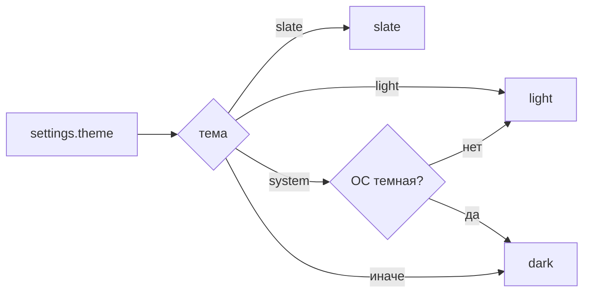

# 🎨 Темы

Документ описывает темы браузера: набор, резолв, применение к сайтам и внутренним страницам.

## 🧩 Набор тем

Поддерживаются `dark`, `light`, `system`, `slate`. Хранение идет в `settingsStore.ts`, shell читает через `useTheme.ts`, оверлей через payload, внутренние страницы через `getSettings`.

## 🔄 Резолв

`system` резолвится в `dark` или `light`: main через `nativeTheme`, renderer и страницы через `matchMedia`. `slate` остается собой везде, кроме сайтов, где маппится в `dark` color-scheme.

## 🌐 Сайты

`browserTheme.ts` прокидывает `color-scheme` через `insertCSS` во все view. Работает только для сайтов, уважающих `prefers-color-scheme`. Смена темы ОС при `system` пересчитывается через `nativeTheme.updated`.

## 📄 Внутренние страницы

`konstruktor://` читают тему при загрузке и ставят `dataset.theme`. При смене настроек main проставляет тему вживую через `executeJavaScript` без перезагрузки. Новая вкладка получает текущую тему сразу через `applyThemeToTab`.
