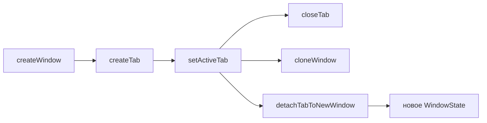
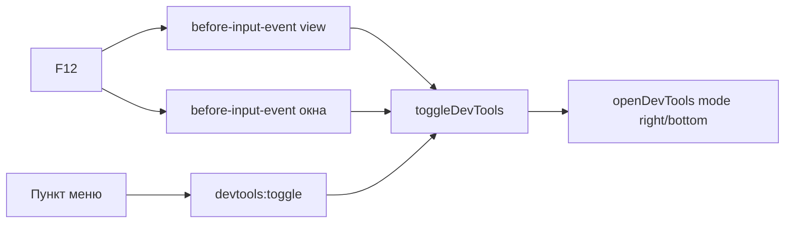

# 🖥️ Окна и вкладки

Документ описывает окна браузера и вкладки: состояние, жизненный цикл, меню окна, перетаскивание, layout, сессии, fullscreen, инкогнито.

## 📐 Архитектура

`browserState.ts` хранит типы `WindowState` и `TabData`, пул `windows`, партиции `persist:konstruktor` и `incognito-mem`. Поиск вкладки идет через `findTab`, окно-родитель через `parentOfTab`, id выдает `allocTabId`.

Окна живут в `windows/`: `windowsManager.ts` (`createWindow`, `layoutView`, `layoutActiveView`, `startWindowDrag`, `snapshotSessionTabs`), F11-сценарий и сброс контентного режима — в `fullscreen.ts` (`toggleFullscreenMode`, `clearContentFullscreen`), меню окна — в `windowMenu.ts`. Вкладки и панель живут в `tabs/`: `tabsManager.ts` (`createTab`, `setActiveTab`, `closeTab`, `cloneWindow`, `detachTabToNewWindow`, `pushTabsState`), шаблоны групп — в `groupsStore.ts`, экземпляры — в `groupsInstances.ts`, меню групп — в `groupsMenu.ts`. Общее ядро — `browserState.ts` (типы и пул окон) и `windows/deps.ts`, связывающий оба кластера через deps (createTab/createWindow без циклов); каналы держат `tabs/tabsIpc.ts`, `windows/windowIpc.ts`, `tabs/tabsMenu.ts` и `windows/browserMenu.ts` — `index.ts` только собирает `register*Ipc`.



## 📋 Панель вкладок

Порядок панели задают `stripOrder` и `pinnedStripOrder` (`stripOrder.ts` — `ensureStripToken`, `removeStripToken`, `moveStripToken`, `reorderStrip`, `rebuildStripFromTabs`; инвариант проверяет `checkStripInvariant`). Токены двух сортов: `t:<id>` для вкладок и `g:<instanceId>` для корневых групп — одного ранга, чередуются свободно.

Вложенные группы (`parentInstanceId`) в ряд не входят, рисуются внутри родителя. Вкладка без группы лежит в `stripOrder`; вкладка внутри группы токена не имеет. `createTab` кладёт токен вкладки, уход вкладки в группу его убирает, создание и открытие группы кладут токен группы. Нарушение инварианта даёт невидимую группу или дубль в ряду.

`tabs:reorder` принимает токены единого ряда и синхронизирует `tabOrder` по нему.

### 📎 Minimize

Пункт меню `Minimize` ставит флаг `pinned` без перемещения вкладки: свернутая вкладка схлопывается до иконки и остается на своем месте в общем ряду. Отдельной закрепленной зоны для вкладок нет, `pinnedStripOrder` хранит только закрепленные группы.

## 🗂 Группы вкладок

Шаблон группы живет в `groups.json` (`groupsStore.ts`), открытые экземпляры — в `groupsInstances.ts`. Вкладка ссылаетеея на экземпляр через `groupId`, группа хранит `urls` и `children` — вложенность без циклов.

Один шаблон открывается несколько раз, у каждого открытия свой `instanceId`, вложенность открытых экземпляров — через `parentInstanceId`. Пустой экземпляр исчезает с панели вкладок, минимальная группа содержит одну вкладку. Закрепление на панели закладок — флаг `pinned`: незакрепленная группа живет только на панели вкладок, пока открыта.

Мутации шаблонов рассылаются через `groups:changed` моментально, без ожидания `tabs:state`. Меню заголовка группы: создать группу, переименовать, цвет, иконка, вложить в другую группу, закрепить на закладках, закрыть вкладки, разгруппировать, перенести вкладки в другую группу, удалить.

## � Открытие ссылок

`setWindowOpenHandler` на view перехватывает `window.open` и клики по `target="_blank"`. Http/https и `konstruktor://` открывает вкладкой в том же окне через `createTab` — системный браузер не участвует. Не-http схемы (`mailto:`, `tel:`) уходят в `shell.openExternal`: в вкладку их не загрузить.

## �🖥️ Меню окна

ПКМ по кнопкам навигации открывает меню окна: `windowMenu.ts`, вид оверлея `window-menu`, компонент `WindowMenu.vue`.

Состав: **Open new window, Clone window, Minimize, Maximize|Restore, Close**. Maximize и Restore взаимоисключающие — в меню присутствует ровно один, по состоянию окна.

- **Open new window** — `createWindow({ restoreSession: false })`: окно только со стартовой страницей. Флаг обязателен: `sessionTabs` в settings — общий слот на всё приложение, а не слот конкретного окна, и без флага новое окно подхватывало бы вкладки чужого.
- **Clone window** — `cloneWindow` в `tabsManager.ts`: копирует группы и вкладки в новое окно, исходные остаются на месте. В отличие от `detachTabToNewWindow`, который **переносит** `WebContentsView` (одна view принадлежит одному родителю, и `addChildView` в второе окно её оттуда заберёт), клон создаёт свои view с той же партицией — с той же историей и кэшем. Новое окно сдвинуто от исходного, иначе два окна легли бы друг на друга.

Копирование внутри `cloneWindow` идёт в строгом порядке:

1. Группы — до вкладок, потому что вкладки ссылаются на `instanceId`, и группа, появившаяся позже, оставила бы ссылку в пустоте. `instanceId` сохраняется, чтобы вкладка вела в копию той же группы.
2. Вкладки — в порядке `tabOrder` исходного окна. `createTab` кладёт токен в ряд сам, а для вкладки с группой он убирается через `removeStripToken`.
3. Порядок панели — через `reorderStrip`, куда передаётся порядок исходного окна с подменёнными токенами вкладок `t:<исходный> → t:<копия>`. Без этого шага ряд строился бы заново: группы добавляются первыми, вкладки докладываются в конец, и группа, стоявшая в исходном окне последней, оказалась бы первой.

## 🖱️ Контекстные меню страницы

ПКМ по сайту (и Shift+F10) открывает overlay-меню `kind: 'menu'` — системный `Menu.popup` проект не использует. Хук `context-menu` висит на `view.webContents` в `createTab` (`tabs/tabsManager.ts`), пункты и действия — в `tabs/pageMenu.ts` (`buildPageMenu` + `showPageContextMenu`), действия «открыть вкладкой/окном» и инспектор собирает `windows/deps.ts` (`pageMenuDeps`).

```mermaid
flowchart LR
  View[view.webContents<br/>context-menu] --> PM[pageMenu.ts]
  PM -->|buildPageMenu| Items[OverlayMenuItem[]]
  PM -->|showOverlay kind: menu| OV[overlay-окно]
  OV -->|onSelect| Act[действия в main]
  Act --> WC[webContents<br/>clipboard, download, навигация]
```

Приоритет контекста — цепочка Chrome: `isEditable` → `linkURL` → `mediaType === 'image'` → `selectionText` → страница. Пункт не показывается, если контекст его не даёт: редактируемые поля меню не получают (Cut/Copy/Paste через `editFlags` — вторая фаза), внутренние страницы `konstruktor://` отсекаются до показа.

| Контекст | Пункты |
|---|---|
| Страница | Back (disabled без истории), Forward, Reload, Save page as, Print |
| Изображение | Open image in new tab/new window, Save image as, Copy image address |
| Выделение | Copy |
| Ссылка | Open link in new tab/new window, Save link as, Copy link address, Copy link text |

Общий хвост добавляется один раз: разделитель, `Search`, View page source, Inspect. Подпись поиска — без пояснений: ни названия движка, ни текста запроса в пункте нет. Аргумент поиска: выделение → текст ссылки → URL страницы; пробелы нормализуются, но текст не обрезается — иначе обрезка уходила в сам запрос. Движок и `%s` берутся из `searchEngine` (`getSettingsSync()`) в момент выбора, то есть поиск идёт движком браузера из настроек (меню своего движка не имеет), запрос открывается в той же вкладке. Пункты «открыть вкладкой/окном» показываются только для схем `http`, `https`, `konstruktor`, `file` — `javascript:` и прочие скрываются при сборке. `Save link as` и `Save image as` уходят в `downloadURL` → тот же конвейер `will-download` (downloads.json и тост), `Save page as` — `dialog.showSaveDialog` + `savePage(path, 'HTMLComplete')` со своим тостом, `Print` — `wc.print()`, `Inspect` — `inspectElementAt` (`tabs/devtools.ts`): `toggleDevTools`, если панель закрыта, затем `inspectElement(x, y)`.

Состояние перечитывается в момент показа и в момент действия через `findTab(tabId)`: замыкание хука хранит только id, а `tabs:attach`/`detach` переносят view между окнами — ид вкладки стабилен при переезде, ws — нет.

Якорь — `view.getBounds() + params.{x, y}` в координатах content-области окна, кламп в `workArea` уже в `overlay/geometry.ts`. `params.x/y` приходят в DIP viewport вызвавшего вида и не меняются при зуме (проверено на 80/100/150%), при прокрутке и из iframe — координаты считаются от основного вида даже для сабфрейма. Клавиатурный вызов приходит тем же событием `context-menu` с `menuSourceType: 'keyboard'`.

Ограничение: один оверлей на родителя — ПКМ по странице при открытой панели поиска закрывает панель поиска. Согласовано с инвариантом системы, стек меню поверх поиска — вторая фаза.

Подписи пунктов — ключи `pageMenu.*` (`src/shared/i18n/locales/*.json`), поэтому меню следует за языком интерфейса: `t()` синхронен после `initI18n()` и собирается в момент показа, как у `getSettingsSync()`.

## 👉 Перетаскивание окна

Окно тащит `onTitleMouseDown` в `App.vue`: `mousedown` с принуждением на ЛКМ → `screenX/screenY` → `setBounds` (`startWindowDrag` / `moveWindowDrag` / `endWindowDrag` в `windowsManager.ts`). Заголовок не помечен `-webkit-app-region: drag`, потому что drag-область на Windows перехватывает правый клик и отдаёт его системному меню окна: событие до renderer не доходит, отменить его нечем. Из-за этого контекстное меню панели открывалось только на кнопке «+» — она `no-drag`.

- Координаты экранные (`screenX`), а не `clientX`: окно двигается по экрану, а `client` отсчитывается от области содержимого.
- `window:drag-start` — `sendSync`, не `invoke`: ответ нужен синхронно, до первого `mousemove`, иначе окно дёрнется на первом кадре.
- Двойной клик по пустой области заголовка разворачивает окно (`onTitleDblClick`).
- Окно развёрнутое или в fullscreen мышью не двигается.

`contextmenu` после снятия drag-области доходит до renderer штатно, поэтому зоны меню объявлены явно:

| Зона | Меню |
|---|---|
`.tab` | меню вкладки |
`.tabgroup-head` | меню группы |
`.tabgroup`, `.tabgroup-body` | меню группы |
`.strip-filler`, `.tabstrip` | меню панели |

## 🎨 Оформление меню

Все меню рисует один компонент `MenuList.vue`: вкладки, группы, панель, браузер, окно. Клавиатурная навигация — roving tabindex, а не `tabindex` на каждом пункте, иначе Tab перебирал бы все пункты подряд.

Разделители реализованы и не используются: контракт `MenuItem.separator` (`shared/overlay-types.ts`), отрисовка `<div class="menu-separator" role="separator">`. Разделитель не получает фокус — `selectable` его исключает, поэтому стрелки его перешагивают. Включается пунктом `{ id: 'sep-N', label: '', icon: '', separator: true }`.

## 📏 Оверлеи

Меню, диалоги, панель поиска, тосты и меню окна рисует окно оверлея (`overlay/`), а не DOM: поверх `WebContentsView` рисовать нельзя. Виды разбирает реестр `registry.ts`, размеры и позиция считает `geometry.ts`, состояние уровней живёт в `session.ts`.

## � DevTools страницы

F12 открывает Chrome DevTools для открытой веб-страницы — то есть для `WebContentsView` вкладки, а не для интерфейса браузера. Логика в `devtools.ts` (`toggleDevTools`, `closeDevToolsFor`, `devToolsStateOf`), точки входа: `before-input-event` view, `before-input-event` окна, `devtools:toggle`, пункт меню браузера.



Точки входа дублируются намеренно: `before-input-event` стреляет только в том `webContents`, который сейчас в фокусе, поэтому F12 из адресной строки или панели вкладок без обработчика окна не сработал бы. В фокусе самого DevTools Chromium обрабатывает F12 сам — там событие не доходит, закрывает панель штатно.

Определяющий факт реализации: `WebContentsView` в Electron — обёртка над `InspectableWebContentsView`, где уже есть пара «страница + DevTools» и разметка дока с разделителем и ресайзом. Док-нутые DevTools рисует Chromium сам, деля bounds view между контентом и панелью, поэтому `layoutView` в layout не вмешивается. Побочный эффект тот же, что и у обычного дока: при пересчёте `setBounds` содержимое страницы сужается вместе с панелью.

`setDevToolsWebContents` не используется — он переводит DevTools в `detach` с отдельным системным окном, а докнуть панель в собственный `BrowserWindow` или оверлей-окно нельзя: там нет `InspectableWebContentsView`, который Chromium ждёт для разметки дока.

Сторона дока на первом открытии выбирается по геометрии view: узкое окно (меньше 480 px) или высокое (высота больше 3/4 ширины) — док вниз, иначе вправо, как в Chrome. Дальше Chromium переключает док сам при ресайзе. Режимы `detach` и `undocked` не используются: это отдельное окно поверх окна, другой UX.

Состояние лежит в `TabData.devTools` и в `TabRecord.devToolsOpen`. Оно принадлежит конкретной вкладке, поэтому смена активной вкладки панель не закрывает — она остаётся открытой на своей вкладке. `pushTabsState` берёт признак не из записи, а опросом `isDevToolsOpened()`: панель закрывается не только через F12, но и крестиком в самом DevTools, и запись без такой подстраховки протухала бы. Подписки `devtools-opened` и `devtools-closed` в `createTab` держат запись в синхроне. Закрытие панели при закрытии вкладки и при переключении инкогнито делает `closeDevToolsFor` — до уничтожения `webContents`, иначе состояние уходит вместе с view молча.

## 📖 Layout

Renderer сообщает отступы UI через `layout:update`. `layoutView` ставит `WebContentsView` в свободную область, `layoutActiveView` пересчитывает активную view. В контентном fullscreen отступы игнорируются.

## 💾 Сессии и геометрия

Слепок вкладок строит `snapshotSessionTabs`, запись идет через `persistSessionTabs`, чтение — `restoreSessionTabs` (до 50 вкладок, пропуская битые URL и `about:blank`). Геометрия окна пишется с debounce при `resized` и `moved`. Холодный старт читает файл синхронно через `readSettingsFileSync`. Восстановление сессии выключается настройкой `rememberTabs`.

## 📱 Fullscreen

Сценарий выбирает `toggleFullscreenMode` из `windows/fullscreen.ts`. Режим `window` разворачивает все окно, режим `content` прячет панели и растягивает view. Исконные bounds лежат в `savedBounds` и возвращаются при выходе. Выход из fullscreen не через F11 (Esc, Win-жесты) тоже сбрасывает контентный режим (`clearContentFullscreen`).

## 🕵️ Инкогнито

Окно целиком приватное: in-memory партиция, история не пишется и не читается, сессия вкладок не сохраняется и не восстанавливается. При закрытии storage и кэш чистятся. Клон инкогнито-окна остаётся инкогнито.