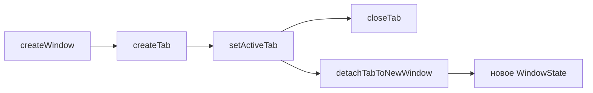

# 🖥️ Окна и вкладки

Документ описывает окна браузера и вкладки: состояние, жизненный цикл, layout, сессии, fullscreen, инкогнито.

## 🧩 Состояние

`browserState.ts` хранит типы `WindowState` и `TabData`, пул `windows`, партиции `persist:konstruktor` и `incognito-mem`. Поиск вкладки идет через `findTab`, окно-родитель через `parentOfTab`. Id выдает `allocTabId`.

## 🔄 Жизненный цикл

Окна живут в `windowsManager.ts` (`createWindow`, `layoutView`, `toggleFullscreenMode`, сессии и bounds), вкладки — в `tabsManager.ts` (`createTab`, `setActiveTab`, `closeTab`, `detachTabToNewWindow`, `pushTabsState`). `index.ts` только связывает их через deps и держит IPC-роутер. Активная вкладка переключается через `setActiveTab`, закрывается через `closeTab`. Вынос вкладки создает новое окно через `detachTabToNewWindow`, втягивание чужой вкладки идет через `tabs:attach`. Меню самой панели (мимо вкладок) открывает `tabs:strip-context-menu`: создать вкладку, создать группу, закрыть все.

## 📁 Группы вкладок

Шаблон живет в `groups.json` (`groupsStore.ts`), экземпляры — в `groupsInstances.ts` (`openInstance`, `toggleCollapse`, `togglePin`), меню — в `groupsMenu.ts`, роутер `groups:*` — в `groupsManager.ts`. Вкладка ссылается на экземпляр через `groupId`. Группа содержит вкладки (`urls`) и другие группы (`children`) — вложенность без циклов. Закрепление на панели закладок — флаг `pinned`: незакрепленная группа живет только на панели вкладок, пока открыта. Один шаблон открывается несколько раз, у каждого открытия свой `instanceId`, вложенность открытых экземпляров — через `parentInstanceId`. Пустой экземпляр исчезает с панели вкладок. Минимум 1 вкладка: пустая группа открывается со стартовой. Мутации шаблонов рассылаются через `groups:changed` моментально, без ожидания `tabs:state`. Меню заголовка группы: создать группу, переименовать, цвет, иконка, вложить в другую группу, закрепить на закладках, закрыть вкладки, разгруппировать, перенести вкладки в другую группу.

## 🧮 Единый ряд панели

Корневые группы того же ранга, что вкладки: порядок задают `stripOrder` и `pinnedStripOrder` (`stripOrder.ts` — `ensure/remove/move/reorder`, инвариант проверяет `checkStripInvariant`) — токены `t:<id>` и `g:<instanceId>`. Вложенные группы (`parentInstanceId`) в ряд не входят, рисуются внутри родителя. `createTab` кладет токен вкладки, уход вкладки в группу его убирает; создание и открытие группы кладет токен группы. `tabs:reorder` принимает токены единого ряда, `tabOrder` синхронизируется с рядом. Меню вкладки `Add to group` показывает открытые корневые экземпляры и закрепленные шаблоны из закладок с заданными именем, иконкой и цветом; `Remove from group` показывается только для вкладки в открытой группе.

## 🔽 Minimize вкладок

Пункт меню `Minimize` ставит флаг `pinned` без перемещения вкладки: свернутая вкладка схлопывается до иконки и остается на своем месте в общем ряду. Отдельной закрепленной зоны для вкладок нет, `pinnedStripOrder` хранит только закрепленные группы.

## 📐 Layout

Renderer сообщает отступы UI через `layout:update`. `layoutView` ставит `WebContentsView` в свободную область, `layoutActiveView` пересчитывает активную view. В контентном fullscreen отступы игнорируются.

## 💾 Сессии и геометрия

Слепок вкладок строит `snapshotSessionTabs`, запись идет через `persistSessionTabs`. Геометрия окна пишется с debounce при `resized` и `moved`. Холодный старт читает файл синхронно через `readSettingsFileSync`.

## 🖥️ Fullscreen

Сценарий выбирает `toggleFullscreenMode`. Режим `window` разворачивает все окно, режим `content` прячет панели и растягивает view. Исконные bounds лежат в `savedBounds` и возвращаются при выходе.

## 🕵️ Инкогнито

Окно целиком приватное: in-memory партиция, история не пишется и не читается, сессия вкладок не сохраняется. При закрытии storage и кэш чистятся.
