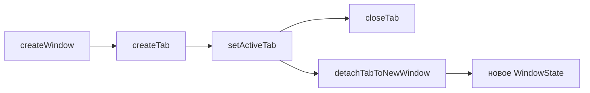

# 🖥️ Окна и вкладки

Документ описывает окна браузера и вкладки: состояние, жизненный цикл, layout, сессии, fullscreen, инкогнито.

## 🧩 Состояние

`browserState.ts` хранит типы `WindowState` и `TabData`, пул `windows`, партиции `persist:konstruktor` и `incognito-mem`. Поиск вкладки идет через `findTab`, окно-родитель через `parentOfTab`. Id выдает `allocTabId`.

## 🔄 Жизненный цикл

`index.ts` создает окно через `createWindow`, вкладку через `createTab`. Активная вкладка переключается через `setActiveTab`, закрывается через `closeTab`. Вынос вкладки создает новое окно через `detachTabToNewWindow`, втягивание чужой вкладки идет через `tabs:attach`. Меню самой панели (мимо вкладок) открывает `tabs:strip-context-menu`: создать вкладку, закрыть все.

## 📐 Layout

Renderer сообщает отступы UI через `layout:update`. `layoutView` ставит `WebContentsView` в свободную область, `layoutActiveView` пересчитывает активную view. В контентном fullscreen отступы игнорируются.

## 💾 Сессии и геометрия

Слепок вкладок строит `snapshotSessionTabs`, запись идет через `persistSessionTabs`. Геометрия окна пишется с debounce при `resized` и `moved`. Холодный старт читает файл синхронно через `readSettingsFileSync`.

## 🖥️ Fullscreen

Сценарий выбирает `toggleFullscreenMode`. Режим `window` разворачивает все окно, режим `content` прячет панели и растягивает view. Исконные bounds лежат в `savedBounds` и возвращаются при выходе.

## 🕵️ Инкогнито

Окно целиком приватное: in-memory партиция, история не пишется и не читается, сессия вкладок не сохраняется. При закрытии storage и кэш чистятся.
