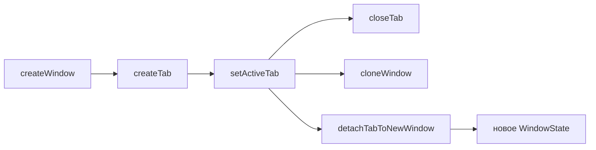

# 🖥️ Окна и вкладки

Документ описывает окна браузера и вкладки: состояние, жизненный цикл, меню окна, перетаскивание, layout, сессии, fullscreen, инкогнито.

## 📐 Архитектура

`browserState.ts` хранит типы `WindowState` и `TabData`, пул `windows`, партиции `persist:konstruktor` и `incognito-mem`. Поиск вкладки идет через `findTab`, окно-родитель через `parentOfTab`, id выдает `allocTabId`.

Окна живут в `windowsManager.ts` (`createWindow`, `layoutView`, `layoutActiveView`, `toggleFullscreenMode`, `startWindowDrag`, `snapshotSessionTabs`), вкладки — в `tabsManager.ts` (`createTab`, `setActiveTab`, `closeTab`, `cloneWindow`, `detachTabToNewWindow`, `pushTabsState`), шаблоны групп — в `groupsStore.ts`, экземпляры — в `groupsInstances.ts`, меню групп — в `groupsMenu.ts`, меню окна — в `windowMenu.ts`. `index.ts` связывает их через deps и держит IPC-роутер.

## 📋 Панель вкладок

Порядок панели задают `stripOrder` и `pinnedStripOrder` (`stripOrder.ts` — `ensureStripToken`, `removeStripToken`, `moveStripToken`, `reorderStrip`, `rebuildStripFromTabs`; инвариант проверяет `checkStripInvariant`). Токены двух сортов: `t:<id>` для вкладок и `g:<instanceId>` для корневых групп — одного ранга, чередуются свободно.

Вложенные группы (`parentInstanceId`) в ряд не входят, рисуются внутри родителя. Вкладка без группы лежит в `stripOrder`; вкладка внутри группы токена не имеет. `createTab` кладёт токен вкладки, уход вкладки в группу его убирает, создание и открытие группы кладут токен группы. Нарушение инварианта даёт невидимую группу или дубль в ряду.

`tabs:reorder` принимает токены единого ряда и синхронизирует `tabOrder` по нему.

### 📎 Minimize

Пункт меню `Minimize` ставит флаг `pinned` без перемещения вкладки: свернутая вкладка схлопывается до иконки и остается на своем месте в общем ряду. Отдельной закрепленной зоны для вкладок нет, `pinnedStripOrder` хранит только закрепленные группы.

## 🗂 Группы вкладок

Шаблон группы живет в `groups.json` (`groupsStore.ts`), открытые экземпляры — в `groupsInstances.ts`. Вкладка ссылаетеея на экземпляр через `groupId`, группа хранит `urls` и `children` — вложенность без циклов.

Один шаблон открывается несколько раз, у каждого открытия свой `instanceId`, вложенность открытых экземпляров — через `parentInstanceId`. Пустой экземпляр исчезает с панели вкладок, минимальная группа содержит одну вкладку. Закрепление на панели закладок — флаг `pinned`: незакрепленная группа живет только на панели вкладок, пока открыта.

Мутации шаблонов рассылаются через `groups:changed` моментально, без ожидания `tabs:state`. Меню заголовка группы: создать группу, переименовать, цвет, иконка, вложить в другую группу, закрепить на закладках, закрыть вкладки, разгруппировать, перенести вкладки в другую группу, удалить.

## 🖥️ Меню окна

ПКМ по кнопкам навигации открывает меню окна: `windowMenu.ts`, вид оверлея `window-menu`, компонент `WindowMenu.vue`.

Состав: **Open new window, Clone window, Minimize, Maximize|Restore, Close**. Maximize и Restore взаимоисключающие — в меню присутствует ровно один, по состоянию окна.

- **Open new window** — `createWindow({ restoreSession: false })`: окно только со стартовой страницей. Флаг обязателен: `sessionTabs` в settings — общий слот на всё приложение, а не слот конкретного окна, и без флага новое окно подхватывало бы вкладки чужого.
- **Clone window** — `cloneWindow` в `tabsManager.ts`: копирует группы и вкладки в новое окно, исходные остаются на месте. В отличие от `detachTabToNewWindow`, который **переносит** `WebContentsView` (одна view принадлежит одному родителю, и `addChildView` в второе окно её оттуда заберёт), клон создаёт свои view с той же партицией — с той же историей и кэшем. Новое окно сдвинуто от исходного, иначе два окна легли бы друг на друга.

Копирование внутри `cloneWindow` идёт в строгом порядке:

1. Группы — до вкладок, потому что вкладки ссылаются на `instanceId`, и группа, появившаяся позже, оставила бы ссылку в пустоте. `instanceId` сохраняется, чтобы вкладка вела в копию той же группы.
2. Вкладки — в порядке `tabOrder` исходного окна. `createTab` кладёт токен в ряд сам, а для вкладки с группой он убирается через `removeStripToken`.
3. Порядок панели — через `reorderStrip`, куда передаётся порядок исходного окна с подменёнными токенами вкладок `t:<исходный> → t:<копия>`. Без этого шага ряд строился бы заново: группы добавляются первыми, вкладки докладываются в конец, и группа, стоявшая в исходном окне последней, оказалась бы первой.

## 👉 Перетаскивание окна

Окно тащит `onTitleMouseDown` в `App.vue`: `mousedown` с принуждением на ЛКМ → `screenX/screenY` → `setBounds` (`startWindowDrag` / `moveWindowDrag` / `endWindowDrag` в `windowsManager.ts`). Заголовок не помечен `-webkit-app-region: drag`, потому что drag-область на Windows перехватывает правый клик и отдаёт его системному меню окна: событие до renderer не доходит, отменить его нечем. Из-за этого контекстное меню панели открывалось только на кнопке «+» — она `no-drag`.

- Координаты экранные (`screenX`), а не `clientX`: окно двигается по экрану, а `client` отсчитывается от области содержимого.
- `window:drag-start` — `sendSync`, не `invoke`: ответ нужен синхронно, до первого `mousemove`, иначе окно дёрнется на первом кадре.
- Двойной клик по пустой области заголовка разворачивает окно (`onTitleDblClick`).
- Окно развёрнутое или в fullscreen мышью не двигается.

`contextmenu` после снятия drag-области доходит до renderer штатно, поэтому зоны меню объявлены явно:

| Зона | Меню |
|---|---|
`.tab` | меню вкладки |
`.tabgroup-head` | меню группы |
`.tabgroup`, `.tabgroup-body` | меню группы |
`.strip-filler`, `.tabstrip` | меню панели |

## 🎨 Оформление меню

Все меню рисует один компонент `MenuList.vue`: вкладки, группы, панель, браузер, окно. Клавиатурная навигация — roving tabindex, а не `tabindex` на каждом пункте, иначе Tab перебирал бы все пункты подряд.

Разделители реализованы и не используются: контракт `MenuItem.separator` (`shared/overlay-types.ts`), отрисовка `
`. Разделитель не получает фокус — `selectable` его исключает, поэтому стрелки его перешагивают. Включается пунктом `{ id: 'sep-N', label: '', icon: '', separator: true }`.

## 📏 Оверлеи

Меню, диалоги, панель поиска, тосты и меню окна рисует окно оверлея (`overlay/`), а не DOM: поверх `WebContentsView` рисовать нельзя. Виды разбирает реестр `registry.ts`, размеры и позиция считает `geometry.ts`, состояние уровней живёт в `session.ts`.

## 📐 Layout

Renderer сообщает отступы UI через `layout:update`. `layoutView` ставит `WebContentsView` в свободную область, `layoutActiveView` пересчитывает активную view. В контентном fullscreen отступы игнорируются.

## 💾 Сессии и геометрия

Слепок вкладок строит `snapshotSessionTabs`, запись идет через `persistSessionTabs`, чтение — `restoreSessionTabs` (до 50 вкладок, пропуская битые URL и `about:blank`). Геометрия окна пишется с debounce при `resized` и `moved`. Холодный старт читает файл синхронно через `readSettingsFileSync`. Восстановление сессии выключается настройкой `rememberTabs`.

## 📱 Fullscreen

Сценарий выбирает `toggleFullscreenMode`. Режим `window` разворачивает все окно, режим `content` прячет панели и растягивает view. Исконные bounds лежат в `savedBounds` и возвращаются при выходе. Выход из fullscreen не через F11 (Esc, Win-жесты) тоже сбрасывает контентный режим.

## 🕵️ Инкогнито

Окно целиком приватное: in-memory партиция, история не пишется и не читается, сессия вкладок не сохраняется и не восстанавливается. При закрытии storage и кэш чистятся. Клон инкогнито-окна остаётся инкогнито.