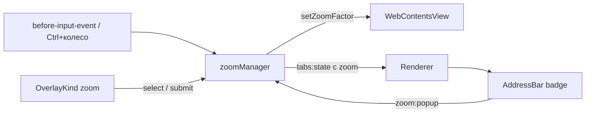

# 🔬 Масштаб страницы

Документ описывает зум веб-страницы: ядро в `zoomManager.ts`, лестницу процентов, клавиши и колесо, бейдж в адресной строке, попап оверлея и края на навигацию/вкладки.

## 🎯 Общее

Зум живет на `webContents` вкладки и управляется в процентах: `webContents.setZoomFactor(percent / 100)`. Политика выбирается настройкой (см. «Режимы зума»): per-origin или per-tab. Процент читается опросом `getZoomFactor()` при каждом пуше `pushTabsState`, поэтому badge не может разойтись со страницей.

## 🧭 Режимы зума

Две настройки на странице `konstruktor://settings`:

- **Page zoom** (`zoomMode`) — политика `webContents.setZoomMode`. `origin` (по умолчанию) — per-origin Chromium: вкладки одного сайта делят масштаб, значение хранится в partition и переживает перезапуск. `tab` — `isolated`: зум принадлежит вкладке, не наследуется по URL, переживает навигации внутри вкладки (документированное поведение isolated) и умирает вместе с ней — новая вкладка с тем же адресом стартует со 100%, закрытие вкладки и есть сброс. `setZoomMode` применяется и к уже открытым view при смене настройки (sweep в `settings:save`).
- **Same zoom for all tabs** (`zoomSync`) — один процент на все вкладки всех окон. Любое изменение идет через `applyZoomToWs`: при включенной галке цикл применяет ко всем вкладкам и пушит каждый window; новые вкладки открываются с последнего процента. Включение настройки сразу выравнивает существующие вкладки по активной.

Требование: `setZoomMode` появился в Electron 44 (PR #49962) — проект на 44.5.1, ниже этого API нет (в 41 метод отсутствует и в типах, и в рантайме).

Грабль: `setZoomFactor` **до** загрузки страницы не применяется (замер: `getZoomFactor()` до `did-finish-load` возвращает 1). Поэтому seed единого зума в `createTab` вешается на `did-finish-load`, а не вызывается сразу; там же он перебивает origin-значение нового сайта при каждой навигации.

## 📐 Лестница

`ZOOM_LADDER = 25, 33, 50, 67, 75, 80, 90, 100, 110, 125, 150, 175, 200, 250, 300, 400, 500`. Шаг `ladderStep(percent, dir)` идет по ближайшей ступени сверху/снизу; текущее значение может в лестницу не попадать (ручной ввод 137), тогда `+` ведет на 150, а `−` — на 125. Ручной ввод клампится `clampPercent` в `[25, 500]` с округлением до целого — это границы Chromium: `setZoomFactor` сам клампит в 0.25..5.0 (25..500%), и значение вне диапазона молча становится краем, поэтому ниже 25 и выше 500 отдать нечего. `setZoom` возвращает опрошенный `getZoomFactor`, а не запрошенное: на краю шкалы возвращаемое значение — это реально стоящий процент. Проценты целые намеренно: дробные в badge выглядят как баг, а округление на каждом шаге копило бы ошибку.

## ⌨️ Триггеры

- `Ctrl/Cmd + = / - / 0` — `before-input-event` view (`tabsManager.ts`) и окна (`windowsManager.ts`). Обе точки обязательны: событие стреляет только в focused `webContents`, и без дубля зум из адресной строки не срабатывал бы. Разбор по `input.code` (физическая клавиша), не по `key`: раскладка, см. `TROUBLESHOOTING.md` «Ctrl+F и раскладка». `shift` для зума не исключается — на части раскладок `+` дает Shift+Equal.
- `Ctrl+колесо` — событие `zoom-changed` view. Electron зум сам не применяет: content шлет делегату запрос, а реализация Electron только испускает событие (в Chrome на этом месте `IDC_ZOOM_PLUS`). Поэтому лестница применяется прямо в обработчике, а `pushTabsState` синхронизирует badge.
- Pinch-zoom отключен: `setVisualZoomLevelLimits(1, 1)` на view при создании — визуальный зум со своей шкалой спорил бы с процентным.

Дедупликации с `App.vue` нет намеренно: обработчики окна вызывают `preventDefault`, и `keydown` до renderer не доходит — дубль дал бы два шага лестницы за одно нажатие.

## 🏷️ Бейдж

`AddressBar.vue` держит кнопку `🔬 N%` справа от кнопки поиска, `v-if="zoomPercent !== 100"`. `zoomPercent` — вычисляемое из `tabs`/`activeTabId` (поле `zoom` в `TabInfo`), реактивное через общий `tabs:state`. Сброс к 100 гасит бейдж, и `url-input` снова занимает ширину через `flex: 1`; инсеты layout не задеты — `layoutEngine` меряет высоту панели. Класс `menu-trigger` на кнопке гасит dismiss по клику, закрытие/открытие делает toggle по `toggleKey: 'zoom-badge'`.

## 🪟 Попап

Новый оверлей-вид `zoom`: геометрия `geometry.ts` (`align: 'anchor-end'`, правый край под правым краем бейджа), контракт `ZoomModel { percent }` в `shared/overlay-types.ts`, компонент `renderer/overlay/ZoomPopup.vue` в реестре. Поле ввода первое в DOM (его ловит `focusTopLevel`) и второе визуально через flex `order` — кадр `− N% + ↺`, сброс символом в том же стиле, что и `−`/`+`.

Команды переиспользуют существующий `OverlayCommand` без роста типов: `select` (`zoom-in`/`zoom-out`/`zoom-reset`) и `submit` (ручной процент). `select` держит попап открытым через `holdOnSelect` и шлет патч `overlay:update { zoom: { percent } }`, `submit` применяет процент и закрывает сессию. Поле попапа синхронизируется со страницей из `syncZoomPopup` внутри `pushTabsState`: любое изменение зума — клавиши, Ctrl+колесо, IPC, кнопки самого попапа — проходит через этот пуш, поэтому поле не отстает при зуме колесом с открытым попапом. Закрытие попапа — Esc (глобальный слушатель оверлея), клик по shell или странице (`isDismissableMenuLike`), повторный клик по бейджу, переключение вкладки.

## 🧩 Края

- **Навигация** — в режиме `origin` зум применяет и сбрасывает сам partition, `did-navigate` ничего не дублирует (пуш после навигации приводит badge в соответствие); в режиме `tab` isolated переживает навигации сам; при включенном `zoomSync` seed перебивает процент на каждой загрузке.
- **Дублирование/клон/инкогнито** — режим `origin`: копия наследует per-origin процент через партицию. Режим `tab`: новый `webContents` изолирован и открывается со 100% (кроме `zoomSync` — там seed). Detach/attach переносит view целиком, процент переезжает с ней в любом режиме.
- **Ручной IPC** — `zoom:in`/`zoom:out`/`zoom:reset`/`zoom:set(percent)` работают по активной вкладке и возвращают примененный процент; `zoom:popup` принимает якорь от renderer. Все каналы идут через `applyZoomToWs`/`stepActiveZoom` — режим единого зума не дублируется по точкам входа.

## 🔎 Отладка

У зума отдельного флага нет. Попап попадает в общий `OVERLAY_DEBUG=1 npm run dev`: в логах строки `open(zoom, …)` и `close` с `kind=zoom`. Процент страницы проверяется в DevTools shell-окна: `await window.browserAPI.zoomOut()` → `getZoomFactor()` уменьшился, `await window.browserAPI.zoomSet(137)` → ровно 137.
