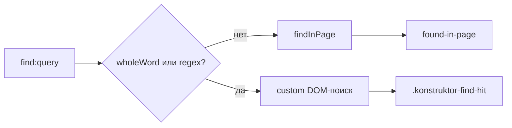

# 🔍 Поиск по странице

Документ описывает поиск по странице: панель, обычный и собственный поиск, подсветку, счетчик.

## 🧩 Панель

`findManager.ts` открывает панель через `openFindOverlay`. Повторный вызов при открытой панели считается no-op. Точки входа: `before-input-event` view, Ctrl+F shell, `find:open`. Закрытие идет через `closeFind` с чисткой подсветки.

Точки входа дублируются в двух местах — на view и на окне — по одной причине: `before-input-event` стреляет только в том `webContents`, который в фокусе, поэтому Ctrl+F из адресной строки иначе не сработал бы. Тот же приём используется для F11 и F12.

## 🔤 Обычный поиск

Подстрока с `matchCase` идет через `webContents.findInPage`. Навигация идет через `nextFind` и `prevFind` с флагом `findNext`. Состояние хранится в `lastFindText` и `lastFindFlags`.

## 🧬 Собственный поиск

`wholeWord` и `useRegex` идут через `runCustomFind`: TreeWalker по текстовым узлам, границы слов через Unicode-классы, подсветка спанами `.konstruktor-find-hit`. Шаг идет через `stepCustomFind`, снятие через `clearCustomFind`.

## 🧱 JS-инъекции

`findScripts.ts` собирает все шаблоны `executeJavaScript`: счетчик `found-in-page`, установка темы страницы, запуск, шаг и чистка custom-поиска. Main только подставляет параметры через `JSON.stringify`.

## 🔢 Счетчик

Обычный поиск обновляет панель через событие `found-in-page`. Собственный поиск обновляет `.find-count` напрямую после каждого шага. Пустой запрос чистит выделение, битый regex показывает `Invalid expression`.

## 🛠️ Проблемы и решения

Накопленные грабли этого модуля: причина → следствие.

### ⌨️ Ctrl+F и раскладка

`input.key` зависит от раскладки (русская `а` = `KeyF`): проверять `input.code === 'KeyF'`. `before-input-event` не стреляет при фокусе в omnibox/devtools — дублировать через `win.webContents.on('before-input-event')`.
