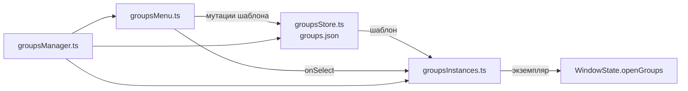

# 🗂️ Группы вкладок

Документ описывает группы вкладок: чем шаблон группы отличается от открытого экземпляра, как группы вкладываются, закрепляются и сворачиваются, как ими управлять через меню заголовка.

Обзор места групп среди вкладок — в [TABS.md](../tabs/TABS.md); здесь детали системы.

## 📐 Архитектура

Шаблоны групп живут в `groupsStore.ts` (`groups.json` в userData), открытые экземпляры — в `groupsInstances.ts` (мутация `WindowState.openGroups` и вкладок), контекстное меню — в `groupsMenu.ts`, каналы `groups:*` — в `groupsManager.ts` (тонкий роутер). Авторские вкладки `groupId` ссылается на экземпляр; шаблон хранит `urls` и `children`.

## 🗃️ Шаблоны

`SavedGroup` — запись шаблона: `id` вида `g<N>`, `name`, `icon`, `color`, `urls`, `children`, `pinned`. Список лежит в `groups.json`, кэшируется в памяти и пишется целиком после каждой мутации.

- Имя обрезается; пустое откатывается к текущему (`updateSavedGroup`) или к `Group` (`createSavedGroup`).
- Минимум одна вкладка: пустой `urls` заменяется на `konstruktor://start` — группа без вкладок не открывается.
- `about:blank` из `urls` отсеивается при создании и обновлении.
- Счётчик `id` продолжается после максимального сохранённого при загрузке.
- Миграция старого формата: отсутствующие `children` добиваются пустым списком, `pinned` — значением `true`.
- `children` фильтруются: нельзя вложить группу в саму себя и ссылаться на несуществующий `id`.

## 🧩 Открытые экземпляры

Один шаблон открывается сколько угодно раз: у каждого открытия свой `instanceId` вида `i<N>` (`allocInstance`). Запись `WindowState.openGroups` хранит `instanceId`, `savedId`, `collapsed`, `pinned`, `parentInstanceId`.

`openInstance` рекурсивно разворачивает шаблон: сам экземпляр, затем его вкладки (каждая — `createTab` с последующей привязкой `groupId` и снятием токена вкладки) и рекурсивно дочерние группы с `parentInstanceId`. `createAndOpen` делает то же для нового шаблона.

`syncSavedUrls` перезаписывает `urls` шаблона фактическими адресами вкладок экземпляра — набор вкладок группы и её шаблон держатся синхронно. Пустой экземпляр снимается с панели через `pruneEmptyGroup`: минимальная группа содержит одну вкладку.

## 🌲 Вложенность

Вложенность есть на двух уровнях: `children` у шаблона и `parentInstanceId` у открытого экземпляра. Циклы запрещены — перед вложением DFS (`reaches` в `groupsManager.ts` и `groupsMenu.ts`) проверяет, что целевой родитель не достижим из вкладываемой группы.

В единый ряд (`stripOrder`) попадают только корневые группы — у них нет `parentInstanceId`, и им выдаётся токен `g:<instanceId>`. Вложенные экземпляры токена не имеют и рисуются внутри родителя. Переходы между уровнями делают `promoteToRoot` (вернуть токен) и `demoteToChild` (снять токен).

## 📌 Закрепление и сворачивание

Три независимых состояния, которые легко перепутать:

| Состояние | Где живёт | Что делает |
|---|---|---|
| `pinned` экземпляра | `openGroups` (`togglePin`) | Корневая группа уходит в закреплённую зону ряда (`moveStripToken`) |
| `pinned` шаблона | `SavedGroup` (`toggle-bookmark-pin`) | Шаблон показывается на панели закладок, даже когда группа закрыта |
| `collapsed` экземпляра | `openGroups` (`toggleCollapse`) | Группа прячет view своих вкладок, кроме активной |

Сворачивание скрывает view всех вкладок группы, кроме активной: иначе свёрнутая группа с активной вкладкой оставила бы пустой экран.

## 🖱️ Меню заголовка

`showGroupContextMenu` собирает меню `kind: 'menu'`: создать группу, переименовать, цвет, иконка, вложить в группу, закрепить/открепить на закладках, закрыть вкладки, разгруппировать, удалить, а также перенести вкладки (пункт появляется только когда есть другие экземпляры).

- Подпись закрепления зависит от состояния шаблона (`groups.menu.pinToBookmarks` / `unpinFromBookmarks`) и берётся асинхронно из store.
- Переименование и цвет открывают центральный диалог (`kind: 'dialog'`), иконка — общий диалог (`kind: 'icon'`).
- «Перенести вкладки» и «Вложить в группу» открывают второй уровень — меню выбора цели. Кандидаты на вложение исключают саму группу и её потомков.
- `onSelect` синхронный, поэтому асинхронные ветки уходят в `void`-промисы, перечитывая состояние окна перед мутацией.
- Удаление шаблона действует на все окна: экземпляры снимаются, вкладки разгруппировываются и продолжают жить.

## 🔌 Каналы

| Канал | Действие |
|---|---|
| `groups:list` | Список шаблонов |
| `groups:create` | Создать шаблон и открыть экземпляр |
| `groups:open` | Открыть шаблон новым экземпляром |
| `groups:rename` / `groups:set-color` / `groups:set-icon` | Правка шаблона |
| `groups:delete` | Удалить шаблон, разгруппировать открытые экземпляры |
| `groups:toggle-collapse` / `groups:toggle-pin` | Состояние экземпляра |
| `groups:toggle-bookmark-pin` | Закрепление шаблона на панели закладок |
| `groups:nest` / `groups:unnest` | Вложить группу в группу и вынуть обратно |
| `groups:add-tab` / `groups:remove-tab` | Вкладка входит в группу и выходит из неё |
| `groups:ungroup` | Разгруппировать экземпляр |
| `groups:close-tabs` | Закрыть все вкладки экземпляра |
| `groups:move-tabs` | Перенести вкладки в другой экземпляр |
| `groups:context-menu` | Показать меню заголовка |

Мутации шаблонов рассылаются каналом `groups:changed` во все окна моментально, не дожидаясь `tabs:state`.

## 🎨 Renderer

Shell держит `openGroups` и `savedGroups` в `core/useTabs.ts`: первые приходят в `tabs:state`, вторые — через `listGroups` и подписку `groups:changed`. Узел группы рисует `TabGroupNode.vue` — рекурсивный компонент: заголовок слева, вкладки и дочерние группы справа в линию. Панель закладок (`BookmarksBar.vue`) показывает закреплённые шаблоны, в том числе когда группа закрыта.

## 🛠️ Проблемы и решения

Накопленные грабли этого модуля: причина → следствие.

### 👻 Забытый токен даёт невидимую группу

Инвариант единого ряда: у корневой группы ровно один токен `g:<instanceId>` в ровно одной зоне. Любая мутация, меняющая вложенность или принадлежность вкладки, обязана токен снять (`removeStripToken`) или поставить (`ensureStripToken`) в том же обработчике. Пропущенный шаг даёт группу без токена — она не рисуется в панели, хотя занимает место в состоянии (баг `New Group` со stray-токеном `t:`). Проверка инварианта — `checkStripInvariant` в `tabs/stripOrder.ts`.
