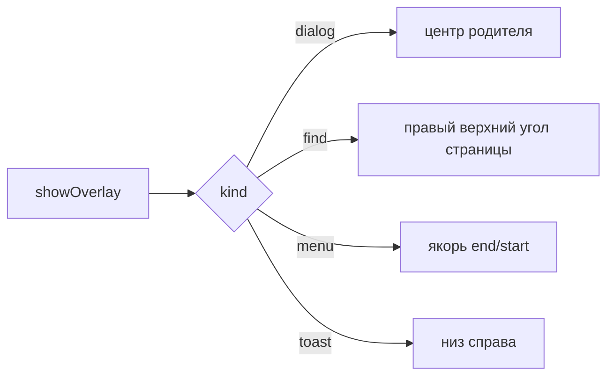

# 💬 Оверлей-окна

Документ описывает overlay-окна main: виды панелей, позиционирование, фокус, жизненный цикл, отладку.

Логика показа, закрытие сессий, команды renderer'а, геометрия, пул окон и каналы разложены по модулям папки `overlay/`; точка входа для потребителей — `overlay/index.ts`. Накопленные грабли — в разделе «Проблемы и решения» ниже.

## 🧩 Виды панелей

Сервис поддерживает kinds `menu`, `toast`, `dialog`, `find`, `icon`, `window-menu`, `zoom`. Меню показывает пункты и инкогнито-бейдж, тост показывает завершение загрузки, диалог запрашивает ввод, диалог иконки принимает URL, путь к файлу или emoji с верификацией типа (`iconVerify.ts` — `verifyIconSource`/`verifyEmojiButton`), поиск висит над страницей, попап зума управляет масштабом страницы у бейджа в адресной строке.

Компонент для каждого вида выбирается из реестра `renderer/overlay/registry.ts` по `model.view`, поэтому новая поверхность добавляется регистрацией компонента, а не правкой корня.

Виды с общим контрактом гашения собирает `isDismissableMenuLike` (menu, window-menu, zoom): повторный клик-тогл по триггеру, клик мимо по shell/странице и запоминание `lastClosed` проходят через неё. Зум-попап в списке обязателен: без него он не закрывался бы кликом по странице либо закрывался при каждом `+`. Команды `select` попапа дополнительно держат сессию открытой через `holdOnSelect` — `+`/`−`/`Reset` обновляют процент патчем `overlay:update` вместо закрытия.

## 📐 Позиционирование и размер

Позиция и размер поверхности описываются декларативно в `geometry.ts` (`SurfaceSpec` на вид: ширина и чем она задаётся, высота, выравнивание, отступ) и считаются функцией `resolveBounds()` с разворотом меню у края экрана.

Диалог центрируется по родителю. Поиск встает в правый верхний угль области страницы ниже верхней панели. Меню встает от якоря с выравниванием `end` или `start`. Тост — в правый нижний. Координаты клампятся в `workArea` дисплея **родителя**, а не в объединённую область: на Linux `workArea.x` отрицателен для левого монитора, и арифметика в положительных координатах уводила окно на соседний дисплей.



**Размер приходит из renderer, а не из формулы.** Компонент меряет свой элемент поверхности через `ResizeObserver` и шлёт `overlay:measured`; main клампит и применяет через `applyMeasured`. Пункт занимает 46 px (padding 9+9, строка 14, border 1), и измерение снимается вместо расчёта, поэтому смена темы или системного шрифта размер не ломает.

**Чем задаётся ширина — отдельное поле, а не следствие выравнивания.** `sizing: 'content'` — окно равно карточке: измерение задаёт ширину в пределах `width`, нижнюю границу держит `minWidth` (меню, попап зума, тост). `sizing: 'fixed'` — ширина из замысла, измерение уточняет только высоту (диалог, иконка, панель поиска). Тост обязан быть `'content'`: уровень в renderer позиционируется по ЛЕВОМУ краю окна, поэтому окно шире карточки оставляет справа пустую полосу, и карточка уезжает от правого края на разницу ширин.

Меряется `firstElementChild` поверхности, а не `.overlay-root`: корень растянут на всё окно и мерял бы размер окна, то есть сам бы себе противоречил.

Пока размер не пришёл, окно получает запасной размер (потолок `spec.width`) — он заметно шире настоящего, поэтому при `align: 'end'` левая сторона прыгает после замера.

## ⌨️ Фокус

Окно создается с `focusable: true`, иначе панель поиска не держит ввод. Меню и панель поиска забирают фокус явно (`focus()`), остальные виды открываются через `showInactive()`. Диалоги фокус берут автофокусом поля ввода, тост фокуса не берёт вовсе.

Явный `focus()` обязателен для клавиатурной навигации: оверлей открывается без фокуса, и без вызова стрелки не доходят до renderer. Клик по меню тоже сработал бы, но активирует окно — то есть фокус даёт первый клик, а не открытие.

Из-за `focusable: true` оверлей остаётся в цепочке Alt+Tab, и Windows при возврате в приложение отдаёт фокус **ему**, а не родителю. Окно при этом прозрачное и пустое, но живое: клавиши уходят в его `webContents`, где `before-input-event` не слушается. Поэтому при возврате фокус переадресуется родителю.

Фокус возвращается и при закрытии оверлея — иначе повторный Ctrl+F не сработал бы, пока пользователь не кликнет по странице. Возврат выполняется не всегда, а только если фокус сейчас наш: иначе мы бы выкинули пользователя из чужого приложения.

## 🎚️ Видимость вместо show/hide

Окно живёт постоянно, а видимость меняется прозрачностью:

| Действие | Реализация |
|----------|-----------|
| Показать | `setOpacity(1)` |
| Скрыть | `setOpacity(0)` + `setIgnoreMouseEvents(true)` + размонтирование содержимого |

Окно показывается один раз за жизнь — на прогреве при старте, сразу с `setOpacity(0)`.

**Скрытие обеспечивают три независимых слоя.** Размонтирование содержимого через `v-if` в renderer, прозрачность окна и `setIgnoreMouseEvents(true)`. Каждый закрывает свою часть: окно может оказаться в любой точке экрана, и прозрачный кадр виден там, где пустой DOM не виден вовсе.

Окно остаётся на своих координатах и не перемещается при скрытии.

**На Linux `setOpacity` не действует**, поэтому содержимое снимается размонтированием, а размонтирование асинхронно. Перед перемещением окна main дожидается подтверждения, что содержимое убрано из DOM (`awaitUnmounted`, канал `overlay:unmounted`).

## 🔄 Показ по подтверждению

Показ выполняется только после подтверждения отрисовки от renderer: до сигнала `overlay:painted` окно прозрачно, иначе видны пункты предыдущего меню.

```ts
win.setOpacity(0)                    // погасить
win.setBounds({ x, y, w, h })        // потом переставить
pushPayload(win, message)            // данные через overlay:push
setContentUnmounted(win, false)      // renderer снимает v-if
const painted = await overlayPainted(win, token)
if (!painted) { abortPresent(win, parent, token); return }
win.setOpacity(1)                    // и только теперь видно
```

Если подтверждения не пришло, показ отменяется и оверлей возвращается в пул: показ вслепую дал бы пустое окно без ошибок в логах.

Push несёт тему, флаг анимаций и язык интерфейса (`PushMessage.language`, код из реестра LANGUAGES). Renderer применяет язык до отрисовки стека — FindBar и диалог иконки монтируются уже на нём. Каталоги вшиты в бандл, поэтому `changeLanguage` отрабатывает синхронно (см. [I18N.md](../../shared/i18n/I18N.md)).

Таймаут ожидания разделён надвое: `PAINT_BUDGET_MS` (60 мс) — только лог, показ не трогаем; `PAINT_TIMEOUT_MS` (1000 мс) — настоящая страховка для случая «renderer не ответит никогда». Разделение принципиально: пока ждём, окно прозрачно и пусто, поэтому ожидание не ощущается — оно целиком уходит на паузу **до** появления меню. Короткий таймаут ловит не поломку, а медленный кадр, и отменяет показ, который вот-вот был бы показан.

## 🔄 Жизненный цикл

На родителя жив один оверлей: новый вытесняет старый. Выбор уходит через `resolveOverlaySelect`, ввод через `resolveOverlaySubmit`, отмена через `resolveOverlayDismiss`, отмена диалога иконки — `resolveOverlaySubmitIcon`.

Оверлей закрывается при потере родителя: движение, ресайз, сворачивание и переключение на чужое окно. Пока содержимое размонтировано, эти слушатели игнорируются — иначе собственные `setBounds` при показе закрывают только что открытое меню.

Переключение на другое приложение ловится на том окне, которое **фактически держало фокус**: и на родителе, и на самом оверлее. Слушать только родителя мало — при открытой панели поиска фокус держит оверлей, родитель потерял его ещё при открытии, и его `blur` при Alt+Tab не приходит вовсе. Признак один: фокус ушло в чужое приложение, а не в наше второе окно.

Повторный клик по той же кнопке-триггеру закрывает её меню: сравнивается `toggleKey` активного запроса. Контекстные меню (правый клик) ключа не имеют и всегда просто показываются.

Клик в любом другом месте гасит меню: по вкладке, адресной строке, панели закладок и по самой странице. Меню живёт в отдельном окне, поэтому shell и view-preload (`preload/view/internal.ts`) ловят `mousedown` и отправляют `menu:dismiss-on-shell-click`. Закрывается только `kind: 'menu'` — диалоги и панель поиска живут своей логикой. Клик по самому триггеру `☰` не гасит меню, иначе `toggle` сломался бы.

Оверлей принадлежит прежней вкладке, поэтому при переключении вкладки он закрывается — и закрывается **до** переключения. Иначе возврат фокуса отдал бы его родителю, а переключение тут же забрало бы фокус у вкладки, и наоборот.

## 🔐 Сессии и защита от гонок

Каждое открытие увеличивает `sessionId`. Токен едет в каждой команде и проверяется на трёх сторонах: renderer отбрасывает запоздалые `push` и `update`, `ipc.ts` отсекает команду до вызова обработчика и отвечает `false`, а `session.ts` сверяет токен в `resolveOverlay*`.

Окно из пула одно на все сессии, поэтому без сверки счётчик от прошлого поиска появился бы в текущем, а команда для закрытой сессии применилась бы к новой.

## 🗄️ Стек вложенности

Сессии хранятся стеком на родителя (`session.ts`), геометрия считает объединение уровней, контракт несёт `stack: StackEntry[]` со сдвигом каждого уровня, renderer рисует уровни друг над другом.

При `NESTED_DIALOGS = false` в `showOverlay` стек всегда глубиной 1: диалог иконки вытесняет меню вкладки. Флаг включает второй уровень — диалог поверх меню; условие под ним написано, и все проверки по токену, геометрии уровней и фокусу уже работают на любой глубине.

## 🧪 Отладка

Логи включаются переменной окружения, читается один раз при старте:

```bash
# Подробно: каждое событие
OVERLAY_DEBUG=1 npm run dev

# Максимально подробно
OVERLAY_DEBUG=2 npm run dev

# Без переменной — terse: только открытия, закрытия и ошибки
```

Категории: `pool`, `session`, `command`, `geometry`, `perf`, `lifecycle`, `error`. Полный список флагов окружения и средств отладки — в [DIAGNOSTICS.md](../docs/DIAGNOSTICS.md).

Пример вывода:
```
[overlay:pool     ] prewarming window { parentId: 1 }
[overlay:perf     ] prewarm: 358.0ms { parentId: 1 }
[overlay:pool     ] reusing pooled window { parentId: 1, kind: 'menu' }
[overlay:geometry ] resolved { x: 351, y: 279, width: 260, height: 340 }
[overlay:lifecycle] [trace] push sessionId=1 no-anim=true anims=[] count=0 { windowId: 2 }
[overlay:perf     ] open(menu, reused): 30.3ms
[overlay:session  ] closing { parentId: 1, kind: 'menu' }
```

Страница оверлея грузится **один раз за жизнь окна**, данные приходят через `overlay:push`. Значение `loadCount: 1` в логах — признак того, что навигация не вернулась; рост означает, что оверлей снова перезагружает страницу вместо обновления по IPC.

Диагностический приём: `waited for unmount confirm` и `unmount confirm timeout` показывают, отработала ли синхронизация размонтирования перед перемещением окна. Второе — повод разбираться, а не норма.

## 🛠️ Проблемы и решения

Накопленные грабли этого модуля: причина → следствие.

### 🖥️ WebContentsView вне DOM

View — нативный слой вне DOM: поверх сайта ничего не нарисовать из renderer. Меню, диалоги, поиск — только отдельными прозрачными окнами (`overlayManager.ts`). `z-index` и CSS поверх view не работают никогда.

### 🖥️ Анимация появления окон (DWM)

Windows анимирует появление и скрытие frameless-окна; длительность берётся из настройки «Анимированные элементы управления и элементы внутри окна» (~200 мс).

- `setOpacity`, `prefers-reduced-motion` и настройка приложения на неё не влияют
- **Прогрев не помогает**: DWM анимирует каждый цикл show/hide, а не только первый. Показ со `opacity: 0` на старте не «расходует» анимацию
- **Работает только отказ от `show()`/`hide()`**. Окно живёт постоянно: показ = `setBounds` реальными координатами + `setOpacity(1)`, скрытие = `setOpacity(0)` + размонтирование содержимого. `showInactive()` вызывается ровно один раз за жизнь окна, на прогреве

### 🔔 Событие готовности окна: dev ≠ prod

| Сценарий | Навигация | Событие |
|---|---|---|
| dev (`loadURL` на Vite, смена hash) | same-document | `did-navigate-in-page` |
| prod (`loadFile` с hash) | полный reload | `did-finish-load` |
| новое окно | первая загрузка | `ready-to-show` |

Слушатели вешать **до** `load` — иначе на быстром кэше событие приходит раньше подписки. Оба слушателя обязательно снимать в обработчике: не сработавший `once` висит до следующей навигации, и Electron ругается на `MaxListenersExceededWarning` (лимит 10 на WebContents).

### 👻 Вспышка старого содержимого при смене меню

Показ по подтверждению от renderer, иначе в окне видны пункты предыдущего меню:

1. main: `setOpacity(0)` **до любого** `setBounds` с реальными координатами
2. main: `overlay:push` с payload сессии — renderer применяет его реактивно, без навигации
3. main: `setContentUnmounted(win, false)` → renderer снимает `v-if`
4. main: `setOpacity(1)` только после `overlay:painted`

Токен = `++sessionCounter`, подтверждения устаревших сессий игнорируются.

**Фазы `ready` не существует.** Раньше она ждала `hashchange`; на шаге 4 навигация ушла, а вместе с ней и отдельное подтверждение применения payload: страница загружается один раз, renderer уже смонтирован и слушает `overlay:push`. Осталась одна фаза — `painted`.

**Страховки отменяют показ, а не показывают вслепую.** Раньше по таймауту окно просто показывалось, и пользователь получал пустое непрозрачное окно **без единой ошибки в логах**: push уходил в `webContents` без документа и молча пропадал. Теперь `waitPageReady` и `overlayPainted` возвращают `boolean`, и по `false` `abortPresent` гасит окно и снимает сессию.

### ✨ Прозрачность включать только после отрисовки

`setContentUnmounted(win, false)` — асинхронный IPC. Между вызовом и применением `v-if` в renderer проходит **кадр**. Если сразу после него вернуть `setOpacity(1)`, возникает кадр, где окно уже на реальных координатах, уже непрозрачное, но ещё со **старым** содержимым — это и есть вспышка. Чем реже она видна, тем больше повезло с таймингами: баг гончный, а не постоянный.

Решение — не возвращать прозрачность, пока renderer не подтвердит, что кадр отдан:

```ts
win.setBounds({ x, y, width, height })
win.setIgnoreMouseEvents(false)
setContentUnmounted(win, false)
await overlayPainted(win, token)   // ждём overlay:painted
win.setOpacity(1)                 // и только теперь видимо
```

Renderer подтверждает после **двух** `requestAnimationFrame` от момента применения `parked = false`: первый кадр — DOM обновлён, второй — кадр реально отдан. Один `rAF` недостаточен, он срабатывает до применения `v-if`.

Страховка по таймеру обязательна: зависшее прозрачное меню хуже крохотной вспышки, поэтому по таймауту показываем как есть.

**Общий принцип порядка операций:**

| Действие | Порядок |
|---|---|
| Парковка | содержимое → прозрачность → ввод → перемещение |
| Показ | координаты → ввод → содержимое → **ждём кадр** → прозрачность |

### 🎯️ Мигание старого меню на Linux

`setOpacity(0)` на Windows гасит окно мгновенно, на Linux композитор успевает показать кадр — пользователь видит пункты предыдущего меню на новом месте.

Правило: **`setOpacity(0)` не является защитой**. Пока renderer не подтвердил отрисовку, содержимое должно быть размонтировано, а окно — просто прозрачным.

Отсюда порядок показа: размонтировать → реальные координаты → дождаться подтверждения payload → вернуть содержимое → дождаться кадра → `setOpacity(1)`. Пока содержимого нет, окно пустое и мигать нечему.

### 🧪 Ложная диагностика анимаций

`document.getAnimations()`, измеренный через `requestAnimationFrame` **после применения payload**, показывает `count=0` — анимация к этому моменту уже завершилась. Анимации нет только если её нет и на первом кадре: проверять нужно сразу при монтировании либо отключать системную анимацию Windows и сравнивать.

### 🖥️ Парковка координатами: работала, но устарела

**Координатная парковка больше не выполняется.** `PARK_MOVES_WINDOW = false`, функции `parkPosition` / `parkOffscreen` / `parkOnParentDisplay` помечены `@deprecated` и выведены из использования.

#### 🛖 Почему отключили

Замеры по фазам открытия показали: задержка первого открытия целиком в фазе `paint` и равна ровно одному кадру. Причина — **переезд между дисплеями**, а не парковка как таковая. Парковка в пределах дисплея родителя убирала задержку (16.6 → 3.8 мс), и полное отключение перемещения давало тот же результат (3.9 мс). Позиция сверх размонтирования не добавляет ничего.

#### 🗜 Почему парковка вообще появилась

`PARK = { x: -32000, y: -32000 }` работает только на одном мониторе: при мониторе **слева** (x < 0) эта точка попадает в его рабочую область.

Даже вычисление от `min(workArea.x) - 2000` **не помогает**: WM Linux клампит координаты `parent`-связанного окна в рабочую область ближайшего дисплея. Окно оказывается на соседнем мониторе, и парковка превращается в «показать на другом экране».

**`setBounds` за экран — это просьба, а не команда.** WM вправе её проигнорировать, и на практике проигнорирует: в тестах срабатывала в 9 случаях из 10, на десятый раз окно оставалось на экране и мелькало. Отсюда «иногда моргает, иногда нет» — это не разные сценарии, а гонка с оконным менеджером.

Именно поэтому `parkOffscreen` проверял результат:

1. Пробуем увести с реальным размером, читаем `getBounds()`
2. Проверяем пересечение с `workArea` всех дисплеев (`intersectsWorkArea`)
3. Если окно всё ещё на экране — повторяем крохотным, `1x1`, и ещё дальше
4. Если и это не сработало — пишем в лог, чтобы это было видно, а не ловилось на глаз

#### 🔐 Что реально скрывает содержимое

Парковка выполняется в порядке «сначала опустошить, потом перемещать»:

```ts
setContentUnmounted(overlay, true)                    // 1. убрать содержимое
overlay.setOpacity(0)                                 // 2. погасить прозрачность
overlay.setIgnoreMouseEvents(true, { forward: false }) // 3. выключить ввод
// перемещение — устарело, отключено
```

Даже если WM положит окно куда угодно, рисовать нечего.

**Скрытие держится на трёх независимых слоях:**

| Слой | Что делает |
|---|---|
| `setIgnoreMouseEvents(true)` | Окно не перехватывает клики — **главный слой** |
| `overlay:park` + `v-if` | Содержимое убрано из рендера, пустой DOM не виден нигде |
| `pointer-events: none` | Полноэкранный `.overlay-root` перестаёт быть мишенью мыши |

`setOpacity(0)` — дополнительно, на Linux не гарантия.

### 🖱 Парковать нужно полностью, а не только прозрачностью

Ветка переиспользования окна (блок `parked while loading` внутри `showOverlay`) вызывала только `setOpacity(0)` и `setBounds`. Этого **не хватало**: припаркованный оверлей оставался кликабельным, его `onBackdrop` ловил mousedown и слал `dismiss` — отсюда цикл открытий и моргание на втором мониторе.

Полный набор — три независимых слоя, любой достаточен:

```ts
overlay.setIgnoreMouseEvents(true, { forward: false })  // ввод
overlay.setOpacity(0)                                   // прозрачность
setContentUnmounted(overlay, true)                      // содержимое
```

Обе ветки парковки обязаны делать одно и то же. Забыть `setIgnoreMouseEvents` в одной из них — и цикл `dismiss` вернётся только в этом сценарии.

### 🔄 Парковка и события родителя

`setBounds(parkBounds(...))` двигает окно оверлея, а на нём висят слушатели `parent.move`/`resize`. Без проверки `parked.has(parent.id)` каждое движение родителя засоряет лог и закрывает активное меню в момент установки bounds.

### 📐 `getBounds()` не показывает, куда WM положил окно

Проверка «увести окно за экран и убедиться» через `getBounds()` **бесполезна**: Electron возвращает запрошенные координаты, а не фактические. Окно можно в этот момент находиться на втором мониторе, и проверка скажет «всё хорошо».

Ориентироваться надо не на результат `setBounds`, а на **порядок операций**: сначала опустошить окно, и только потом перемещать. Тогда неважно, куда WM его положит, — рисовать нечего.

### 🖥️ Переезд между дисплеями стоит один кадр

Парковка за объединённую рабочую область уводила окно на **другой** дисплей. В логах видно сразу:

```
after park:  displayId 3452793496   <- дисплей парковки
resolved:    displayId 1203119769   <- дисплей родителя
```

При возврате на целевой дисплей композитор **пересоздаёт поверхность**, и первый кадр приходит с задержкой ровно в один кадр (16.6 мс при 60 Гц).

**Прогрев это не покрывает.** `prewarm` ждёт `ready-to-show`, но ни одного кадра в истории окна не существует — сохранять нечего.

Диагностика: сравнить `paint` на первом и последующих открытиях. Равные значения — переезда нет.

| Конфигурация парковки | `paint` первого открытия |
|---|---|
| за объединённой рабочей областью (другой дисплей) | 16.6 мс |
| в пределах дисплея родителя | 3.8 мс |
| перемещение отключено полностью | 3.9 мс |

Убирать нужно не парковку, а **смену дисплея**: две последние конфигурации дают одинаковый результат.

### 🕳 Паркованное окно душит requestAnimationFrame

Припаркованное за экран окно композитор считает **скрытым** и не отдаёт ему кадры. `requestAnimationFrame` в таком окне не срабатывает вовсе.

Симптом обманчив: подтверждение отрисовки не приходит, срабатывает таймаут 120 мс, и первое открытие из пула занимает дольше, чем последующие.

**Как распознать:** лог-строка, сама печатающаяся через `rAF`, появляется **после** `paint timeout`. Лог, зависящий от кадров, пришёл позже таймаута — значит кадров не было.

**Решение:** уводить окно за экран **до** подтверждения нельзя. Сначала размонтировать содержимое и погасить прозрачность, потом ставить реальные координаты, и только потом ждать подтверждения. Окно пустое и прозрачное — моргать нечему, а кадровый цикл работает.

Побочный вывод: `v-if`-размонтирование достаточно для защиты от вспышки, координатная парковка для этого не нужна.

### 📮 Буфер push недостижим, если ждать готовности до отправки

`waitPageReady` сам выставляет `pageReady = true` в своём `finish()`. Если `present()` сначала ждёт его, а потом зовёт `pushPayload`, очередь всегда пуста — ветка буферизации **недостижима**.

```ts
// Не работает: очередь всегда пуста
await waitPageReady(win)
pushPayload(win, message)

// Работает: сообщение встаёт в очередь и уйдёт при did-finish-load
pushPayload(win, message)
await waitPageReady(win)
```

Обнаружить это без задержки нельзя: буфер молчит одинаково и когда работает, и когда мёртв. Проверяется только искусственной задержкой загрузки страницы (`OVERLAY_PAGE_LOAD_DELAY_MS`) — в логах должен появиться `flushed buffered overlay payloads`.

Отмена сессии выбрасывает из очереди только своё сообщение — полная очистка снесла бы payload более новой сессии (`dropPendingPush`).

### 👆 Клик мимо меню его не закрывает

Меню живёт в отдельном окне над `WebContentsView` и клика по вкладке, адресной строке или сайту не видит. Пользователь ждёт обычного поведения — меню гаснет.

Оба места ловят `mousedown` в фазе capture и шлют `menu:dismiss-on-shell-click`: shell (`App.vue`) и страница (`preload/view/internal.ts`, работает во всех вкладках, включая инкогнито). Main закрывает **только** `kind: 'menu'` — диалоги и панель поиска живут своей логикой.

Тонкости:

- Ловить `mousedown`, а не `click`: меню должно гаснуть до действия под курсором
- Только ЛКМ (`button === 0`): правый клик открывает меню, его нельзя тут же гасить
- Клик по **триггеру** (☰) гасить нельзя, иначе `toggle` сломался бы: открытие и закрытие пришли бы в одном кадре. Триггер помечен классом `.menu-trigger` и проверяется через `closest()`
- Sender бывает двух видов: webContents окна (клик по shell) и webContents `WebContentsView` (клик по сайту). У второго `BrowserWindow.fromWebContents` вернёт `undefined` — окно ищется через `parentOfSenderView`

### 👻 Эхо открывающего клика

Клик, открывший меню, долетает до `document` shell'а **после** того, как окно оверлея появилось, — и гасит только что открытое меню тем же самым кликом.

Отличать по типу события **бесполезно**: ни `mousedown`, ни `click` от этого не спасают — пока renderer грузит payload и ждёт подтверждения (20–30 мс), исходное событие успевает долететь в оба места.

Отличать надо **по времени**. `active` хранит `openedAt`, а `closeOverlayIfMenu` игнорирует гашения в первые `OPEN_SETTLE_MS` (350 мс — с запасом на медленный prod-перезапуск страницы оверлея).

Побочный эффект, который стоит знать: из-за этого же эха ломался **toggle**. Первый клик по `☰` открывал меню, эхо его тут же закрывало, `active` становился пуст, и второй клик по `☰` уже не видел открытого меню — вместо закрытия происходило новое открытие («моргает и снова открывается»). Починка эха чинит и toggle.

### 🕳 Пустой полноэкранный div всё равно ловит клики

Парковка убирает **содержимое** через `v-if="!parked"`, но корневой `.overlay-root` остаётся: он размером `100vw × 100vh` и всегда перекрывает весь вьюпорт. Пустой полноэкранный div — полноценная мишень, поэтому `setIgnoreMouseEvents` на уровне ОС не спасал: клик по вкладке не доходил до shell, а уходил `overlay:dismiss`. Меню съедало клик и тут же само себя закрывало — в логах `[overlay:command] dismiss` без единого `reusing pooled window`.

Лечится через `pointer-events` в CSS, а не только через `setIgnoreMouseEvents`:

```css
.overlay-root { pointer-events: none; }    /* парк: мишени нет вообще */
.overlay-root.live { pointer-events: auto; } /* показ: пункты кликабельны */
```

Класс `live` ставится реактивно от `parked`. Три слоя работают только вместе: `setIgnoreMouseEvents` (ОС), `pointer-events` (DOM), отсутствие содержимого (`v-if`).

**Но этого недостаточно на Windows без парковки.** Окно лежит точно под курсором с выключенным вводом; Windows всё равно его активирует, родитель теряет фокус, `closeOnBlur` закрывает меню не получив выбора. Лечение — `overlay.isFocused()` в обработчике `blur`, см. следующий раздел.

### 👇 Клик по пункту меню не срабатывает (Linux, меню закрывается тем же кликом)

**Симптом:** меню открывается, но выбор пункта ничего не делает — диалог не
появляется. В логах при этом нет ошибок.

**Диагностика по логу (проверено на живом прогоне):**

```
open(menu, reused): 13.4ms
app left focus -> close overlay { parentId: 1, holderId: 1 }   <- blur РОДИТЕЛЯ
closing { kind: 'menu' }
focus landed on hidden overlay -> parent { overlayId: 2 }      <- фокус ПЕРЕДАН ПОЗЖЕ
shell click { source: 'view' }
```

Порядок строк говорит всё: меню закрылось раньше, чем фокус успел уйти
оверлею.

**Причина.** Клик по меню активирует само окно оверлея — оно `focusable: true`
и лежит под курсором (парковка координатами отключена,
`PARK_MOVES_WINDOW = false`). Родитель теряет фокус, срабатывает `closeOnBlur`.

На Linux активация окна **асинхронна**: в момент blur WM ещё не перевёл фокус
на оверлей, поэтому `getFocusedWindow()` возвращает `null`, и
`closeIfFocusLeftApp` решал, что приложение покинуто. Меню закрывалось тем
самым кликом, которым выбирают пункт, и `mouseup` уходил в уже размонтированное
содержимое. Защита `overlay.isFocused()` стояла только под
`process.platform === 'win32'` — на Windows `isFocused()` синхронен, на Linux
нет.

**Исправление.** Обе проверки blur переведены на отложенную через
`BLUR_SETTLE_MS = 60` и работают на всех платформах:

- `isCurrentSession(parent.id, token)` — за 60 мс сессия могла смениться, и
  тогда blur относится к другой поверхности;
- `overlay.isFocused() || parent.isFocused()` — фокус у нашей поверхности
  значит «уход из приложения» не было;
- 60 мс незаметны при Alt+Tab, но на клик по меню их больше нет — там
  проверка возвращается синхронно и ничего не гасит.

### 🔀 Переключение на другое окно

Сворачивание, движение и ресайз родителя закрывают оверлей, а простое переключение на чужое окно — нет: событий не стреляет, родитель остаётся на месте. Оверлей при этом `alwaysOnTop: true` и висит поверх чужого окна с меню не того приложения.

Ловить нужно **на обоих**: `parent.on('blur')` и `overlay.on('blur')`. Меню открывается через `showInactive()` и само фокуса не берёт, но панель поиска берёт (`focus()`), и тогда blur придёт только оверлею — родитель его уже потерял. Подробно — в разделе «Уход из приложения не ловится на `parent.on('blur')`».

Исключение — намеренная передача фокуса оверлею: панель поиска забирает фокус через `focus()`, диалоги — автофокусом поля ввода. Родитель закономерно его теряет. Проверять надо **по метке времени** (`focusHandoff` + `noteFocusHandoff`), а не по `overlay.isFocused()`: `focus()` на Linux асинхронный, и в момент blur родителя оверлей ещё не успел получить фокус — панель поиска закрывалась бы сразу после открытия.

#### 🔎 Два вида blur нуждаются в разных проверках

**Windows**: если без парковки окно лежит под курсором, клик активирует его, и blur родителя — побочный эффект нажатия, а не переключение пользователя. `overlay.isFocused()` на Windows **синхронный**, поэтому проверка надёжна:

```ts
if (process.platform === 'win32' && overlay.isFocused()) return
```

**Linux**: `focus()` асинхронный, `isFocused()` в момент blur ещё `false` — там нужна временная метка `focusHandoff` (см. выше).

Обе проверки нужны: убрать одну — вернуть баг на соответствующей платформе.

### 🔄 Оверлей не скрывается при переключении на ДРУГОЕ окно браузера

**Симптом:** в первом окне открыто меню, пользователь переключается на второе
окно браузера — меню остаётся висеть поверх него.

**Причина — регрессия от предыдущего исправления.** В `closeIfFocusLeftApp`
было исключение «фокус ушёл в другое наше окно — это переключение внутри
приложения, не трогаем». Оно работало только потому, что проверка была
**мгновенной**: в момент blur ни одно наше окно ещё не успело получить фокус, и
условие не срабатывало. Как только проверку сделали отложенной (предыдущий
пункт), второе окно браузера к этому моменту **уже в фокусе** — исключение
начало срабатывать и оставлять оверлей висеть.

**Исправление.** Исключение сужено до своей поверхности:

```ts
if (focused && !focused.isDestroyed() &&
    (focused.id === holder.id || focused.id === parent.id)) {
  return false
}
```

Фокус в самом оверлее или его родителе — не уход, игнорируем. Чужое
приложение или **другое окно браузера** — наше окно больше не сверху, гасим.

**Общий вывод.** Мгновенная проверка `isFocused()` и отложенная — не
взаимозаменяемые: каждая из них маскирует другую гонку. Отложенная нужна для
перехода фокуса, мгновенная была единственным, что закрывало «ушли в своё
окно». Правило: сначала спрашивать «фокус у НАШЕЙ поверхности?», и только
потом — «ушёл ли он наружу?».

### 🔀 Уход из приложения не ловится на `parent.on('blur')`

Панель поиска забирает фокус через `focus()`. Родитель теряет его **при открытии**, и при Alt+Tab фокус уходит с оверлея — `blur` родителя не приходит вовсе, тот просто не в фокусе. Меню остаётся висеть поверх чужого окна (`alwaysOnTop`).

Сигнал надо брать с окна, которое **фактически держало фокус**: и `parent.on('blur')`, и `overlay.on('blur')` (`onOverlayBlur`).

#### 🚫 `browser-window-blur` не годится

Проверено на живом прогоне: `app.on('browser-window-blur')` срабатывает и когда фокус уходит **собственному** оверлею, а не только когда уходит из приложения. Панель поиска закрывалась сразу после открытия.

Отличить по `getFocusedWindow()` не вышло: в момент срабатывания фокус ещё числится нашим, и признак «фокуса в процессе нет» срабатывал на каждом открытии. Задержка в 80 мс не спасла.

### 🎯️ Возврат из Alt+Tab оседает в скрытом оверлее

Оверлей создан с `focusable: true` — иначе панель поиска не смогла бы забрать фокус на поле ввода. Но пока он в цепочке Alt+Tab, Windows при возврате отдаёт фокус **ему**, а не родителю.

Окно при этом прозрачное и пустое, но живое: клавиши уходят в его `webContents`, где `before-input-event` не слушается. Симптом тот же, что был с повторным Ctrl+F.

Вернуть фокус из фона нельзя — пользователь сам ушёл, и украсть его обратно значило бы выкинуть его из чужого приложения. Поэтому moment «приложение снова на экране» (`browser-window-focus`) используется для **переадресации**: если фокус ушёл в скрытый оверлей, отдаём его родителю.

```ts
app.on('browser-window-focus', (_e, focused) => {
  const parentId = parentOfPooledOverlay(focused.id)   // карта ОКОН, не сессий
  if (parentId === undefined) return
  if (!isContentUnmounted(parentId)) return             // фокус законный
  BrowserWindow.fromId(parentId)?.focus()
})
```

Родителя ищем по карте окон, а не по `active`: после Alt+Tab сессия уже снята, и `active` вернул бы `undefined` именно в том случае, ради которого написан обработчик.

### 🔎 Возврат фокуса при закрытии оверлея

Окно оверлея переживает закрытие (оно в пуле), и если перед закрытием забрало фокус, фокус остаётся в нём. `before-input-event` слушается только на родителе и на view, поэтому Ctrl+F не срабатывает, пока пользователь не кликнет по странице.

Возврат выполняется **не всегда**: только если фокус сейчас наш. Иначе Alt+Tab закрыл бы оверлей и мы бы украли фокус обратно из чужого приложения.

Проверка различается по платформе, и это не формальность:

| Платформа | Признак | Почему |
|---|---|---|
| Windows | `win.isFocused()` | `focus()` синхронен, метка времени не годится |
| Linux | `focusHandoff` по времени | `focus()` асинхронен, `isFocused()` ещё `false` |

**Guard `if (win.isFocused()) return` здесь вреден.** Он выглядит безобидной защитой, но по замеру `isFocused()` уже `true`, и guard отменяет ровно тот вызов, ради которого написан. Условие на `focused()` проверять нельзя: наш интерес — не «в фокусе ли окно», а «доходит ли до нас ввод».

#### 🔍 Как это диагностировать

```powershell
$env:OVERLAY_FOCUS_DEBUG = '1'; npm run dev
```

Логирует `focus: owner` (у кого фокус) и `focus: key` (приход любой клавиши с указанием места: `window:N` или `view-under:N`).

**Ловушка, стоившая четырёх неверных гипотез:** подписка только на `BrowserWindow.getAllWindows()` показывает ложное «ввода нет», потому что `webContents` вкладки в этот список **не входит**. Прежняя диагностика слушала не там, где ввод приходит, и подтверждала любую догадку.

### ⌨️ Esc не доходит до оверлея

Esc обрабатывался только в renderer'е оверлея, но окно открыто через `showInactive()` и само по себе фокуса не имеет — значит клавиши уходят в страницу, а renderer их не видит. Обработчик в renderer'е работал вхолостую.

**Решение:** ловить на родителе через `before-input-event`:

```ts
parent.webContents.on('before-input-event', (event, input) => {
  if (input.type !== 'keyDown' || input.key !== 'Escape') return
  const entry = active.get(parent.id)
  if (!entry) return
  if (entry.request.kind === 'toast') return   // пассивны, не гасим
  event.preventDefault()
  closeOverlay(parent)
})
```

Тосты исключены намеренно: они живут по своему таймеру и пользователем не гасятся. Обработчик в renderer'е оверлея убран, чтобы не осталось двух путей закрытия.

В логах появляется `esc closes overlay { kind }`.

### 💣 Сравнение сессий по `overlay` всегда истинно

`resolveOverlaySelect` проверял `active.get(parentId)?.overlay !== overlay`, рассчитывая сохранить новый оверлей, открытый из `onSelect`. Но окно из пула у всех сессий одно и то же, сравнение всегда истинно и проверка не срабатывала **никогда**.

Из-за этого `Change Icon` открывался только со второго раза: `onSelect` вызывал `showOverlay` с диалогом иконки, а следом `closeOverlay` закрывал его же.

Сравнивать надо `sessionId`: `active` хранит `{ overlay, request, sessionId }`, а `sessionCounter` выдаёт токен до `active.set`.

### 🧩 Сессия пережила смену вкладки: меню от другой страницы

**Симптом:** открыто контекстное меню вкладки, переключились на другую
вкладку — меню осталось и показывает пункты первой страницы.

**Причина:** `setActiveTab` про оверлей ничего не знал. Он переключал
view, но активная сессия оверлея остава прежней, и её `request.onSelect`
замыкание указывало на уже невидимую вкладку. Клик по пункту такого меню
менял favicon у другой записи.

**Исправление:** `closeOverlayOnTabChange` вызывается из
`setActiveTab` ДО переключения. Порядок обязателен:

```
closeOverlayOnTabChange(win, id)   // внутри: restoreFocusToParent -> win.focus()
setActiveTabRaw(ws, deps, id)      // внутри: view.webContents.focus()
```

Обратный порядок отдаёт фокус не той вкладке: `closeOverlay` возвращает
фокус ОКНУ (это его работа после панели поиска и автофокуса поля), а
`setActiveTabRaw` сразу после этого забирает его view — то есть последним
решением остаётся правильное. Наоборот, view не смог бы забрать фокус:
после `closeOverlay` его перебил бы `win.focus()`.

**Как проверить:** откройте контекстное меню вкладки и переключитесь на
другую вкладку. Меню должно исчезнуть, клавиатура — работать сразу (Ctrl+F
открывает панель на НОВОЙ вкладке).

### 🧩 Запоздалая команда применяется к новой сессии

**Симптом:** в логах `STALE, dropped` не появляется никогда, хотя окно
переиспользуется из пула и сессии сменяются быстро. Клик по пункту меню
иногда закрывает другое меню.

**Причина (две разные):**

1. Renderer не отправлял `sessionId` — `OverlayCommand` его требовал, но
   вызовы шли через устаревшие методы preload без токена. Проверять было
   нечего, и `accept()` пропускал всё подряд.
2. Сравнение по объекту окна всегда истинно: окно из пула у всех сессий
   одно и то же. На этом уже поймали баг «Change Icon открывается только
   со второго раза».

**Исправление:** токен едет в каждой команде и сверяется в трёх
местах: `isCommandCurrent` в main, `push` и `update` в renderer.

**Как увидеть `STALE, dropped`:** токены монотонно растут, поэтому гонку
нельзя воспроизвести естественно. Рядом с `applyPayload` в
`OverlayRoot.vue` временно вызовите
`applyPayload({ ...msg, sessionId: msg.sessionId - 1 })` — в логах появится
`STALE, dropped push`, а меню останется прежним. Отладочный вызов убрать.

**Проверка ответа `false`:** `ipc.ts` отвечает `false`, когда команда
отброшена. Если ваш обработчик ждёт `true` и закрывает оверлей сам по
локальной логике — он закроет НОВЫЙ оверлей. Ориентироваться надо на
ответ, а не на локальное предположение.

### 🕳 Утечка сессии при переключении меню без закрытия

При открытии нового оверлея поверх живого `pendingReady.set(parent.id, ...)` **затирает** запись предыдущей сессии по тому же ключу `parentId`.

Старый `resolve` больше нигде не хранится, поэтому его `await` в старом `present()` не завершается никогда: и подтверждение придёт не в него, и таймаут в 150 мс не сработает, потому что найдёт уже новую запись с другим токеном.

Последствия: `perf('open')` и `recordOpen()` для той сессии не вызываются — **статистика занижена**, часть открытий не попадает в счёт. Плюс старое замыкание навсегда удерживает `parent`, `win` и `request`.

Сценарий с промежуточным закрытием от этого защищён: там `closeOverlay` завершает старую сессию синхронно, до `pendingReady.set` новой.

**Как заметить:** число открытий в логах меньше, чем число `reusing pooled window`. Лечится хранением `pendingReady` по токену, а не по `parentId`.

### 🏷 Нативный `select` приходит в IPC как нестроковая команда

**Симптом:** `Error occurred in handler for 'overlay:select': TypeError: id.replace is not a function` без видимой причины — чаще при открытии попапа зума или выделении текста в любом поле поверхности. Без падения сессия могла закрываться сама, без выбора пользователя.

**Причина:** компоненты поверхности не объявляют `defineEmits`, и слушатель `@select` из `OverlayRoot` падает им fallthrough'ем на корень как нативный обработчик. В Chromium событие `select` (выделение текста в `<input>`) **пузырится** — `bubbles=true`, проверено замером. Двойной клик по полю процента зума поднимает `select` до корня, `OverlayRoot.onSelect` получает DOM-`Event` и шлёт его в `overlay:select`; по IPC объект доходит до main, и `id.replace` падает на не-строке. У сессии без `onSelect` (панель поиска) та же команда молча закрыла бы оверлей через `closeOverlay`.

**Решение — три слоя:** типовая проверка `typeof id === 'string'` в `OverlayRoot.onSelect`/`onSubmit` (renderer не шлёт не-строку), такая же в `resolveOverlaySelect`/`resolveOverlaySubmit` (main не падает на чужом IPC), и лог `select with non-string id, ignored` с категорией `error` — без него источник следующего такого события найти неоткуда.

**Как проверить:** открыть попап зума, дважды кликнуть по числу в поле — выделение не должно ничего ломать; Esc после этого закрывает попап штатно.

### 📍 Кнопка File не открывает системный диалог

Оверлей `alwaysOnTop: true`, системный диалог открывается **под** ним — пользователь видит только рамку оверлея. На время выбора снимаем `alwaysOnTop` и возвращаем в `finally`. Паровать окно здесь нельзя — потеряется состояние диалога.

### ⬛ Кнопка Cancel в диалоге иконки

**Корневая причина была не в кнопке.** В `resolveOverlaySelect` переменная `stillSame` вычислялась, но **никогда не использовалась**:

```ts
const stillSame = active.get(parentId)?.sessionId === entry.sessionId
if (parent) closeOverlay(parent)     // stillSame игнорируется
```

После `onSelect`, открывшего новую сессию (меню → диалог иконки), `closeOverlay` закрывал **уже новую** сессию, потому что `active` перезаписан. Диалог жил ноль времени: `open(icon)` завершался успешно, `paint` в норме, и сразу шло `closing { kind: 'icon' }`.

**Как распознать:** в логах `open(...)` успешен, и следом немедленно `closing` — без единого пользовательского действия.

**Решение:** `if (!stillSame) return` — не закрывать новую сессию. В логе появляется `select opened new session, keeping it open`.

Вторая проблема была косметической: `.dialog-btn-ghost` делал Cancel кнопкой-призраком с прозрачным фоном и приглушённым текстом, и на тёмной теме она читалась как текст, а не как кнопка. Модификатор убрали — Cancel стала такая же кнопка, как URL / File / Emoji.

### 📐 Размеры оверлея нельзя считать формулой в main

**Симптом:** меню не влезает по высоте, у него пустота внизу, а длинное
название группы обрезается. Кламп по экрану отсутствует: меню у правого
края уезжает за границу окна.

**Причина.** Размер считался в main формулой
`MENU_PAD + N * MENU_ITEM_H`, где `MENU_ITEM_H = 40`. Это число не имело
никакого отношения к CSS: пункт в реальности занимал 46 px (padding 9+9,
строка 14, border 1), и каждый пункт «съедал» 6 px. Для меню вкладки это
120 px пустоты внизу окна.

**Как распознать.** Сравнить `resolved.height` в логах с числом пунктов
× 46. Если не сходится — формула в main.

**Решение.** Размер снимается с реального DOM через
`ResizeObserver` и приходит в main каналом `overlay:measured`.

**Главная тонкость: мерить нужно НЕ `.overlay-root`.** Корень растянут на
`100vw × 100vh` и меряет размеры ОКНА, а не содержимого. Размер окна main и
без нас знает — получается замкнутый круг, из-за которого размер никогда
не сошёлся бы. Меряется `firstElementChild` поверхности.

### ↩️ «Разворот» меню был сдвигом на 220 px

**Симптом:** контекстное меню у правого края экрана частично уезжает за
границу окна.

**Причина.** Для `align: 'end'` позиция считалась как
`anchor.x - (width - 40)`. Вычитание `width - 40` — это не разворот, а
сдвиг на `260 - 40 = 220` px: правый край меню оказывался на 220 px левее
точки клика вместо того, чтобы совпасть с ней. Клампа по `workArea` не было
вообще — был только зажим в границы родителя.

**Решение.** `resolveBounds()` в `geometry.ts`: сначала правая сторона, затем
проверка «влезает ли справа»; если нет и слева есть — разворот с флагом
`flipped`. Финальный кламп по `workArea` дисплея **родителя**: при
раскладке с окном на левом мониторе `workArea.x` отрицателен, и арифметика
в положительных координатах увела бы окно на соседний дисплей.

### 🔻 Тост: выравнивание и ширина окна

**Симптом:** тост встаёт по верхнему краю, а должен быть в нижнем. Или:
после появления тоста его позиция «плывёт».

**Причина.** Оба сводились к `page-top-right`, а разница только в
вертикали. Работало ровно до того момента, пока высота была константой:
тогда сдвиг «вниз на высоту окна» давал низ. С измерением содержимого
высота стала переменной, и позиция поплыла.

**Решение.** В `SurfaceAlign` добавлен `page-bottom-right`. Тост и панель
поиска больше не делят одно значение.

**Второй слой той же проблемы: окно шире карточки.** После перехода на
выравнивание по углу тост всё равно вставал ЛЕВЕЕ правого края — на
разницу между шириной окна и шириной карточки.

**Причина.** Ширина окна выбиралась по выравниванию, а не по замыслу:
`boundsFromMeasurement()` брала измеренную ширину только для `anchor` и
`anchor-end`, а остальные поверхности считала фиксированными по
`spec.width`. Тост выравнивается по углу ОКНА (`page-bottom-right`) и в это
правило не попадал, поэтому окно оставалось 360 px при карточке около
200 px. Уровень в renderer позиционируется по ЛЕВОМУ краю окна
(`left: offset.x`), значит справа оставалась полоса пустого окна — карточка
уезжала от края ровно на её ширину. Высоту измерение уже задавало, поэтому
тост был прижат к низу и просто сдвинут влево.

**Решение.** У `SurfaceSpec` появилось поле `sizing`: `'content'` — ширину
задаёт измерение (в пределах `width`, нижняя граница — `minWidth`),
`'fixed'` — ширина из замысла. У тоста `sizing: 'content'` и
`minWidth: 0`: любой пол шире карточки вернул бы тот же сдвиг.

**Проверка.** `OVERLAY_DEBUG=1 npm run dev`, строка `bounds from
measurement`: ширина окна должна совпасть с измеренной шириной карточки, а
не остаться равной `spec.width`.

### 🖱️ Фокус окна и фокус DOM — не одно и то же

**Симптом.** Клавиатурная навигация в меню работала только после
клика по самому меню. Без клика стрелки не двигали подсветку, `Enter` не
выбирал. Клик при этом не на пункт — просто в пустое место карточки.

**Две разные вещи, обе нужны.**

1. `win.focus()` в main — фокус уходит ОКНУ, а не элементу внутри него.
   Раньше `focus()` вызывался только для `find`. Меню открывалось через
   `showInactive()`, фокуса не получало, и клавиши до renderer не доходили.
2. `HTMLElement.focus()` в компоненте — фокус элементу внутри документа.
   `keydown` висел на `<div class="menu-list" tabindex="0">`, но на этот
   div фокус никто не ставил: событие приходило в `document` и до
   обработчика не доходило.

**Почему клик «чинил» навигацию.** Клик целился в сам список и ставил фокус
на элемент, то есть выполнял ровно то, чего не делало открытие. Отсюда и
формулировка «работает, если аккуратно кликнуть»: клик был не условием
работы, а недостающим шагом, который пользователь выполнял руками.

**Что сделано.** `menu` добавлен в список видов, получающих `win.focus()`
при показе, и в список видов, помечающих передачу фокуса родителю
(`noteFocusHandoff`). Пометка обязательна: окно забирает фокус, родитель
теряет его по `blur`, и без пометки родитель принял бы это за уход из
приложения и закрыл меню тем самым фокусированием. `MenuList` фокусирует
свой корень в `onMounted` и подсвечивает первый пункт.

**`autofocus` не подходит.** Он срабатывает при загрузке страницы оверлея,
когда меню ещё нет, и повторно не срабатывает при следующих сессиях —
страница одна на всё время жизни окна.

**Проверка в логах.** Ничего: навигация целиком в renderer, `[overlay:*]` её
не логирует. Читать результат можно только глазами по отклику на стрелки.

### 📐 Окно обрезало скругления: margin не входит в getBoundingClientRect

**Симптом.** Нижний правый угол меню вкладки выглядел острым,
хотя у карточки `border-radius: 12px`.

**Причина.** Размер окна считался по `getBoundingClientRect()` ПЕРВОГО
дочернего элемента поверхности, то есть самой карточки. Поля (`margin`) в
этот прямоугольник не входят: он описывает рамку элемента. А карточка
имела `margin: 4px 4px 0 0`, то есть прижималась к нижней и правой границе
окна, и скругления уезжали на кромку поверхности, где их срезал
Compositor.

**Исправление.** К измеренному размеру прибавляются `marginLeft +
marginRight` и `marginTop + marginBottom` из `getComputedStyle`. Округление
вверх, а не вниз: округление вниз срезало бы ту же границу.

**Обобщение.** Любая измеренная геометрия и размер окна расходятся, если
измеряемый элемент имеет поля или рамку. Считать размер окна по размеру
карточки можно только когда карточка занимает окно целиком.

### ⌨️ Esc сломался, когда меню стало получать фокус

**Симптом (регрессия шага 7).** После того как меню начало получать фокус
для клавиатурной навигации, `Esc` перестал закрывать меню. Навигация при этом
работала — то есть клавиши доходили, но не закрывали.

**Причина.** `Esc` ловился через `before-input-event` на `webContents`
РОДИТЕЛЯ. Это работало, пока оверлей был открыт через `showInactive()` и
фокуса не получал: нажатие уходило в страницу браузера, и renderer оверлея
его не видел, зато видел родитель.

Как только меню забрало фокус, `before-input-event` родителя перестал
срабатывать — нажатие ушло в оверлей, а тот слушал только
`before-input-event` родителя. В renderer `Esc` намеренно не ловится
(`DialogForm` и `MenuList` его игнорируют), поэтому нажатие пропадало
целиком: ни ошибки, ни лога.

**Исправление.** Слушатель `before-input-event` навешен на оба
`webContents` — родителя и оверлея. Двойного закрытия не будет: нажатие
приходит ровно в тот, у которого фокус.

**Вывод.** Обработчик, привязанный к окну, а не к приложению, ломается в
момент, когда фокус переезжает. При добавлении `win.focus()` к новому виду
надо проверять не только то, что клавиши дошли, но и что прежние
обработчики этого вида не остались привязаны к старому окну.

### 💥 «Object has been destroyed» при закрытии приложения

**Симптом.** При выходе из браузера поверх приложения появляется диалог
`A JavaScript error occurred in the main process` с текстом
`TypeError: Object has been destroyed at BrowserWindow.<anonymous>`.

**Причина.** Слушатель `before-input-event` висел на `webContents`
ОВЕРЛЕЯ, а снимался в обработчике `overlay.on('closed')`. При выходе
разрушаются оба окна, и порядок не гарантирован: если родитель уже
уничтожен, обращение к `parent.webContents.removeListener` бросает
исключение прямо из обработчика события. Необработанное исключение в
главном процессе Electron показывается диалогом, а не пишется в лог.

**Почему не ловили раньше.** Слушатель на `webContents` оверлея появился
только на шаге 7 (нужен был для `Esc` после передачи фокуса меню), и
только тогда начал сниматься в `closed`. До этого снимался лишь
`parent.webContents`, а он при выходе уничтожался позже оверлея —
исключения не возникало.

**Исправление.** Обе стороны проверяются на `isDestroyed()` перед
снятием слушателя. Проверка нужна для каждой отдельно: порядок
разрушения окон не задан.

**Обобщение.** `BrowserWindow` — обычный `EventEmitter`, его
`removeListener` работает и после разрушения. А вот `webContents` — нет:
объект уничтожается вместе с окном, и обращение к нему бросает
исключение. Поэтому в обработчиках закрытия окна любое обращение к
`webContents` требует проверки `isDestroyed()`, и `grep` по `webContents`
внутри `on('closed')` — обязательный шаг проверки.

### 🗂 Стек сессий: проверять вершину, а не любое его место

Сессии хранятся стеком на родителя. Окно из пула одно на все сессии, и
почти все проверки обязаны смотреть на **вершину**:

- `isTopSession(parentId, id)` — вершина стека. Для действий: показать,
  закрыть, снять геометрию. `isCurrentSession` (истина в любом месте
  стека) годится только там, где нужно знать «эта сессия жива вообще».
  Различие в одном слове, и на этом же месте диалог закрывался сразу после
  открытия, оставляя одну вспышку.
- Обратная карта «окно оверлея → родитель» **общая для всех уровней**.
  Снимать её можно только при пустом стеке: при удалении уровня оверлей
  переставал находить родителя, пока стек жив, и меню умирало до
  перезапуска.
- `spec` и `anchor` лежат на **каждом уровне** (`LevelGeometry`), а не на
  показе. Общие значения означают, что нижележащее меню пересчитывается по
  ширине верхнего диалога и уезжает.

**Сверка устаревших push сравнивает стеки, а не верхние токены.**
Укорочение стека при закрытии верхнего уровня — норма, а не признак
устаревшего сообщения. Верное правило: токены монотонны, поэтому push
устарел только тогда, когда его верхний токен **меньше** текущего **и его
нет нигде в текущем стеке**. Проверка «меньше — значит позднее» отбрасывала
возврат к нижнему уровню; проверка «укороченный стек — всегда устарел»
отбрасывала всё подряд.

**`ResizeObserver` нельзя оборачивать в заданный размер.** Рамка с
зафиксированным размером неизменна, наблюдатель молчит, и измерение
поверхностей перестаёт работает. Размер намеренно не входит в контракт:
`StackEntry` его не содержит.

**Известное ограничение.** При возврате к нижнему уровню содержимое моргает
один раз: `applyMeasured` по замеру оставшегося уровня пересчитывает окно, и
меню прыгает внутри него. Механизм заморозки есть (флаг `frozen` в
`PendingGeometry`), но на живом стеке не проверен. Актуально только при
`NESTED_DIALOGS = true`.

### 👻 Прежнее меню мелькает на месте нового

**Симптом.** При переходе «меню вкладки -> диалог иконки» на долю кадра в
месте диалога видно само меню вкладок, и только потом оно сменяется.
Выглядит как неполная перерисовка: якобы компонент не успел размонтироваться.

**Причина — не в renderer.** Рендер тут ни при чём: DOM перерисовывается
корректно, компонент пересоздаётся. Проблема в порядке операций в `main`,
и она видна только на Linux.

Последовательность была такая:

```
setContentUnmounted(win, true)   // асинхронный IPC в renderer
win.setBounds({ x, y, ... })     // выполняется в ту же миллисекунду
```

`setContentUnmounted` уходит в renderer через IPC, а renderer применяет его
через Vue — то есть на следующем кадре. `setBounds` же применяется сразу.
Окно переезжает на новые координаты, а прежнее содержимое ещё на экране.

**Почему только Linux.** Защита от такого кадра — `setOpacity(0)`, но на
Linux `setOpacity` является no-op (проверено измерениями на шаге 3).
Значит на Linux единственная защита — размонтирование через `v-if` в
renderer, и именно его не успевало. На Windows прозрачность срабатывала, и
дефект был не виден.

Показательно, что порядок в коде был правильным и об этом даже был
комментарий: «сначала опустошаем окно, и только потом перемещаем».
Опустошить требовало подтверждения, а подтверждения не было — только
надежда, что асинхронный IPC успеет раньше следующей строки.

**Исправление.** Добавлено подтверждение размонтирования:

- новый канал `overlay:unmounted` в `OVERLAY_CHANNELS`;
- renderer шлёт его в обработчике park ПОСЛЕ `nextTick`, когда `v-if` уже
  снят (отправлять сразу в том же кадре бессмысленно — DOM ещё не очищен);
- `awaitUnmounted()` в main ждёт подтверждения перед `setBounds`, но только
  когда стирать реально есть что — то есть когда окно было ЖИВЫМ. У
  припаркованного окна содержимое уже убрано, и ждать нечего;
- `confirmUnmounted()` и множество `unmountedSeen` на случай, когда
  подтверждение пришло ДО подписки: renderer отвечает на каждое park-
  сообщение, в том числе отправленное мимо этой точки;
- страховка 250 мс: renderer не ответил — показываем всё равно. Отсутствие
  ответа означает риск одного кадра, а не поломку, и вечно ждать нельзя.

**Обобщение.** На Linux прозрачность окна не работает, и это меняет всё
проектирование: `setOpacity` не защита, а украшение. Единственный способ
убрать содержимое — размонтировать его, а размонтирование асинхронно.
Значит «опустошить, потом переместить» без обратной связи — не порядок, а
надежда на скорость IPC.

Общее правило: как только у действия есть подтверждение из другого
процесса (IPC, ответ renderer, callback), отправка команды и ожидание
подтверждения должны быть РАЗДЕЛЕНЫ во времени. Пока подтверждения нет,
состояние недействительно, и любые действия с видимым результатом должны
ждать его. Отличать «действие принято» от «действие применено» — отдельная
задача, и на Linux она обязательная.
