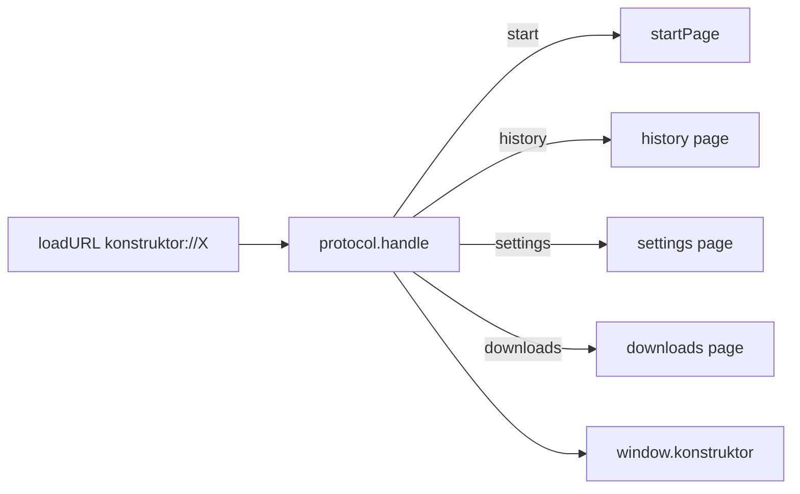

# 🌐 Внутренние страницы

Документ описывает внутренние страницы `konstruktor://`: их адреса и назначение, роутинг запросов, preload-мост и темизацию.

## 🧩 Адреса

Поддерживаются `konstruktor://start`, `history`, `settings`, `downloads`. HTML собирают `build*Page` в `startPage.ts`/`historyPage.ts`/`settingsPage.ts`/`downloadsPage.ts` (общий каркас — `shell.ts`); URL всех четырёх адресов и реэкспорт builders — `internalPages.ts`, единая точка входа для `protocol.ts`, меню и кластеров windows/groups. Страницы без внешних ресурсов — работают офлайн. Каждая страница собирается на запрос с текущим языком: статические строки переводятся `t()`, динамические строки скриптов — встроенным `tr()` по каталогу из `window.__I18N__`, даты — по `window.__I18N_INTL__` (см. [I18N.md](../../shared/i18n/I18N.md)).

| Адрес | Назначение | Хранилище |
|---|---|---|
| `konstruktor://start` | Стартовая страница-табло с плитками | `shortcuts.json` |
| `konstruktor://history` | История визитов с хронологией по дням, месяцам и годам | `history.json`, инкогнито не пишет и не читает |
| `konstruktor://downloads` | Хранилище загрузок с системными иконками | `downloads.json` |
| `konstruktor://settings` | Поиск, домашняя страница, DNS, тема, режимы зума | `settings.json` |

## 🔀 Роутинг

`pages/protocol.ts` регистрирует `protocol.handle` на трех сессиях: default, обычной и инкогнито. Роутинг идет по host URL. Схема объявлена privileged до ready в `index.ts`, иначе view ее не рендерит.

## 🔌 Мост

`internalBridge.ts` ставит `registerPreloadScript` на каждую партицию. Скрипт выполняется в каждом фрейме до загрузки документа и отдает `window.konstruktor`: история, настройки, шорткаты, загрузки.

## 🎨 Темы и поведение

Страницы читают тему из настроек до отрисовки и ставят `dataset.theme`. История группирует визиты по дням, месяцам и годам. Настройки сохраняются через `saveSettings` и пушат `settings:changed` в shell с полем `locale`. Селектор языка в `konstruktor://settings` строится из реестра `LANGUAGES`; после смены языка страница обновляется перезагрузкой вкладки.
