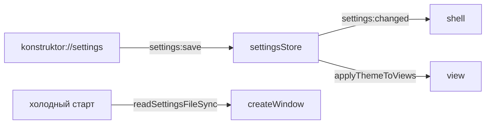

# 💾 Хранилища

Документ описывает JSON-хранилища main и Secure DNS: файлы, кэши, поведение инкогнито.

## 🧩 Файлы

Настройки лежат в `settings.json`, история в `history.json`, загрузки в `downloads.json`, плитки в `shortcuts.json`. Все файлы живут в userData. Каждый store держит кэш в памяти и пишет через debounce или по событию. Каналы `history:*` / `downloads:*` / `settings:*` / `shortcuts:*` сводит `ipc.ts`.

## ⚙️ Настройки

`settingsStore.ts` хранит поисковик, homepage, devtools, DNS, язык интерфейса (`locale`: `auto` | код из реестра LANGUAGES, дефолт `auto` — резолв и смена описаны в [I18N.md](../../shared/i18n/I18N.md)), анимации, тему, скругление, fullscreen, `rememberBounds`, `rememberTabs`, режим зума (`zoomMode`: origin/tab) и единый зум (`zoomSync`), геометрию и сессию вкладок. Чтение идет через `getSettings`, синхронное через `getSettingsSync`, запись через `saveSettings`.

## 🕘 История и загрузки

`historyStore.ts` пишет визиты и метаданные, отдает ленту через `getTimeline`. `downloadsStore.ts` ведет прогресс через `will-download`. Инкогнито историю не пишет и не читает, загрузки читает общие.

## 🔒 Secure DNS

`dnsConfig.ts` маппит режим в DoH-сервер через `dnsServersFor` и ставит switches через `applySecureDns`. Применение идет при старте из сохраненных настроек, смена в UI требует рестарта.

## 🛠️ Проблемы и решения

Накопленные грабли этого модуля: причина → следствие.

### 📜 История без дублей

`page-title-updated`/`page-favicon-updated` — только `updateMetadata`, новый визит не засчитывать, иначе один заход = ×2 в истории.

### 💾 Кэш настроек пуст на старте

`getSettingsSync()` до первого `load()` возвращает дефолты. Геометрия/сессия первого окна читаются синхронно с диска (`readSettingsFileSync`), иначе окно стартует не с тех bounds.
