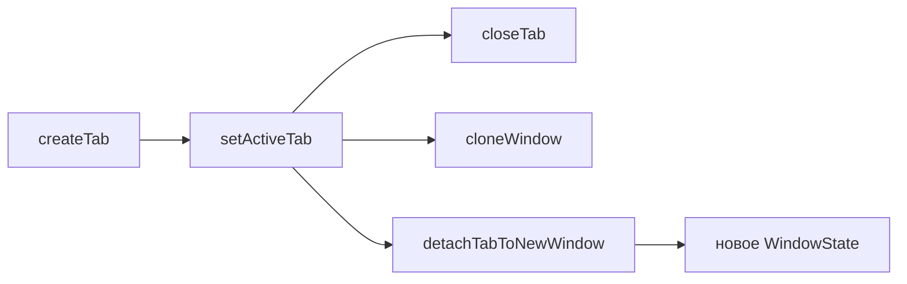
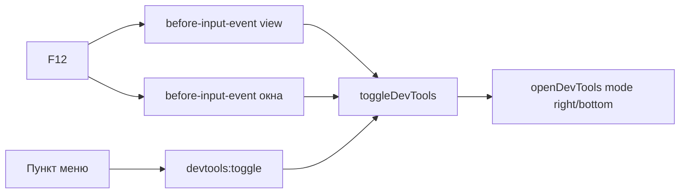

# 📂 Вкладки

Документ описывает вкладки браузера: состояние и жизненный цикл, панель вкладок, перетаскивание, контекстные меню и DevTools страницы. Система групп вкладок вынесена в [GROUPS.md](../groups/GROUPS.md).

## 📐 Архитектура

Вкладка — `WebContentsView` внутри окна, а не webContents самого окна. Вкладки и панель живут в `tabs/`: `tabsManager.ts` (`createTab`, `setActiveTab`, `closeTab`, `cloneWindow`, `detachTabToNewWindow`, `pushTabsState`), порядок ряда — в `stripOrder.ts`, меню вкладки и панели — в `tabsMenu.ts`, контекстное меню страницы — в `pageMenu.ts`, DevTools — в `devtools.ts`, каналы `tabs:*`/`devtools:*`/`layout:update` — в `tabsIpc.ts`. Шаблоны групп — в `groups/groupsStore.ts`, экземпляры — в `groups/groupsInstances.ts`, меню групп — в `groups/groupsMenu.ts`. Типы `TabData` и пул окон лежат в `windows/browserState.ts`, поиск вкладки — `findTab`, окно-родитель — `parentOfTab`.



## 📋 Панель вкладок

Порядок панели задают `stripOrder` и `pinnedStripOrder` (`stripOrder.ts` — `ensureStripToken`, `removeStripToken`, `moveStripToken`, `reorderStrip`, `rebuildStripFromTabs`; инвариант проверяет `checkStripInvariant`). Токены двух сортов: `t:<id>` для вкладок и `g:<instanceId>` для корневых групп — одного ранга, чередуются свободно.

Вложенные группы (`parentInstanceId`) в ряд не входят, рисуются внутри родителя. Вкладка без группы лежит в `stripOrder`; вкладка внутри группы токена не имеет. `createTab` кладёт токен вкладки, уход вкладки в группу его убирает, создание и открытие группы кладут токен группы. Нарушение инварианта даёт невидимую группу или дубль в ряду.

`tabs:reorder` принимает токены единого ряда и синхронизирует `tabOrder` по нему.

### 📎 Minimize

Пункт меню `Minimize` ставит флаг `pinned` без перемещения вкладки: свернутая вкладка схлопывается до иконки и остается на своем месте в общем ряду. Отдельной закрепленной зоны для вкладок нет, `pinnedStripOrder` хранит только закрепленные группы.

## 🗂️ Группы вкладок

Шаблон группы живет в `groups.json` (`groupsStore.ts`), открытые экземпляры — в `groupsInstances.ts`. Вкладка ссылаетеея на экземпляр через `groupId`, группа хранит `urls` и `children` — вложенность без циклов. Детали системы — в [GROUPS.md](../groups/GROUPS.md).

Один шаблон открывается несколько раз, у каждого открытия свой `instanceId`, вложенность открытых экземпляров — через `parentInstanceId`. Пустой экземпляр исчезает с панели вкладок, минимальная группа содержит одну вкладку. Закрепление на панели закладок — флаг `pinned`: незакрепленная группа живет только на панели вкладок, пока открыта.

Мутации шаблонов рассылаются через `groups:changed` моментально, без ожидания `tabs:state`. Меню заголовка группы: создать группу, переименовать, цвет, иконка, вложить в другую группу, закрепить на закладках, закрыть вкладки, разгруппировать, перенести вкладки в другую группу, удалить.

## 🔗 Открытие ссылок

`setWindowOpenHandler` на view перехватывает `window.open` и клики по `target="_blank"`. Http/https и `konstruktor://` открывает вкладкой в том же окне через `createTab` — системный браузер не участвует. Не-http схемы (`mailto:`, `tel:`) уходят в `shell.openExternal`: в вкладку их не загрузить.

## 🖱️ Контекстные меню страницы

ПКМ по сайту (и Shift+F10) открывает overlay-меню `kind: 'menu'` — системный `Menu.popup` проект не использует. Хук `context-menu` висит на `view.webContents` в `createTab` (`tabs/tabsManager.ts`), пункты и действия — в `tabs/pageMenu.ts` (`buildPageMenu` + `showPageContextMenu`), действия «открыть вкладкой/окном» и инспектор собирает `windows/deps.ts` (`pageMenuDeps`).

```mermaid
flowchart LR
  View[view.webContents<br/>context-menu] --> PM[pageMenu.ts]
  PM -->|buildPageMenu| Items[OverlayMenuItem[]]
  PM -->|showOverlay kind: menu| OV[overlay-окно]
  OV -->|onSelect| Act[действия в main]
  Act --> WC[webContents<br/>clipboard, download, навигация]
```

Приоритет контекста — цепочка Chrome: `isEditable` → `linkURL` → `mediaType === 'image'` → `selectionText` → страница. Пункт не показывается, если контекст его не даёт: редактируемые поля меню не получают (Cut/Copy/Paste через `editFlags` — вторая фаза), внутренние страницы `konstruktor://` отсекаются до показа.

| Контекст | Пункты |
|---|---|
| Страница | Back (disabled без истории), Forward, Reload, Save page as, Print |
| Изображение | Open image in new tab/new window, Save image as, Copy image address |
| Выделение | Copy |
| Ссылка | Open link in new tab/new window, Save link as, Copy link address, Copy link text |

Общий хвост добавляется один раз: разделитель, `Search`, View page source, Inspect. Подпись поиска — без пояснений: ни названия движка, ни текста запроса в пункте нет. Аргумент поиска: выделение → текст ссылки → URL страницы; пробелы нормализуются, но текст не обрезается — иначе обрезка уходила в сам запрос. Движок и `%s` берутся из `searchEngine` (`getSettingsSync()`) в момент выбора, то есть поиск идёт движком браузера из настроек (меню своего движка не имеет), запрос открывается в той же вкладке. Пункты «открыть вкладкой/окном» показываются только для схем `http`, `https`, `konstruktor`, `file` — `javascript:` и прочие скрываются при сборке. `Save link as` и `Save image as` уходят в `downloadURL` → тот же конвейер `will-download` (downloads.json и тост), `Save page as` — `dialog.showSaveDialog` + `savePage(path, 'HTMLComplete')` со своим тостом, `Print` — `wc.print()`, `Inspect` — `inspectElementAt` (`tabs/devtools.ts`): `toggleDevTools`, если панель закрыта, затем `inspectElement(x, y)`.

Состояние перечитывается в момент показа и в момент действия через `findTab(tabId)`: замыкание хука хранит только id, а `tabs:attach`/`detach` переносят view между окнами — ид вкладки стабилен при переезде, ws — нет.

Якорь — `view.getBounds() + params.{x, y}` в координатах content-области окна, кламп в `workArea` уже в `overlay/geometry.ts`. `params.x/y` приходят в DIP viewport вызвавшего вида и не меняются при зуме (проверено на 80/100/150%), при прокрутке и из iframe — координаты считаются от основного вида даже для сабфрейма. Клавиатурный вызов приходит тем же событием `context-menu` с `menuSourceType: 'keyboard'`.

Ограничение: один оверлей на родителя — ПКМ по странице при открытой панели поиска закрывает панель поиска. Согласовано с инвариантом системы, стек меню поверх поиска — вторая фаза.

Подписи пунктов — ключи `pageMenu.*` (`src/shared/i18n/locales/*.json`), поэтому меню следует за языком интерфейса: `t()` синхронен после `initI18n()` и собирается в момент показа, как у `getSettingsSync()`.

## 🔧 DevTools страницы

F12 открывает Chrome DevTools для открытой веб-страницы — то есть для `WebContentsView` вкладки, а не для интерфейса браузера. Логика в `devtools.ts` (`toggleDevTools`, `closeDevToolsFor`, `devToolsStateOf`), точки входа: `before-input-event` view, `before-input-event` окна, `devtools:toggle`, пункт меню браузера.



Точки входа дублируются намеренно: `before-input-event` стреляет только в том `webContents`, который сейчас в фокусе, поэтому F12 из адресной строки или панели вкладок без обработчика окна не сработал бы. В фокусе самого DevTools Chromium обрабатывает F12 сам — там событие не доходит, закрывает панель штатно.

Определяющий факт реализации: `WebContentsView` в Electron — обёртка над `InspectableWebContentsView`, где уже есть пара «страница + DevTools» и разметка дока с разделителем и ресайзом. Док-нутые DevTools рисует Chromium сам, деля bounds view между контентом и панелью, поэтому `layoutView` в layout не вмешивается. Побочный эффект тот же, что и у обычного дока: при пересчёте `setBounds` содержимое страницы сужается вместе с панелью.

`setDevToolsWebContents` не используется — он переводит DevTools в `detach` с отдельным системным окном, а докнуть панель в собственный `BrowserWindow` или оверлей-окно нельзя: там нет `InspectableWebContentsView`, который Chromium ждёт для разметки дока.

Сторона дока на первом открытии выбирается по геометрии view: узкое окно (меньше 480 px) или высокое (высота больше 3/4 ширины) — док вниз, иначе вправо, как в Chrome. Дальше Chromium переключает док сам при ресайзе. Режимы `detach` и `undocked` не используются: это отдельное окно поверх окна, другой UX.

Состояние лежит в `TabData.devTools` и в `TabRecord.devToolsOpen`. Оно принадлежит конкретной вкладке, поэтому смена активной вкладки панель не закрывает — она остаётся открытой на своей вкладке. `pushTabsState` берёт признак не из записи, а опросом `isDevToolsOpened()`: панель закрывается не только через F12, но и крестиком в самом DevTools, и запись без такой подстраховки протухала бы. Подписки `devtools-opened` и `devtools-closed` в `createTab` держат запись в синхроне. Закрытие панели при закрытии вкладки и при переключении инкогнито делает `closeDevToolsFor` — до уничтожения `webContents`, иначе состояние уходит вместе с view молча.

## 🛠️ Проблемы и решения

Накопленные грабли этого модуля: причина → следствие.

### 📎 Minimize

Пункт меню `Minimize` ставит флаг `pinned` без перемещения вкладки: свернутая вкладка схлопывается до иконки и остается на своем месте в общем ряду. Отдельной закрепленной зоны для вкладок нет, `pinnedStripOrder` хранит только закрепленные группы.

### 🕵️ Detach до did-finish-load

Новое окно при detach создавать первым и класть вкладку в `tabOrder` сразу: иначе `did-finish-load` создаст лишнюю стартовую, а `pushTabsState` уйдет в пустоту.

### 🐞 GitHub и дефолтный UA

Часть CDN отдает `ERR_CONNECTION_CLOSED` на дефолтном UA Electron: повтор с Chrome-UA чинит handshake (`did-fail-load` в `tabsManager.ts`).
