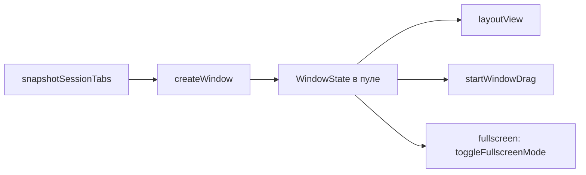

# 🖥️ Окна

Документ описывает окна браузера: состояние и пул, создание и жизненный цикл, меню окна, перетаскивание, layout, сессии, fullscreen, инкогнито.

## 📐 Архитектура

`browserState.ts` хранит типы `WindowState` и `TabData`, пул `windows`, партиции `persist:konstruktor` и `incognito-mem`. Поиск вкладки идет через `findTab`, окно-родитель через `parentOfTab`, id выдает `allocTabId`.

Окна живут в `windows/`: `windowsManager.ts` (`createWindow`, `layoutView`, `layoutActiveView`, `startWindowDrag`, `snapshotSessionTabs`), F11-сценарий и сброс контентного режима — в `fullscreen.ts` (`toggleFullscreenMode`, `clearContentFullscreen`), меню окна — в `windowMenu.ts`, меню браузера — в `browserMenu.ts`, каналы `window:*`/`zoom:*` — в `windowIpc.ts`. Общее ядро — `browserState.ts` (типы и пул окон) и `deps.ts`, связывающий окна и вкладки через deps (createTab/createWindow без циклов); `index.ts` только собирает `register*Ipc`.

## 🖥️ Меню окна

ПКМ по кнопкам навигации открывает меню окна: `windowMenu.ts`, вид оверлея `window-menu`, компонент `WindowMenu.vue`.

Состав: **Open new window, Clone window, Minimize, Maximize|Restore, Close**. Maximize и Restore взаимоисключающие — в меню присутствует ровно один, по состоянию окна.

- **Open new window** — `createWindow({ restoreSession: false })`: окно только со стартовой страницей. Флаг обязателен: `sessionTabs` в settings — общий слот на всё приложение, а не слот конкретного окна, и без флага новое окно подхватывало бы вкладки чужого.
- **Clone window** — `cloneWindow` в `tabsManager.ts`: копирует группы и вкладки в новое окно, исходные остаются на месте. В отличие от `detachTabToNewWindow`, который **переносит** `WebContentsView` (одна view принадлежит одному родителю, и `addChildView` в второе окно её оттуда заберёт), клон создаёт свои view с той же партицией — с той же историей и кэшем. Новое окно сдвинуто от исходного, иначе два окна легли бы друг на друга.

Копирование внутри `cloneWindow` идёт в строгом порядке:

1. Группы — до вкладок, потому что вкладки ссылаются на `instanceId`, и группа, появившаяся позже, оставила бы ссылку в пустоте. `instanceId` сохраняется, чтобы вкладка вела в копию той же группы.
2. Вкладки — в порядке `tabOrder` исходного окна. `createTab` кладёт токен в ряд сам, а для вкладки с группой он убирается через `removeStripToken`.
3. Порядок панели — через `reorderStrip`, куда передаётся порядок исходного окна с подменёнными токенами вкладок `t:<исходный> → t:<копия>`. Без этого шага ряд строился бы заново: группы добавляются первыми, вкладки докладываются в конец, и группа, стоявшая в исходном окне последней, оказалась бы первой.

## 👉 Перетаскивание окна

Окно тащит `onTitleMouseDown` в `App.vue`: `mousedown` с принуждением на ЛКМ → `screenX/screenY` → `setBounds` (`startWindowDrag` / `moveWindowDrag` / `endWindowDrag` в `windowsManager.ts`). Заголовок не помечен `-webkit-app-region: drag`, потому что drag-область на Windows перехватывает правый клик и отдаёт его системному меню окна: событие до renderer не доходит, отменить его нечем. Из-за этого контекстное меню панели открывалось только на кнопке «+» — она `no-drag`.

- Координаты экранные (`screenX`), а не `clientX`: окно двигается по экрану, а `client` отсчитывается от области содержимого.
- `window:drag-start` — `sendSync`, не `invoke`: ответ нужен синхронно, до первого `mousemove`, иначе окно дёрнется на первом кадре.
- Двойной клик по пустой области заголовка разворачивает окно (`onTitleDblClick`).
- Окно развёрнутое или в fullscreen мышью не двигается.

`contextmenu` после снятия drag-области доходит до renderer штатно, поэтому зоны меню объявлены явно:

| Зона | Меню |
|---|---|
| `.tab` | меню вкладки |
| `.tabgroup-head` | меню группы |
| `.tabgroup`, `.tabgroup-body` | меню группы |
| `.strip-filler`, `.tabstrip` | меню панели |

## 📖 Layout

Renderer сообщает отступы UI через `layout:update`. `layoutView` ставит `WebContentsView` в свободную область, `layoutActiveView` пересчитывает активную view. В контентном fullscreen отступы игнорируются.

## 💾 Сессии и геометрия

Слепок вкладок строит `snapshotSessionTabs`, запись идет через `persistSessionTabs`, чтение — `restoreSessionTabs` (до 50 вкладок, пропуская битые URL и `about:blank`). Геометрия окна пишется с debounce при `resized` и `moved`. Холодный старт читает файл синхронно через `readSettingsFileSync`. Восстановление сессии выключается настройкой `rememberTabs`.

## 📱 Fullscreen

Сценарий выбирает `toggleFullscreenMode` из `windows/fullscreen.ts`. Режим `window` разворачивает все окно, режим `content` прячет панели и растягивает view. Исконные bounds лежат в `savedBounds` и возвращаются при выходе. Выход из fullscreen не через F11 (Esc, Win-жесты) тоже сбрасывает контентный режим (`clearContentFullscreen`).

## 🕵️ Инкогнито

Окно целиком приватное: in-memory партиция, история не пишется и не читается, сессия вкладок не сохраняется и не восстанавливается. При закрытии storage и кэш чистятся. Клон инкогнито-окна остаётся инкогнито.

## 🛠️ Проблемы и решения

Накопленные грабли этого модуля: причина → следствие.

### 🖱️ Правый клик на drag-области

На `-webkit-app-region: drag` Windows отдает ПКМ системному меню окна, renderer его не видит. `strip-filler` намеренно `drag` (окно должно таскаться за всю ширину панели), поэтому контекстное меню панели на пустой области не открывается — это размен на таскание.

### 🌃 Мерцание при перетаскивании окна поверх другого окна (не воспроизведено)

**Симптом:** при перетаскивании окна браузера поверх другого окна браузера
верхнее иногда мигает, показывая окно под ним. Нестабильно, к моменту
разбора не воспроизвелось.

**Что проверено и что исключено.** Добавленная на время прогона проба
`traceDragGlitch` логировала границы оверлея и родителя в момент
`parent move/resize`. Результат: за все прогоны проба **ни разу не поймала
живой оверлей** — в момент `move` содержимое уже было размонтировано
(`width: 1, height: 1`, то есть парковочные bounds, а не `260 x N` меню).

Значит гипотеза «`closeOverlay` ждёт подтверждение размонтирования от
renderer, и за этот кадр старое содержимое успевает показать» **не
подтверждается**: к моменту движения содержимого уже нет.

**Оставшаяся версия.** Главное окно браузера само прозрачное
(`transparent: true`, `backgroundColor: '#00000000'` в
`windowsManager.ts`) — ради CSS-скругления в оконном режиме. Мерцание при
перетаскивании прозрачного окна над другим окном — известное поведение
Compositor/WM на Linux, и к оверлею оно отношения не имеет: оверлей к этому
моменту пуст.

**Что делать, если снова появится.** Не гадать: снять кадр (или
`import -window`/скриншот), сравнить, мигает ли прозрачность главного окна или
что-то ещё. Без кадра причина не устанавливается.

### 🏃 Мерцание при изменении размера окна (Linux, не решено)

**Симптом:** при перетаскивании границы окна браузера окно на долю секунды
пропадает — видны обои или содержимое окна под ним. На Windows не
воспроизводится.

**Что исключено замерами, а не догадками:**

| Проверка | Результат | Значит |
|---|---|---|
| `KONSTRUKTOR_OPAQUE=1`: окно непрозрачное, углы квадратные | Мерцание осталось | Прозрачность окна не причина |
| `KONSTRUKTOR_NO_VIEW=1`: `view.setBounds()` не вызывается вовсе | Мерцание почти ушло | `WebContentsView` — главный виновник |
| Счётчики событий окна | `resize` 113–216, `resized` **0** | `resized` на Linux не приходит, опереться на него нельзя |

**Механизм.** `WebContentsView` — нативный слой. Каждый `view.setBounds()`
заставляет Compositor пересоздавать его поверхность, и между старой и
новой окно остаётся без слоёв. `resize` при перетаскивании стреляет
десятками раз в секунду, значит и пересозданий столько же.

**Важно: `resized` на Linux не приходит ни разу.** Первая попытка лечения
убрала `win.on('resize')` и оставила только `win.on('resized')` — то есть
отключила раскладку по изменению размера полностью, а мерцание осталось.
Это выглядело как «лечение не работает», хотя на самом деле работало бы,
если бы `resized` приходил.

**Решение пользователя: отложено.** Мерцание затрагивает и другие окна
системы — вероятно, это поведение Compositor/WM на конкретном окружении,
а не проекта. Возвращаться с диагностикой самой системы.

**Что уже сделано и не помогло** (откачено перед коммитом): отключение
раскладки на `resize`, троттлинг замера панелей в renderer, дедупликация
одинаковых `layout:update`.

**С чего начать при возврате.** Замерить, приходит ли `resized` на этой
системе вообще. Если нет — троттлинг `view.setBounds()` по кадру (не чаще
одного раза в 16 мс), иначе нативный слой пересоздаётся столько же раз.
