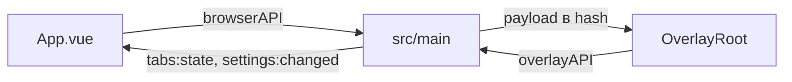

# 🔌 Мост shell

Документ описывает preload-мосты основного и overlay-окон: `window.browserAPI` и `window.overlayAPI`.

## 🧩 Состав

`src/preload/shell/index.ts` отдает `browserAPI` для shell: вкладки, навигация, окна, layout, меню, тосты, поиск, настройки, группы (`groups:*`, `reorderStrip`, `stripOrder`/`pinnedStripOrder` в `TabsState`), DevTools страницы (`toggleDevTools`, `devToolsState`), масштаб страницы (`zoom:in`/`zoom:out`/`zoom:reset`/`zoom:set` возвращают примененный процент, `zoom:popup` отправляет якорь бейджа). `src/preload/overlay-window/overlay.ts` отдает `overlayAPI` для overlay-окна: выбор, ввод, поиск. Оба идут через `contextBridge` с `contextIsolation`.

Контракт сообщений оверлея — в `src/shared/overlay-types.ts`. `overlayAPI` типизирован по нему: `onPush`/`onUpdate` (подписки, возвращают отписку), `send(OverlayCommand)` (действие одним объектом), `measure(MeasureMessage)` (реальные размеры). Старые методы `select`, `dismiss`, `submit`, `submitIcon`, `find*` помечены `@deprecated` и удаляются на шаге 10 миграции.

## 🔀 Направления

Shell вызывает main через `invoke` и `send`, main пушит состояние через `send`. Оверлей вызывает только свои каналы `overlay:*` и `find:*`. Каналы изолированы друг от друга.

## 🔒 Изоляция

Сборка идет в `cjs`, песочница выключена, иначе скрипт молча не грузится. `nodeIntegration` выключен, прямого `require('electron')` в renderer нет.
