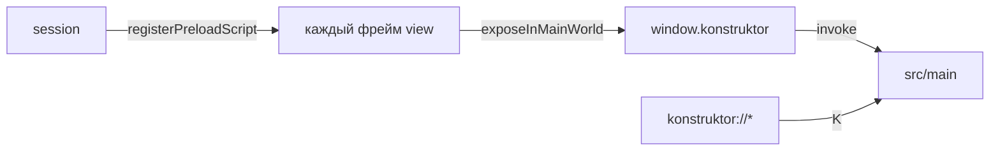

# 🔌 Мост view

Документ описывает preload-мост вкладок: `window.konstruktor` для сайтов и внутренних страниц.

## 🧩 Состав

`src/preload/view/internal.ts` отдает `window.konstruktor`: история, настройки, шорткаты, загрузки. У `WebContentsView` нет своего preload через `webPreferences`, поэтому скрипт ставится через `registerPreloadScript` на сессию.

## 🔀 Выполнение

Скрипт выполняется в каждом фрейме до загрузки документа. `contextBridge` доступен, `require('electron')` не нужен. Внутренние страницы вызывают `historyTimeline`, `getSettings`, `saveSettings`, `downloadsList` и другие методы напрямую.

## 🔒 Изоляция

Сборка идет в `cjs`, контекст изолирован. Внешние сайты тоже видят мост, но методы истории и настроек в инкогнито отдают пусто.

## 🖼️ Кнопка PiP над плеером

`pip.ts` рисует в каждом фрейме кнопку Picture-in-Picture, пока курсор внутри `<video>` от 160×90 с источником. Клик открывает нативное окно Chromium PiP — плавающее, поверх всех окон, с системными контролами. Своё окно приложение не создает: `WebContentsView` принадлежит одному родителю, выносить его ради мини-плеера нельзя.

Кнопка живет в `position: fixed` с `z-index: 2147483647` внутри shadow root (`mode: 'closed'`), стили страницы до нее не достучатся. Поиск видео: hit-test через `elementsFromPoint` как быстрый путь, затем скан `querySelectorAll('video')` с проверкой геометрии — плееры вроде YouTube держат видео с `pointer-events:none` под оверлеями, и hit-test его не отдает. При пересечении нескольких берется видео с наименьшей площадью. Обновление позиции — по одному `requestAnimationFrame` на серию событий мыши, скролла и ресайза.
