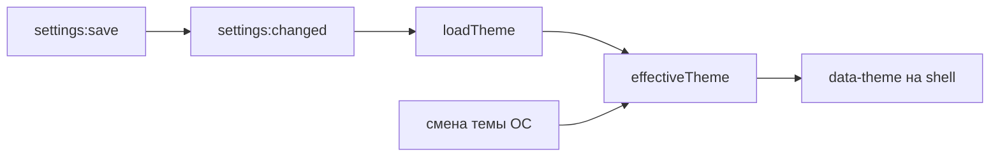

# 🧠 Состояние shell

Документ описывает состояние shell: вкладки, тему, подписки на main.

## 🧩 Вкладки

`useTabs.ts` держит `tabs`, `activeTabId`, `isIncognito`, `openGroups`, `savedGroups`, `stripOrder`, `pinnedStripOrder`. Стартовая загрузка идет через `listTabs`, дальше состояние пушится через `tabs:state` и `tabs:navigated`. Шаблоны групп синкаются через `groups:changed`. Инкогнито красит shell темным акцентом.

## 🎨 Тема

`useTheme.ts` держит `theme` и `effectiveTheme`. `system` резолвится через `matchMedia`, смена ОС пересчитывается подпиской. `loadTheme` читает настройки при старте и на каждом `settings:changed`. Тот же колбэк получает поле `locale` и вызывает `changeLanguage` (i18n shell, см. [I18N.md](../../shared/i18n/I18N.md)): стартовый язык shell читает из настроек до `app.mount()`.

## 🔀 Подписки

Shell слушает `tabs:state`, `tabs:navigated`, `tabs:tab-action`, `settings:changed` (тема, скругление, F11-режим, поле `locale`), `window:maximized`, `window:fullscreen`, `window:content-fullscreen`. Опрос таймером не используется.

## ⌨️ Клавиши shell

`onKey` в `App.vue` держит Ctrl+F (панель поиска), F11 (fullscreen) и F12 (DevTools активной вкладки). F11 и F12 дублируют `before-input-event` окна в main, а не заменяют его: событие стреляет только в том `webContents`, который в фокусе, поэтому из адресной строки или панели вкладок клавиша иначе не дошла бы до main. Решение принимается в main, оттуда же возвращается состояние в `tabs:state`.

## 🔒 Лок оформления

Кастомный компонент фиксирует свое оформление оберткой `.theme-lock`: внутри нее CSS-переменные зафиксированы на dark и тема браузера не влияет. Реестр компонентов живет в `registry.ts`.
