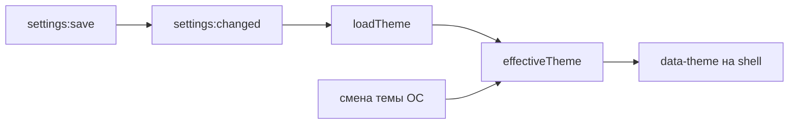

# 🧠 Состояние shell

Документ описывает состояние shell: вкладки, тему, подписки на main.

## 🧩 Вкладки

`useTabs.ts` держит `tabs`, `activeTabId`, `isIncognito`. Стартовая загрузка идет через `listTabs`, дальше состояние пушится через `tabs:state` и `tabs:navigated`. Инкогнито красит shell темным акцентом.

## 🎨 Тема

`useTheme.ts` держит `theme` и `effectiveTheme`. `system` резолвится через `matchMedia`, смена ОС пересчитывается подпиской. `loadTheme` читает настройки при старте и на каждое `settings:changed`.

## 🔀 Подписки

Shell слушает `tabs:state`, `tabs:navigated`, `tabs:tab-action`, `settings:changed`, `window:maximized`, `window:fullscreen`, `window:content-fullscreen`. Опрос таймером не используется.

## 🔒 Лок оформления

Кастомный компонент фиксирует свое оформление оберткой `.theme-lock`: внутри нее CSS-переменные зафиксированы на dark и тема браузера не влияет. Реестр компонентов живет в `registry.ts`.
