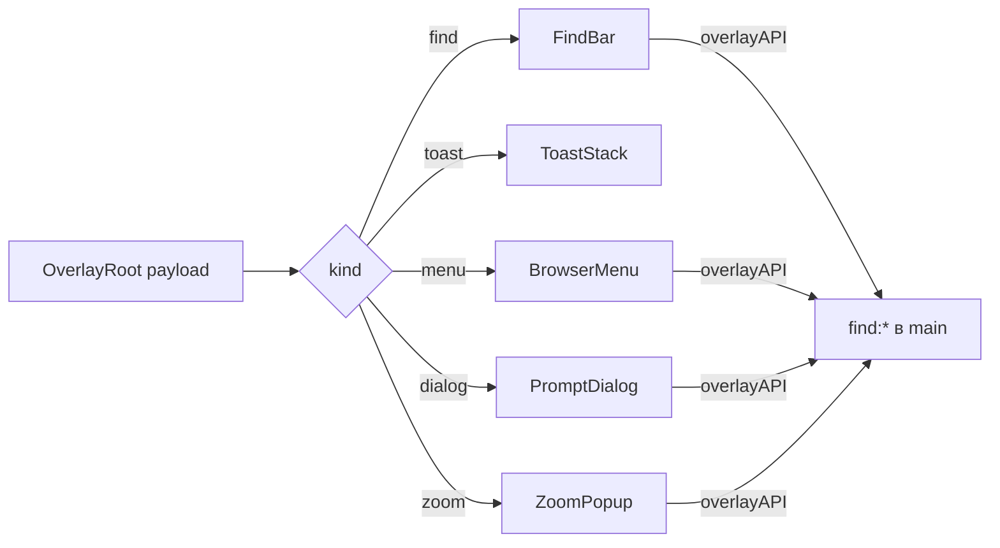

# 💬 Overlay UI

Документ описывает Vue-панели overlay-окна: корень, виды панелей, поиск, стили.

## 🧩 Корень

`OverlayRoot.vue` держит стек уровней и подписки на IPC, разбор payload (типы push, пропсы уровней, мерж патчей, сверка устаревших push) — в `payload.ts`, выбор компонента — в `registry.ts`. Тема (`dataset.theme`), класс `no-anim` и язык из `PushMessage.language` ставятся до установки payload (см. [I18N.md](../../shared/i18n/I18N.md)). Пустой payload показывает ошибку. Клик по прозрачной области закрывает окно без выбора.

## 🗂️ Панели

`BrowserMenu.vue` рисует пункты и инкогнито-бейдж. Пункт группы показывает заданные иконку, название и цветную точку (`color`). `ToastStack.vue` показывает уведомления. `PromptDialog.vue` запрашивает ввод для переименования и цвета. `IconDialog.vue` — общий диалог иконки для вкладок и групп: поле ввода плюс кнопки URL, файл, emoji и отмена; тип источника верифицирует main (`verifyIconSource`). `FindBar.vue` висит над страницей с опциями как в VS Code. `ZoomPopup.vue` управляет масштабом страницы: поле процента, кнопки `−`/`+` и `Reset`; поле первое в DOM ради автофокуса, визуальный порядок `− N% +` задает flex `order`.

## 🔍 Поиск

`FindBar` шлет `findQuery`, `findNext`, `findPrev`, `findClose` через `window.overlayAPI`. Опции: `matchCase`, `wholeWord`, `useRegex`. Счетчик обновляется через `.find-count`.

## 🎨 Стили

`overlay.css` красит панели через те же переменные shell по `data-theme`. Анимация fade длится 60ms и отключается классом `no-anim`. Кастомные панели фиксируются классом `.theme-lock`.
