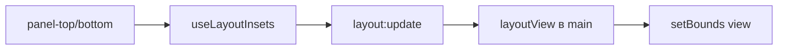

# 🐚 Shell и layout

Документ описывает корневой layout shell: панели, инсеты, скругление, пресеты.

## 🧩 Панели

`App.vue` собирает `panel-top` с вкладками, закладками и адресом, центр оставляет под `WebContentsView`, низ держит прозрачную полосу `panel-bottom` для скругления. В контентном fullscreen панели прячутся через `v-if`. Заголовок держит вкладки и кнопки окна на одной линии по центру: отступы задает `padding` у `.titlebar`, разрыв между панелью и кнопками — `gap` у `.titlebar`, у `TabStrip` внутри заголовка свой `padding` обнулен.

## 📐 Инсеты

`layoutEngine.ts` замеряет высоту панелей через `useLayoutInsets` и шлет `layout:update` в main. Замер идет по `ResizeObserver` и `MutationObserver`, повтор после монтирования стилей через `requestAnimationFrame`.

## ⭕ Скругление

Окно создается `transparent`, фон красит только `.shell` с `border-radius`. Скругление включается классом `rounded` только в оконном режиме, в maximize и fullscreen снимается.

## 🗂️ Пресеты

`layouts/ClassicTop.vue` держит все сверху, `layouts/Minimal.vue` держит вкладки сверху и адрес снизу. Переключение идет копированием пресета в `App.vue`.
