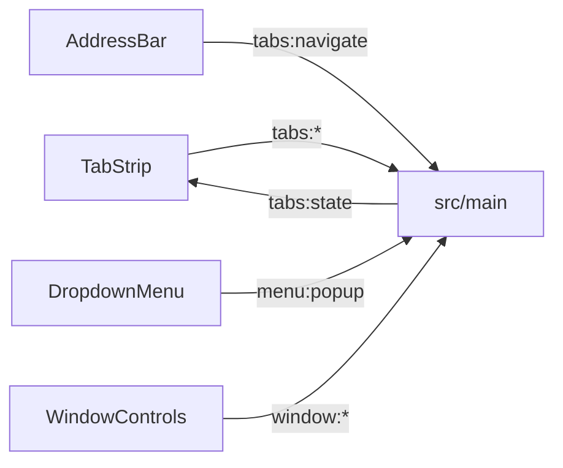

# 🧩 Stdlib-компоненты

Документ описывает стандартную библиотеку shell: состав, поведение, контракт кастомизации.

## 🧩 Состав

`components/stdlib/` содержит `TabStrip`, `TabGroupNode`, `tabShared.ts`/`tabShared.css` (общие `faviconIsEmoji`/`shortTitle`/`iconIsUrl`), `useStripDrag.ts` (липкий токен + зазор DnD), `AddressBar`, `BookmarksBar`, `DropdownMenu`, `WindowControls`, `HistoryView`, `SettingsPage`. Регистрация идет через `registerStdlib`, все компоненты доступны глобально.

## 🖱️ Поведение

`TabStrip` поддерживает DnD, detach за окно, attach между окнами, minimize, дублирование, инлайн-переименование. Единый ряд чередует вкладки и корневые группы по `stripOrder`/`pinnedStripOrder`: логика дропа — в `useStripDrag.ts` (липкий токен, плейсхолдер `.drop-gap`), перетаскивание группы идет за корень узла, дроп вставляет перетаскиваемое перед целью, зазор-плейсхолдер держит место и не дает цели прыгать. Minimize схлопывает вкладку до иконки без перемещения. Группы рисуются горизонтальным узлом `TabGroupNode` высотой как обычная вкладка: заголовок слева, вкладки и дочерние группы справа в линию теми же `.tab`, вложенность рекурсивна. Узел не сжимается при заполненной панели, переполнение уходит во внутренний скролл группы. Тело группы листается колесом отдельно от панели, скроллбар скрыт. Клик сворачивает, правый клик открывает меню группы, дроп вкладки на заголовок кладет ее в группу. Переполнение листается колесом, скроллбары скрыты всегда. Правый клик по панели открывает меню: создать вкладку, создать группу, закрыть все. `AddressBar` навигирует и ищет через поисковик и несет бейдж масштаба 🔬 справа от кнопки поиска: кнопка видна только при `zoom !== 100`, клик открывает overlay-попап зума (`zoom:popup`, якорь — правый нижний угол бейджа), а исчезновение возвращает `url-input` ширину через `flex: 1`. `BookmarksBar` прячется в инкогнито, листается колесом без скроллбаров, показывает только закрепленные группы и принимает внутренние страницы `konstruktor://`: клик открывает экземпляр, правый клик — меню. Фон закладок совпадает с панелью вкладок (`--panel-bg`). `DropdownMenu` открывает overlay-меню. `WindowControls` рисует кнопки окна.

## 🛠️ Кастомизация

Корневой layout правится в `App.vue`: порядок, позиция и стили компонентов. Свои SFC регистрируются через `registerComponent` и резолвятся по имени. Цвета идут через CSS-переменные shell.
