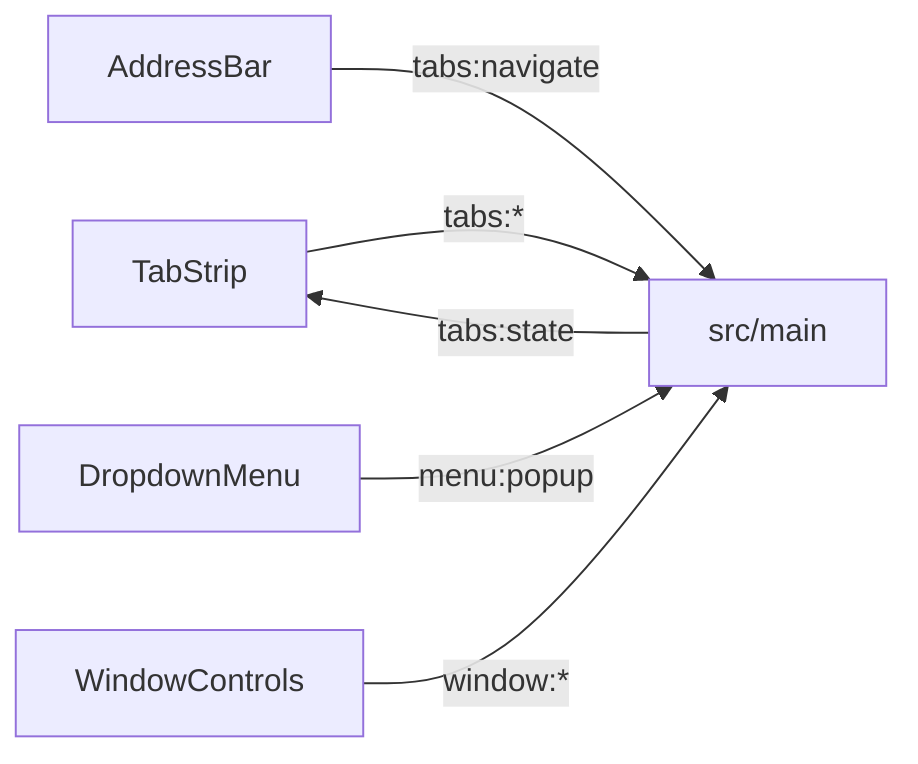

# 🧩 Stdlib-компоненты

Документ описывает стандартную библиотеку shell: состав, поведение, контракт кастомизации.

## 🧩 Состав

`components/stdlib/` содержит `TabStrip`, `AddressBar`, `BookmarksBar`, `DropdownMenu`, `WindowControls`, `HistoryView`, `SettingsPage`. Регистрация идет через `registerStdlib`, все компоненты доступны глобально.

## 🖱️ Поведение

`TabStrip` поддерживает DnD, detach за окно, attach между окнами, pin, дублирование, инлайн-переименование. Переполнение листается колесом, скроллбары скрыты всегда. Правый клик по панели открывает меню: создать вкладку, закрыть все. `AddressBar` навигирует и ищет через поисковик. `BookmarksBar` прячется в инкогнито и тоже листается колесом без скроллбаров. `DropdownMenu` открывает overlay-меню. `WindowControls` рисует кнопки окна.

## 🛠️ Кастомизация

Корневой layout правится в `App.vue`: порядок, позиция и стили компонентов. Свои SFC регистрируются через `registerComponent` и резолвятся по имени. Цвета идут через CSS-переменные shell.
