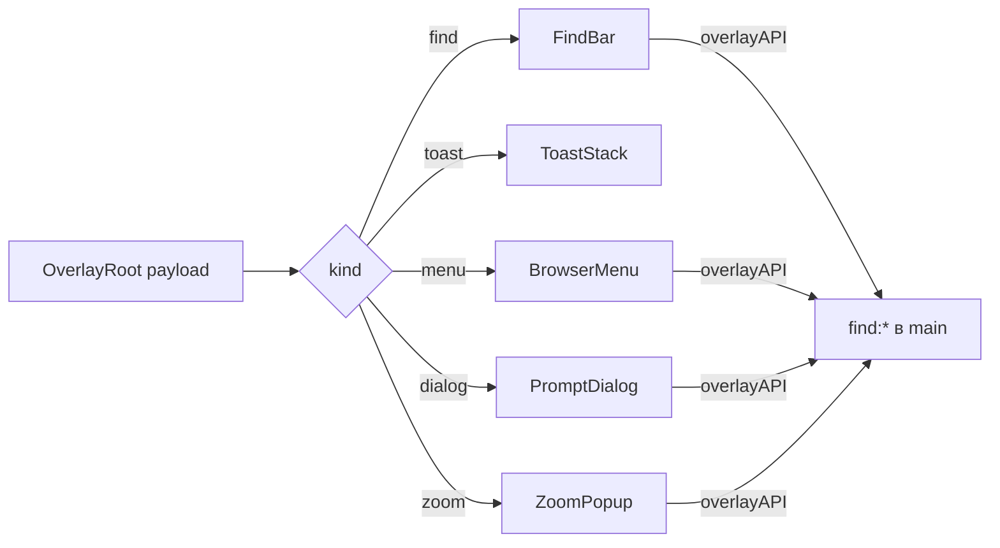

# 💬 Overlay UI

Документ описывает Vue-панели overlay-окна: корень, виды панелей, поиск, стили.

## 🧩 Корень

`OverlayRoot.vue` держит стек уровней и подписки на IPC, разбор payload (типы push, пропсы уровней, мерж патчей, сверка устаревших push) — в `payload.ts`, выбор компонента — в `registry.ts`. Тема (`dataset.theme`), класс `no-anim` и язык из `PushMessage.language` ставятся до установки payload (см. [I18N.md](../../shared/i18n/I18N.md)). Пустой payload показывает ошибку. Клик по прозрачной области закрывает окно без выбора.

## 🗂️ Панели

`BrowserMenu.vue` рисует пункты и инкогнито-бейдж, `WindowMenu.vue` — меню окна (тот же `MenuList`, другой источник пунктов). Пункт группы показывает заданные иконку, название и цветную точку (`color`). `ToastStack.vue` показывает уведомления. `PromptDialog.vue` запрашивает ввод для переименования и цвета. `IconDialog.vue` — общий диалог иконки для вкладок и групп: поле ввода плюс кнопки URL, файл, emoji и отмена; тип источника верифицирует main (`verifyIconSource`). `FindBar.vue` висит над страницей с опциями как в VS Code. `ZoomPopup.vue` управляет масштабом страницы: поле процента, кнопки `−`/`+` и `Reset`; поле первое в DOM ради автофокуса, визуальный порядок `− N% +` задает flex `order`.

## 🔍 Поиск

`FindBar` шлет `findQuery`, `findNext`, `findPrev`, `findClose` через `window.overlayAPI`. Опции: `matchCase`, `wholeWord`, `useRegex`. Счетчик обновляется через `.find-count`.

## 🎨 Стили

`overlay.css` красит панели через те же переменные shell по `data-theme`. Анимация fade длится 60ms и отключается классом `no-anim`. Кастомные панели фиксируются классом `.theme-lock`.

## 🎨 Оформление меню

Все меню рисует один компонент `MenuList.vue`: вкладки, группы, панель, браузер, окно. Клавиатурная навигация — roving tabindex, а не `tabindex` на каждом пункте, иначе Tab перебирал бы все пункты подряд. Стрелки пропускают `disabled` и разделители, `Home`/`End` прыгают к краям, первая буква переводит к следующему пункту на эту букву, а активный пункт подкручивается в вид (`scrollIntoView`).

Разделители реализованы и не используются: контракт `MenuItem.separator` (`shared/overlay-types.ts`), отрисовка `
`. Разделитель не получает фокус — `selectable` его исключает, поэтому стрелки его перешагивают. Включается пунктом `{ id: 'sep-N', label: '', icon: '', separator: true }`.

## 🧩 Общий каркас диалога

`DialogForm.vue` — общий каркас диалога: заголовок, одно поле ввода и ряд кнопок. На нём стоят `PromptDialog.vue` (переименование, цвет) и `IconDialog.vue` (источник иконки), поэтому раскладка и клавиатура описаны один раз.

- Кнопки описываются данными: `id`, `label`, `icon`, `title` и `group`. Группа `sources` собирает кнопки-источники слева (`sourceButtons`), остальные — справа (`otherButtons`); отмена всегда последняя.
- Enter выбирает первую не-отменяющую кнопку (`defaultButton`); отмена приходит отдельным `id: '__cancel__'`.
- Escape в компоненте намеренно не ловится: окно оверлея слушает его глобально и закрывает сессию. Свой обработчик дал бы два `dismiss`.
- Клик по подложке (прозрачной области вокруг диалога) закрывает без выбора; проверка `target === currentTarget` отличает его от клика внутри диалога.
- Поле получает фокус и выделение при монтировании.

## 🛠️ Проблемы и решения

Накопленные грабли этого модуля: причина → следствие.

### 📏 `no-anim` только на `<html>`

Флаг анимаций ставится на `document.documentElement` синхронно при разборе payload, а не реактивно на `.overlay-root`. CSS-анимация `overlay-fade` стартует в том же кадре, что монтируется Vue: класс на `.overlay-root` успевает примениться **после** старта анимации, и fade проигрывается даже при `animations: false`.

### 🔤 Общий каркас диалога теряет смайлики и раскладку

**Симптом (регрессия шага 7).** В диалоге иконки пропали смайлики у кнопок
(`🔗 URL`, `📁 File`, `😀 Emoji`), кнопки встали в один ряд, и `Cancel`
оказался вплотную к источникам.

**Причина.** `IconDialog` стал обёрткой над `DialogForm`, и его кнопки
описывались данными: `{ id, label }`. Смайлик, подсказка и принадлежность к
группе «источники» в этой модели не помещались — тип их не знал. Разметка
при этом осталась верной: кнопки выводились, но уже без иконок и в один
ряд, потому что `dialog-actions` стал `justify-content: flex-end` без
вложенной группы.

**Исправление.** В `DialogForm` добавлены `icon`, `title` и `group` в
описание кнопки, две вычисляемые группы `sourceButtons` / `otherButtons` и
исходная раскладка с двумя блоками.

**Про перенос в общий компонент.** Данные, которых нет в типе, не
переносятся молча: они выпадают без ошибки компиляции. При вынесении
разметки в общий компонент нужно сравнивать свойства передаваемых данных с
исходной разметкой, а не только смотреть, что `typecheck` зелёный.
