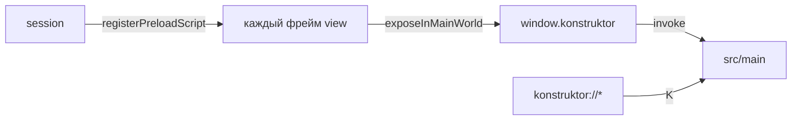

# 🔌 Мост view

Документ описывает preload-мост вкладок: `window.konstruktor` для сайтов и внутренних страниц.

## 🧩 Состав

`src/view-preload/internal.ts` отдает `window.konstruktor`: история, настройки, шорткаты, загрузки. У `WebContentsView` нет своего preload через `webPreferences`, поэтому скрипт ставится через `registerPreloadScript` на сессию.

## 🔀 Выполнение

Скрипт выполняется в каждом фрейме до загрузки документа. `contextBridge` доступен, `require('electron')` не нужен. Внутренние страницы вызывают `historyTimeline`, `getSettings`, `saveSettings`, `downloadsList` и другие методы напрямую.

## 🔒 Изоляция

Сборка идет в `cjs`, контекст изолирован. Внешние сайты тоже видят мост, но методы истории и настроек в инкогнито отдают пусто.
